# The Way Java Works

The goal is to write one application and have it work on whatever device your friends have.

- 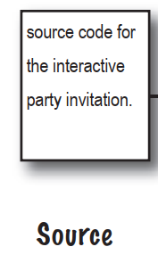Create a source document. Use an established protocol.
- 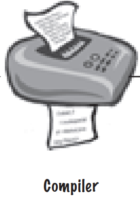Run your document through a source code compiler. The compiler checks for errors and won't let you compile until it's satisfied that everything will run correctly.
- 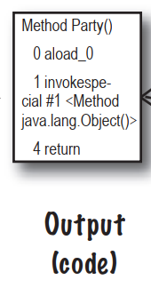The compiler creates a new document,coded into Java **bytecode**. Any device capable of running Java will be able to interpret/translate this file into something it can run. The compiled bytecode is platform-independent.
- 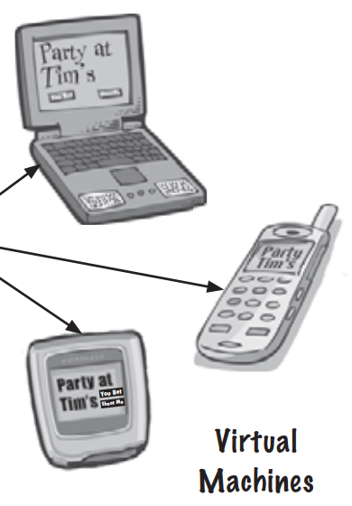Your friends don't have a physical Java Machine,but they all have a **virtual** Java machine running inside their electronic gadgets. The virtual machine reads and runs the bytecode.

# What you'll do in Java

You'll type a source code file,compile it using the **javac** compiler,then run the compiled bytecode on a Java **virtual machine**.

- 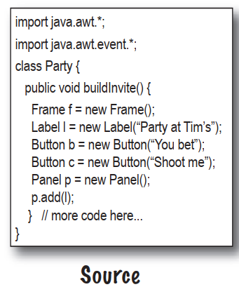Type your source code. Save as:**Party.java**
- 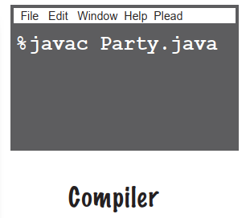Compile the **Party.java** file by running javac. If you don't have errors,you'll get a second document named **Party.class**. The compiler-generated Party.class file is made up of bytecodes.
- 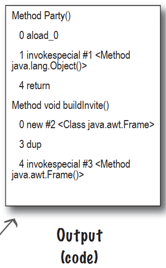Compiled code:**Party.class**
- 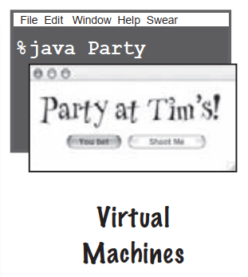Run the program by starting the Java Virtual Machine(JVM) with the **Party.class** file. The JVM translates the bytecode into something the underlying platform understands,and runs your program.

# A very brief history of Java

- Java 1.02
- Java 1.1
- Java 2
  - versions 1.2-1.4
- Java 5.0

### **Q**:Was there a Java 3 and 4?And why is it Java 5.0 but not Java 2.0?

**A**:The joys of marketing...when the version of Java shifted from 1.1 to 1.2,the changes to Java were so dramatic that marketers decided we needed a whole new "name",so they started calling it **Java 2**,even though the actual version of Java was 1.2. But versions 1.3 and 1.4 were still considered **Java 2**. There never was a Java 3 or 4. Beginning with Java version 1.5,the marketers decided once again that the changes were so dramatic that a new name was needed,so they looked at the options. The next number in the name sequence would be "3",but calling Java 1.5 **Java 3** seemed more confusing,so they decided to name it **Java 5** to match the "5" in version "1.5".

So,the original Java was versions 1.02 through 1.1 were just "Java". Versions 1.2,1.3,and 1.4 were "Java 2". And beginning with version 1.5,Java is called "Java 5.0". But you also see it called "Java 5" and "Tiger". We have no idea what will happen with the next release... 

# Code structure in Java

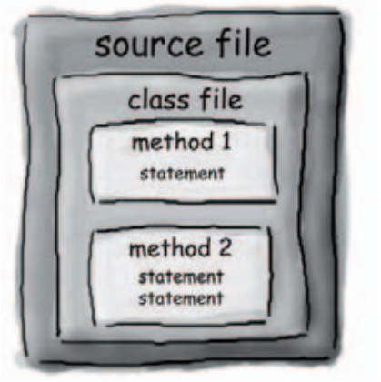

- Put a **class** in a source file
- Put methods in a class
- Put **statements** in a method

### What goes in a **source** file?

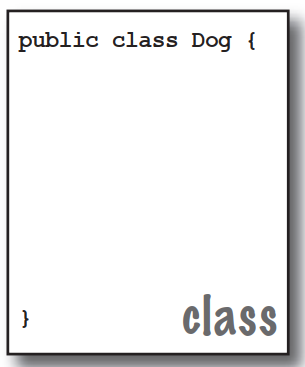A source code file holds one class definition. The class represents a piece of your program,although a very tiny application might need just a single class. The class must go within a pair of curly braces.

### What goes in a **class**?

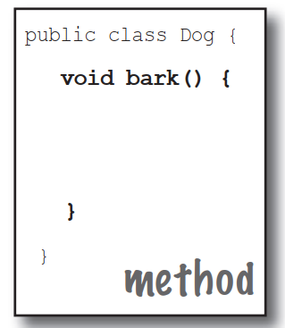A class has one or more methods. In the Dog class,the bark method will hold instructions for how the Dog should bark. Your methods must be declared inside a class.

### What goes in a **method**?

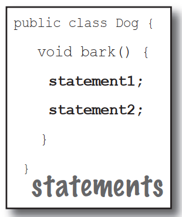Within the curly braces of a method,write your instructions for how that method should be performed. Method code is basically a set of statements,and for now you can think of a method kind of like a function or procedure.

# Anatomy of a class

When the JVM starts running,it looks for the class you give it at the command line. Then it starts looking for a specially-written method that looks exactly like:

```java
public static void main(String[] args){
	//your code goes here
}
```

Next,the JVM runs everything between the curly braces {} of your main method. Every Java application has to have at lease one **class**,and at least one **main** method.

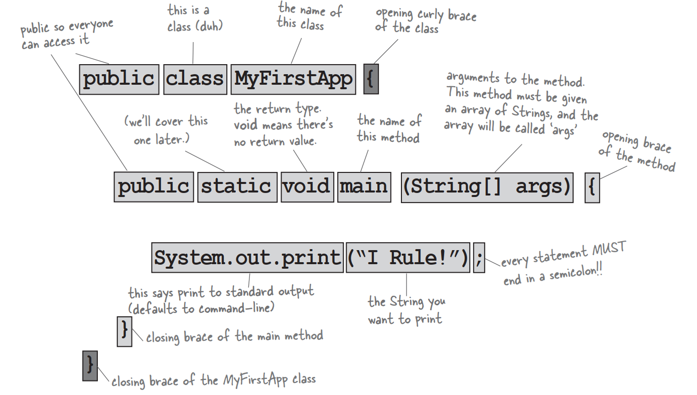

# Writing a class with a main

In Java,everything goes in a **class**. You'll type your source code file,then compile it into a new file. When you run your program,you're really running a class.

Running a program means telling the Java Virtual Machine(JVM) to "Load the **Hello** class,then start executing its **main()** method. Keep running 'til all the code in main is finished."

**How do I WRITE Java code so that it will run?**It all begins with **main()**.

The **main**() method is where your program starts running.

No matter how big your program is,there's got to be a **main**() method to get the ball rolling.

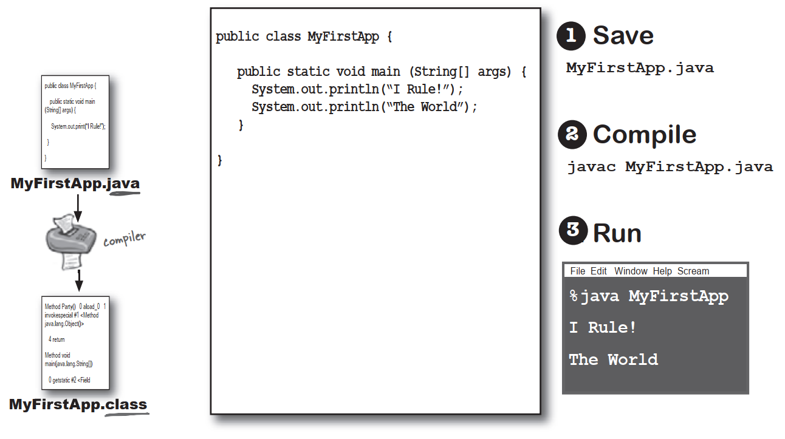

# What can you say in the main method?

Your code can tell the JVM to:

### do something

**Statements**: declarations,assignments,method calls,etc.

```java
int x = 3;
String name = "Dirk";
x = x * 17;
System.out.print("x is " + x);
double d = Math.random();
//this is a comment
```

### do something again and again

**Loops**: for and while

```java
while(x > 12){
    x = x - 1;
}
for(int x = 0;x < 10;x = x + 1){
    System.out.print("x is now "+ x);
}
```

### do something under this condition

**Branching**: if/else tests

```java
if(x == 10){
	System.out.print("x must be 10");
}else{
	System.out.print("x isn't 10");
}
if((x < 3) & (name.equals("Dirk"))){
	System.out.print("Gently");
}
System.out.print("this line runs no matter what");
```

# Syntax

- Each statement must end in a semicolon

  ```java
  x = x + 1;
  ```

- A single-line comment begins with two forward slashes

  ```java
  x = 22;
  //this line disturbes me
  ```

- Most white space doesn't matter

  ```java
  x	=	3;
  ```

- Variables are declared with a **name** and **type**

  ```java
  int weight;
  //type:int, name:weight
  ```

- Classes and methods must be defined within a pair of curly 

  braces

  ```java
  public void go(){
  	//amazing code here
  }
  ```

# Looping and looping and ...

Java has three standard looping constructs: *while*,*do-while*,and *for*. Let's do *while* for now.

The syntax is so simple you're probably asleep already. As long as some condition is true,you do everything inside the loop *block*. The loop block is bounded by a pair of curly braces,so whatever you want to repeat needs to be inside that block.

The key to a loop is the *conditional test*. In Java,a conditional test is an expression that results in a *boolean* value—in other words,something that is either *true* or *false*.

If you say something like,"While *iceCreamInTheTub is true*, keep scooping",you have a clear boolean test. There either *is* ice cream in the tub or there *isn't*. But if you were to say,"While Bob keep scooping",you don't have a real test. To make that work,you'd have to change it to something like,"While Bob is snoring..." or "While Bob is not wearing plaid..."

### Simple boolean tests

You can do a simple boolean test by checking the value of a variable,using a *comparison operator* including:

**<** (less than)
**>** (greater than)
**==** (equality)

Notice the difference between the *assignment* operator and the *equals* operator. Lots of programmers accidentally type = when they *want* ==.

```java
int x = 4;//assign 4 to x
while(x > 3){
    //loop code will run because x is greater than 3
    x = x - 1;//or we'd  loop forever
}
int z = 27;
while(z == 17){
    //loop code will not run because z is not equal to 17
}
```

### **Q**:Why does everything have to be in class?

**A**:Java is an object-oriented language. It's not like old days when you had stream-driven compilers and wrote one monolithic source file with a pile of procedures. A class is  a blueprint for an object,and that nearly everything in Java is an object.

### **Q**:Do I have to put a main in every class I write?

**A**:Nope. A Java program might use dozens of classes,but you might only have *one* with a main method—the one that starts the program running. You might write test classes,though,that have main methods for testing your other classes.

# Conditional branching

In Java,an *if*  test is basically the same as the boolean test in a *while* loop—except instead of saying,"**while** there's still beer...",you'll say,"**if** there's still beer..."

```java
class IfTest{
    public static void main(String[] args){
        int x = 3;
        if(x == 3){
           System.out.println("x must be 3"); 
        }
        System.out.println("This runs no matter what");
    }
}
```

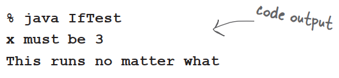

The code above executes the line that prints "x must be 3" only if the condition is true. Regardless of whether it's true,though,the line that prints,"This runs no matter what" will run. So depending on the value of x,either one statement or two will print out.

But we can add an *else* to the condition,so that we can say something like,"If there's still beer,keep coding,else get more beer,and then continue on..."

```java
class IfTest2{
    public static void main(String[] args){
        int x = 2;
        if(x == 3){
           System.out.println("x must be 3"); 
        }else{
        	System.out.println("x is NOT 3"); 
        }
        System.out.println("This runs no matter what");
    }
}
```

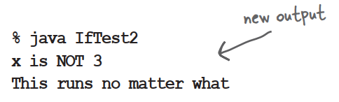

### System.out.**print** vs. System.out.**println**

System.out.**println** inserts a newline while System.out.**print** keeps printing to the same line. If you want each thing you print out to be its own line,use print**ln**. If you want everything to sick together on one line,user print.

# The compiler and the JVM battle over the question,"Who's more important?"

| The Java Virtual Machine                                     | The Compiler                                                 |
| :----------------------------------------------------------- | ------------------------------------------------------------ |
| I'm the guy who actually makes a program *run*. The compiler just gives you a file which doesn't do anything unless I'm there to run it. |                                                              |
|                                                              | But without me,what exactly would you run?There's reason Java was designed to use a bytecode compiler. If Java were a purely interpreted language,where—at runtime—the virtual machine had to translate straight-from-a-text-editor source code,a Java program would run at a ludicrously glacial pace. Java's had a challenging enough time convincing people that it's finally fast and powerful enough for most jobs. |
| If a programmer could just write bytecode by hand,you might be out of a job soon. |                                                              |
|                                                              | That's quite an ignorant perspective. A programmer writing bytecode by hand like doing your word processing by writing raw postscript. And Java is a strongly-typed language,and that means I can't allow variables to hold data of the wrong type. This is a crucial safety feature,and I'm able to stop the vast majority of violations before they ever get to you. |
| But some still get through! I can throw ClassCastExceptions and sometimes I get people trying to put the wrong type of thing in an array that was declared to hold something else. |                                                              |
|                                                              | There are some datatype exceptions that can emerge at runtime,but some of those have to be allowed to support one of Java's other important features—dynamic binding. At runtime,a Java program can include new objects that weren't even known to the original programmer,so I have to allow a certain amount of flexibility. But my job is to stop anything that would never succeed at runtime. Usually I can tell when something won't work,I would detect that and thus protect him from causing harm at runtime. |
|                                                              | I am the first line of defense,as they say. The datatype violations I previously described could wreak havoc in a program if they were allowed to manifest. I am also the one who prevents access violations,such as code trying to invoke a private method,or change a method that—for security reasons—must never be changed. I stop people from touching code they're not meant to see,including code trying to access another class' critical data. |
| I have to do that same stuff too,though,just to make sure nobody snuck in after you and changed the bytecode before running it. |                                                              |
|                                                              | If I didn't prevent what amounts to perhaps 99% of the potential problems,you would grind to a halt. And it looks like we're out of time,so we'll have to revisit this in a later chat. |

