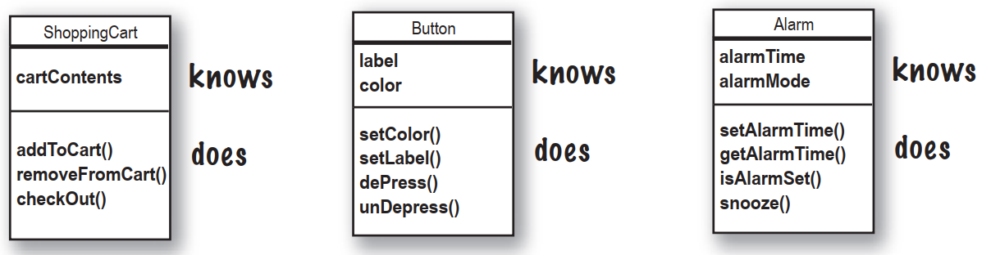
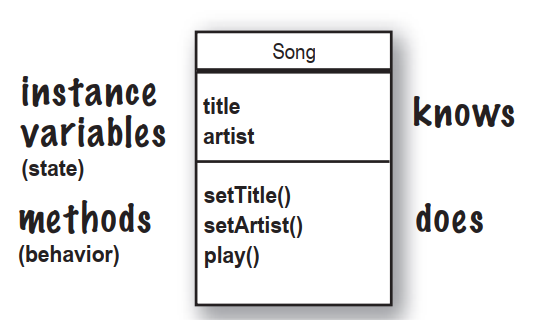
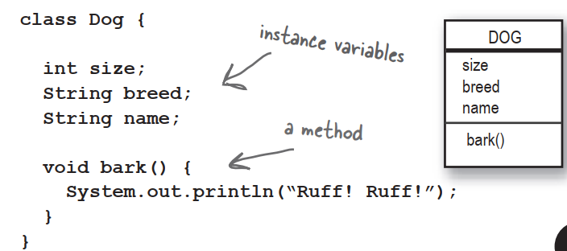
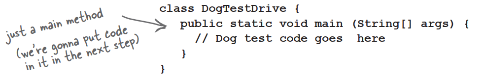
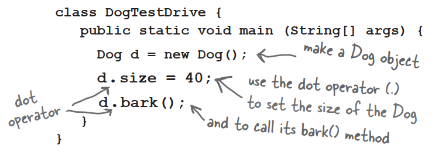

# When you design a class,think about the objects that will be created from that class type. Think about:

- things the object **knows**

- things the object **does**

  

### Things an object  knows about itself are called

- instance variables

### Things an object can do are called

- methods

  

Things an object *knows* about itself are called **instance variables**. They represent an object's state,and can have unique values for each object of that type.

Think of **instance** as another way of saying **Object**.

Things an object can *do* are called **methods**. When you design a class,you think about the data an object will need to know about itself,and you also design the methods that operate on that data. It's common for an object to have methods that read or write the values of the instance variables. For example,Alarm objects have an instance variable to hold the alarmTime,and two methods for getting and setting the alarmTime.

So objects have instance variables and methods,but those instance variables and methods are designed as part of the class.

# What's the difference between a **class** and an **object**?

### A class is not an object.(but it's used to construct them)

**A class is a blueprint for an object**. It tells the virtual machine *how* to make an object of that particular type. Each object made from that class can have its own values for the instance variables of that class. For example,you might use the Button class to make dozens of different buttons,and each button might have its own color,size,shape,label,and so on.

**An object is like one entry in your address book.**

One analogy for objects is a packet of unused Rolodex cards. Each card has the same blank fields. When you fill out a card you are creating an instance,and the entries you make on that card represent its state.

The methods of the class are the things you do to a particular card;getName(),changeName(),setName() could all be methods for class Rolodex.

So,each card can do the same things,but each card *knows* things unique to that particular card.


# Making your first object

So what does it take to create and use an object? You need *two* classes. One class for the type of object you want to use and another class to *test* your new class. The *tester* class is where you put the main method,and in that main() method you create and access objects of your new class type. The tester class has only one job: to *try out* the methods and variables of your new object class type.

- ### Write your class

  

- ### Write a tester (TestDrive) class

  

- In your tester,make an object and access the object's variables and methods

  

# The Dot Operator (.)

### The dot operator gives you access to an object's state and behavior (instance variables and methods).

```java
//make a new object
Dog d = new Dog();

//tell it bark bu using the dot operator on the variable d to call bark()
d.bark();

//set its size using the dor operator
d.size = 40;
```

# Quick!Get out of main!

As long as you're in main(),you're not really in Objectville. It's fine for a  test program to run within the main method,but in a true a OO application,you need objects talking to another objects,as opposed to a static main() method creating and testing objects.

### The two uses of main:

- to **test** your real class
- to **launch/start** your Java **application**

A real Java application is nothing but objects talking to other objects. In this case,*talking* means objects calling methods on one another. 

# Java takes out the Garbage

Each time an object is created in Java,it goes into an area of memory knows as **The Heap**. All objects—no matter when,where,or how they're created—live on the heap. But it's not just any old memory heap;the Java heap is actually called the **Garbage-Collectible Heap**. When you create an object,Java allocates memory space on the heap according to how much that particular object needs. An object with,say,15 instance variables,will probably need more space than an object with only two instance variables. But what happens when you need to reclaim that space? How do you get an object out of the heap when you're done with it? Java manages that memory for you! When the JVM can 'see' that an object can never be used again,that object becomes eligible for garbage collection. And if you're running low on memory,the Garbage Collector will run,throw out the unreachable objects,and free up the space,so that the space can be reused.

### **Q**:What if I need global variables and methods?How do I do that if everything has to go in a class?

**A**:There isn't  a concept of "global" variables and methods in a Java OO program. In practical use,however,there are times when you want a method to be available to any code running in any part of your program. Think of the *random()* method;it's a method that should be callable from anywhere. Or what about a constant like pi? You'll learn that marking a method as *public* and *static* makes it behave much like a "global". Any code,in any class of your application,can access a public static method. And if you mark a variable as *public*,*static*,and *final* - you have essentially made a globally-available constant.

### **Q**:Then how is this object-oriented if you can still make global functions and global data?

**A**:First of all,everything in Java goes in a class. So the constant for pi and the method for *random()*,although both public and static,are defined within the *Math* class. And you must keep in mind that these static things are the exception rather than rule in Java. They represent a very special case,where you don't have multiple instances/objects.

### **Q**:What is a Java program?What do you actually deliver?

**A**:A Java program is a pile of classes. In a Java application,one of the classes must have a main method,used to start-up the program. So as a programmer,you write one or more classes. And those classes are what you deliver. If the end-user doesn't have a JVM,then you'll also need to include that with your application's classes,so that they can run your program. There are a number of installer programs that let you bundle your classes with a variety of JVM's,and put it all on a CD-ROM. Then the end-user can install the correct version of the JVM.

### **Q**:What if I have a hundred classes?Or a thousand?Isn't that a big pain to deliver all those individual files?Can I bundle them into one Application Thing?

**A**:Yes,it would be a big pain to deliver a huge bunch of individual files to your end-users,but you won't have to. You can put all of your application files into a Java Archive - a.jar file - that's based on the pkzip format. In the jar file,you can include a simple text file formatted as something called a manifest,that defines which class in that jar holds the main() method that should run. 

# BULLET POINTS

- Object-oriented programming lets you extend a program without having to touch previously-tested,working code.
- All Java code is defined in a class.
- A class describes how to make an object of that class type. **A class is like a blueprint.**
- An object can take care of itself;you don't have to know or care how the object does it.
- An object **knows** things and **does** things.
- Things an object knows about itself are called **instance variables**. They represent the state of an object.
- Things an object does are called **methods**. They represent the behavior of an object.
- When you create a class,you may also want to create a separate test class which you'll use to create objects of your new class type.
- A class can **inherit** instance variables and methods from a more abstract **superclass**.
- At runtime,a Java program is nothing more than objects "talking" to other objects.