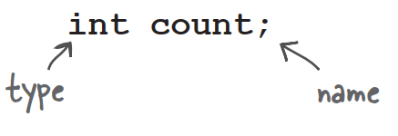
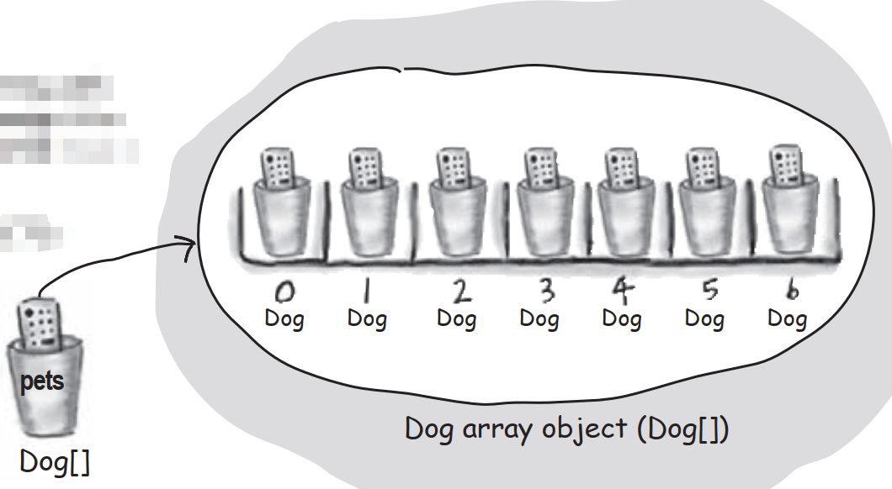

# Declaring a variable

**Java cares about type.** It won't let you do something bizarre and dangerous like stuff a Giraffe reference into a Rabbit variable——what happens when someone tries to ask the so-called Rabbit to hop()?And it won't let you put a floating point number into an integer variable,unless you *acknowledge to the compiler* that you know you might lose precision.

The compiler can spot most problems:

**Rabbit hopper = new Giraffe();**

Don't expect that to compile.

For all this type-safety to work,you must declare the type of your variable. Is it an integer?a Dog?A single character?Variables come in two flavors: *primitive* and *object reference*. Primitives hold fundamental values including integers,booleans,and floating point numbers. Object references hold,well,*references* to *objects*.

We'll look at primitives first and then move on to what an object reference really means. But regardless of the type,you must follow two declaration rules:

------

### 
variables must have a **type**

------

Besides a type,variable needs a name,so that you can use that name in code.

------

### 
variables must have **name**

------

# "I'd like a double mocha,no,make it an int."

When you think of Java variables,think of cups. Coffee cups,tea cups,giant cups that hold lots and lots of beer,those big cups the popcorn comes in at the movies,cups with curvy,sexy handles,and cups with metallic trim that you learned can never,ever go in the microwave.

**A variable is just a cup. A container. It holds something.**

It has a size,and a type. In this chapter,we're going to look first at the variables that hold **primitives**,then a little later we'll look at cups that hold *references to objects*. Stay with us here on the whole cup analogy—as simple as it is right now,it'll give us a common way to look at things when the discussion gets more complex. And that'll happen soon.

Primitives are like the cups they have at the coffeehouse. If you're been to a Starbucks,you know what we're talking about here. They come in different sizes,and each has a name like 'short','tall'.,and,"I'd like a 'grande' mocha half-caff with extra whipped cream".

You might see the cups displayed on the counter,so you can order appropriately:

And in Java,primitives come in different sizes,and those sizes have names. When you declare a variable in Java,you must declare it with a specific type. The four containers here are for the four integer primitives in Java.

Each cup holds a value,so for Java primitives,rather than saying,"I'd like a tall french roast",you say to the compiler,"I'd like an int variable with the number 90 please." Except for one tiny difference...in Java you also have to give your cup a name. So it's actually,"I'd like an int please,with the value of 2486,and name the variable *height*." Each primitive variable has a fixed number of bits. The sizes of the six numeric primitives in Java are shown below:

# Primitive Types

| Type                        | Bit Depth    | Value Range               |
| --------------------------- | ------------ | ------------------------- |
| **boolean and char**        |              |                           |
| boolean                     | JVM-specific | **true** or **false**     |
| char                        | 16 bits      | 0 to 65535                |
| **numeric(all are signed)** |              |                           |
| **integer**                 |              |                           |
| byte                        | 8 bits       | -128 to 127               |
| short                       | 16 bits      | -32768 to 32767           |
| int                         | 32 bits      | -2147483648 to 2147483647 |
| long                        | 64 bits      | -huge to huge             |
| **floating point**          |              |                           |
| float                       | 32 bits      | varies                    |
| double                      | 64 bits      | varies                    |

Gotta have "f" with a float,because Java thinks anything with a floating point is a double,unless you use "f".

# You really don't want to spill that...

**Be sure the value can fit into the variable.**

You can't put a large value into a small cup.

The compiler tries to help prevent *spillage* if it can tell from your code that something's not going to fit in the container you're using.

Why doesn't this work? After all,the value of x is 24,and 24 is definitely small enough to fit into a byte. You know that,and we know that,but all compiler cares about is that you're trying to put a big thing into a small thing,and there's the possibility of spilling. Don't expect the compiler to know what the value of x is,even if you happen to be able to see it literally in your code.

**You can assign a value to a variable in one of several ways including:**

- type a literal value after the equals sign
- assign the value of one variable to another
- use an expression combining the two

# Back away from that keyword!

You know you need a name and a type for your variables.

**But what can you use as names?**The rules are simple. You can name a class,method,or variable according to the following rules:

- **It must start with a letter,underscore,or dollar sign. You can't start a name with a number.**
- **After the first character,you can use numbers as well. Just don't start it with a number.**
- **It can be anything you like,subject to those two rules,just so long as it isn't one of Java's reserved words,are keywords that the compiler recognizes. **

And if you really want to play confuse-compiler,then just try using a reserved word as a name.

# Controlling your Dog object

You know how to declare a primitive variable and assign it a value. But now what about non-primitive variables?In other words,what about objects?

------

- ### There is actually no such thing as an **Object** variable.

- ### There's only an object **reference** variable.

- ### An object reference variable holds bits that represent a way to access an object.

- #### It doesn't hold the object itself,but it holds something like a pointer. Or an address. Except,in Java we don't really know what is inside a reference variable. We do know that whatever it is,it represents one and only one object. And the JVM knows how to use the reference to get to the object.

------

You can't stuff an object into a variable. We often think of it that way...we say things like,"I passed the String to the System.out.println() method." Or,"The method returns a Dog",or,"I put a new Foo object into variable named myFoo."

But that's not what happens. There aren't giant expandable cups that can grow to the size of any object. Objects live in one place and one place only—the garbage collectible heap!

Although a primitive variable is full of bits representing the actual **value** of the variable,an object reference variable is full of bits representing **a way to get to the object**.

You use the dot operator on a reference variable to say,"user the thing before the dot to get me the thing after the dot."For example:

`myDog.bark();`

means,"use the object referenced by the variable myDog to invoke the bark() method." When you use the dot operator on an object reference variable,think of it like pressing a button on the remote control for that object.

# An object reference is just another variable value.

### Something that goes in a cup.

### Only this time,the value is a remote control.

------

**Primitive Variable**

`byte x = 7;`

The bits representing 7 go into the variable.

------

**Reference Variable**

`Dog myDog = new Dog();`

The bits representing a way to get to the Dog object go into the variable.

**The Dog object itself does not go into the variable!**

# The 3 steps of object declaration,creation and assignment

### Declare a reference variable

**Dog myDog** = new Dog();

Tells the JVM to allocate space for a reference variable,and names that variable myDog. The reference variable is,forever,of type Dog. In other words,a remote control that has buttons to control a Dog,but not a Car or a Button or a Socket.

### Create an object

Dog myDog = **new Dog();**

Tells the JVM to allocate space for a new Dog object on the heap.

### Link the object and the reference

Dog myDog **=** new Dog();

Assigns the new Dog to the reference variable myDog. In other words,**programs the remote control.**

### **Q**:How big is a reference variable?

**A**:You don't know. Unless you're cozy with someone on the JVM's development team,you don't know how a reference is represented. There are pointers in there somewhere,but you can't access them. You won't need to. But when you're talking about memory allocation issues,your Big Concern should be about how many objects you're creating,and how big they really are.

### **Q**:So,does that mean that all object references are the same size,regardless of the size of the actual objects to which they refer?

**A**:Yep. All references for a given JVM will be the same size regardless of the objects they reference,but each JVM might have a different way of representing references,so references on one JVM may be smaller or larger than references on another JVM.

### **Q**:Can I do arithmetic on a reference variable,increment it,you know-C stuff?

**A**:Nope. Say it with me again,"Java is not C".

# Life on the garbage-collectible heap

`Book b = new Book();`

`Book c = new Book();`

Declare two Book reference variables. Create two new Book objects. Assign the Book objects to the reference variable.

The two Book objects are now living on the heap.

References:2

Objects:2

------

`Book d = c;`

Declare a new Book reference variable. Rather than creating a new,third Book object,assign the value of variable c to variable d. But what does this mean? It's like saying,"Take the bits in c,make a copy of them,and stick that copy into d."

**Both c and d refer to the same object.**

**The c and d variables hold two different copies of the same value. Two remotes programmed to one TV.**

References:3

Objects:2

------

`c = b;`

Assign the value of variable b to variable c. By now you know what this means. The bits inside variable b are copied,and that new copy is stuffed into variable c.

**Both b and c refer to the same object.**

References:3

Objects:2

# Life and death on the heap

`Book b = new Book();`

`Book c = new Book();`

Active References:2

Reachable Objects:2

------

`b = c;`

**Object 1 is abandoned and eligible for Garbage Collection(GC).**

Active References:2

Reachable Objects:1

Abandoned Objects:1

The first object that b referenced,Object 1,has no more references, It's unreachable.

------

`c = null;`

Assign the value *null* to variable c. This makes c a null reference,meaning it doesn't refer to anything. But it's still a reference variable,and another Book object can still be assigned to it.

**Object 2 still has an active reference(b),and as long as it does,the object is not eligible for GC.**

Active References:1

null References:1

Reachable Objects:1

Abandoned Objects:1

# An array is like a tray of cups

### Declare an int array variable. An array variable is a remote control to an array object.

`int[] nums;`

### Create a new int array with a length of 7,and assign it to the previously-declared *int[]* variable *nums*.

`nums = new int[7];`

### Give each element in the array an int value. Remember,elements in an int array are just int variables.

`nums[0] = 6;`

`nums[1] = 19;`

`nums[2] = 44;`

`nums[3] = 42;`

`nums[4] = 10;`

`nums[5] = 20;`

`nums[6] = 1;`

# Arrays are objects too

Every element in an array is just a variable. In other words,one of the eight primitive variable types or a reference variable. Anything you would put in a variable of that type can be assigned to an array element of that type.

**Arrays are always objects,whether they're declared to hold primitives or object references.** But you can have an array object that's declared to hold primitive values. In other words,the array object can have element which are primitives,but the array itself is never a primitive. Regardless of what the array holds,the array itself always an object!

# Make an array of Dogs

### Declare a Dog array variable

`Dog[] pets;`

### Create a new Dog array with a length of 7,and assign it to the previously-declared *Dog[]* variable *pets*

`pets = new Dog[7];`

------

### Create new Dog objects,and assign them to the array elements.

**Remember,elements in a Dog array are just Dog reference variables. We still need Dogs!**

`pets[0] = new Dog();`

`pets[1] = new Dog();`

# Control your Dog(with a reference variable)

`Dog fido = new Dog();`

`fido.name = "Fido";`

We declare a Dog object and used the dot operator on the reference variable fido to access the name variable.

We can usre the fido reference to get the dog to bark() or eat() or chaseCat().

`fido.bark();`

`fido.chaseCat();`

# What happens if the Dog is in a Dog array?

We know we can access the Dog's instance variables and methods using the dot operator,but on what?

When the Dog is in an array,we don't have an actual variable name. Instead we use array notation and push the remote control button on an object at a particular index in the array:

`Dog[] myDogs = new Dog[3];`

`myDogs[0] = new Dog();`

`myDogs[0].name = "Fido";`

`myDogs[0].bark();`

### Java cares about type.

**Once you've declared an array,you can't put anything in it except things that are of the declared array type.**

# Bullet Points

- Variable come in two flavors: primitive and reference
- Variable must always be declared with a name and a type
- A primitive variable value is the bits representing the value
- A reference variable value is the bits representing a way to get to an object on the heap
- A reference variable is like a remote control. Using the dot operator on a reference variable is like pressing a button on the remote control to access a method or instance variable
- A reference variable has a value of null when it is not referencing any object
- An array is always an object,even if the array is declared to hold primitives. There is no such thing as a primitive array,only an array that holds primitives.