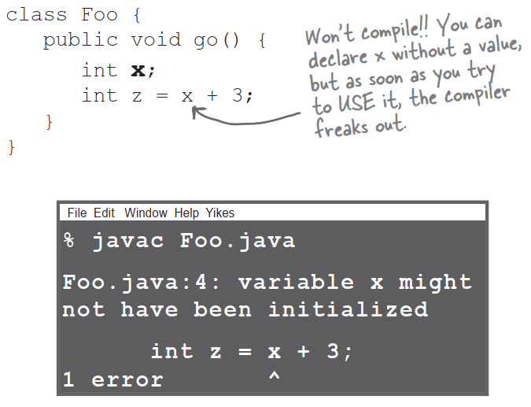
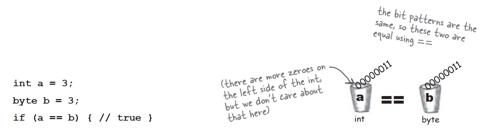
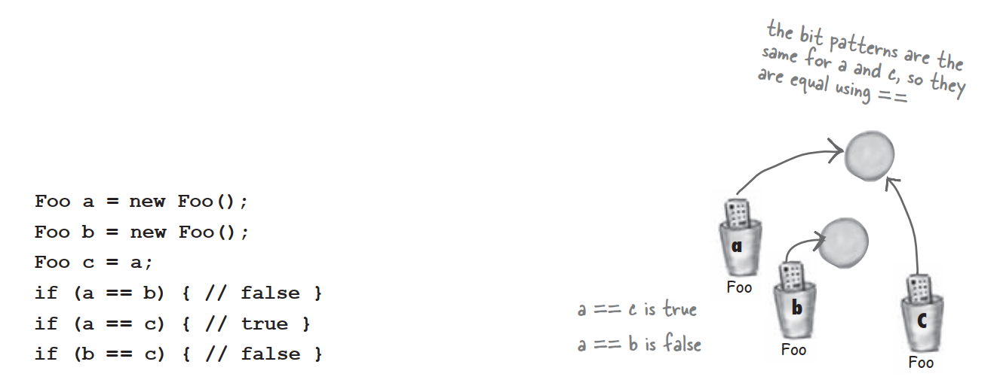

# Remember: a class describes what an object <u>knows</u> and what an object <u>does</u>

**A class is the blueprint for an object.** When you write a class,you're describing how the JVM should make an object of that type. You already know that every object of that type can have different *instance variable* values. But what about the methods?


**Can every object of that type have different method behavior?**

Every instance of a particular class has the same methods,but the methods can *behave* differently based on the value of the instance variables.

The Song class has two instance variables,*title* and *artist*. The play() method plays a song,but the instance you call play() on will play the song represented by the value of the *title* instance variable for that instance. So,if you call the play() method on one instance you'll hear the song "Politik",while another instance plays "Darkstar". The method code,however,is the same.

```java
void play(){
	soundPlayer.playSound(title);
}
```

```java
Song t2 = new Song();
t2.setArtist("Travis");
t2.setTtile("Sing");
Song t3 = new Song();
s3.setArtist("Sex Pistols");
t2.setTtile("My Way");
```


# The size affects the bark

A small Dog's bark is different from a big Dog's bark. The Dog class has an instance variable *size*,that the *bark()* method uses to what kind of bark sound to make.

```java
class Dog{
	int size;
	String name;

	void bark(){
		if(size > 60){
			System.out.println("Wooof!Wooof!");
		}else if(size > 14){
			System.out.println("Ruff!Ruff!");
		}else{
			System.out.println("Yip!Yip!");
		}
	}
}
```

# You can send things to a method

Just as you expect form any programming language,you can pass values into your methods. You might,for example,want to tell a Dog object how many times to bark by calling:

`d.bark(3);`

Depending on your programming background and personal preferences,you might use the *arguments* to perhaps *parameters* for the values passed into a method. Although there are formal computer science distinctions that people who wear lab coats and who will almost certainly not read this book,make,we have bigger fish to fry in this book. So you can call them whatever you like but we're doing it like this:

**A method <u>uses</u> parameters. A caller <u>passes</u> arguments.**

Arguments are the things you pass into the methods. An **argument** lands face-down into a... wait for it... **parameter**. And a parameter is nothing more than a local variable. A variable with a type and a name,that can be used inside the body of the method.

But here's the important part: **If a method takes a parameter,you must pass it something.** And that something must be a value of the appropriate type.


# You can get things back from a method

Methods can return values. Every method is declared with a return type,but until now we've made all of our methods with a **void** return type,which means they don't give anything back.

```java
void go(){

}
```

But we can declare a method to give a specific type of value back to the caller,such as:

```java
int giveSecret(){
	return 42;
}
```

If you declare a method to return a value,you must return a value of the declare type!

**Whatever you say you'll give back,you better give back!**


# You can send more than one thing to a method

Methods can have multiple parameters. Separate them with commas when you declare them,and separate the arguments with commas when you pass them. Most importantly,if a method has parameters,you must pass arguments of the right type and order.

### Calling a two-parameter method,and sending it two arguments.


### You can pass variables into a method,as long as the variable type matches the parameter type.


# Java is pass-by-<u>value</u>.

# That means pass-by-<u>copy</u>.


### **Q**:What happens if the argument you want to pass if an object instead of a primitive?

**A**:Java passes everything by value. **Everything.** But...value means bits inside the variable. And remember,you don't stuff objects into variables;the variable is a remote control—a reference to an object. So if you pass a reference to an object into a method,you're passing a copy of the remote control. Stay tuned,though,we'll have lots more to say about this.

### **Q**:Can a method declare multiple return values?Or is there some way to return more than one value?

**A:**Sort of. A method can declare only one return value. But...if you want to return,say,three int values,then the declared return type can be an in array. Stuff those ints into the array,and pass it on back. It's a little more involved to return multiple values with different types;we'll be talking about that in a later chapter when we talk about ArrayList.

### **Q:**Do I have to return the exact type I declared?

**A:**You can return anything that can be implicitly promoted to that type. So,you can pass a byte where an int it expected. The caller won't care,because the byte fits just fine into the int the caller will use for assigning the result. You must use an explicit cast when the declared type is smaller than what you're trying to return.

### **Q:**Do I have to do something with the return value of a method?Can I just ignore it?

**A:**Java doesn't require you to acknowledge a return value. You might want to call a method with a non-void return type,even though you don't care about the return value. In this case,you're calling the method for the work it does inside the method,rather than for what the method gives returns. In Java,you don't have to assign or use the return value.

# Bullet Points

- Classes define what an object knows and what an object does.
- Things an object knows are its **instance variables**(state).
- Things an object does are its **method**(behavior).
- Methods can use instance variables so that objects of the same type can behave differently.
- A method can have parameters,which means you can pass one or more values in to the method.
- The number and type of the values you pass in must match the order and type of the parameters declared by the method.
- Values passed in and out of methods can be implicitly to a large type re explicitly cast to a smaller type.
- The value you pass as an argument to a method can be a literal or variable of the declared parameter type.
- A method must declare a return type. A void return type means the method doesn't return anything.
- If a method declares a non-void return type,it must return a value compatible with the declared return type.

# Cool things you can do with parameters and return types

Now that we've seen how parameters and return types work,it's time to put them to good use: **Getters** and **Setters**. If you're into being all formal about it,you might prefer to call them *Accessors* and *Mutators*. But that's a waste of perfectly good syllables. Besides,Getters and Setters fits the Java naming convention,so that's what we'll call them.

Getters and Setters let you,well,*get and set things*. Instance variable values,usually. A Getter's sole purpose in life is to send back,as a return value,the value of whatever it is that particular Getter is supposed to be Getting. And by now,it's probably no surprise that a Setter lives and breathes for the chance to take an argument value and use it to set the value of an instance variable.

# Encapsulation

### Do it or risk humiliation and ridicule.

Until this most important moment,we're been committing one of the worst OO faux pas. No,we're talking Faux Pas with a capital 'F'. And 'P'.

Here we are,just humming along without a care in the world leaving our data out there for anyone to see and even touch.

You may have already experienced that vaguely unsetting feeling that comes with leaving your instance variables exposed. Exposed means reachable with the dot operator,as in:

`theCat.height = 27;`

Think about this idea of using our remote control to make a direct change to the Cat object's size instance variable. In the hands of the wrong person,a reference variable is quite a dangerous weapon. Because what's to prevent:

`theCat.height = 0;`

This would be a Bad Thing. We need to build setter methods for all the instance variables,and find a way to force other code to call the setters rather than access the data directly.


# Hide the data

Yes it is that simple to go from an implementation that's just begging for bad data to one that protects your data and protects your right to modify your implementation later. OK,so how exactly do you hide the data?With the **public** and **private** access modifiers. You're familiar with **public**-we use it with every main method. Here's an encapsulation starter rule of thumb: mark your instance variables **private** and provide **public** getters and setters for access control. When you have more design and coding savvy in Java,you will probably do things a little differently,but for now,this approach will keep you safe.

### Mark instance variables **private**.

### Mark getters and setters **public**.

# Encapsulating the GoodDog class


### **Any place where a particular value can be used,a method call that returns that type can be used.**

**instead of:**
`int x = 3 + 24;`
**you can say:**
`int x = 3 + one.getSize();`

# How do objects in an array behave?

Just like any other object. The only difference is how you get to them. In other words,how you get the remote control. Let's try calling methods on Dog objects in an array.

### Declare and create a Dog array,to hold 7Dog references.

```java
Dog[] pets;
pets = new Dog[7];
```


------

### Create two new Dog objects,and assign them to the first two array elements.

```java
pets[0] = new Dog();
pets[1] = new Dog();
```

### Call methods on the two Dog objects.

```java
pets[0].setSize(30);
int x = pets[0].getSize();
pets[1].setSize(8);
```


# Declaring and initializing instance variables

You already know that a variable declaration needs at least a name and a type:

```java
int size;
String name;
```

And you know that you can initialize to the variable at the same time:

```java
int size = 420;
String name = "Donny";
```

But when you don't initialize an instance variable,what happens when you can a getter method? In other words,what is the value of an instance variable before you initialize it?


### Instance variables always get a default value. If you don't explicitly assign a value to an instance variable,or you don't call a setter method,the instance variable still has a value!

| type            | default value |
| --------------- | ------------- |
| integers        | 0             |
| floating points | 0.0           |
| booleans        | false         |
| references      | null          |

# The difference between instance and local variables

- **Instance** variables are declared <u>inside a class</u> but not within a method.

  ```java
  class Horse{
  	private double height = 15.2;
  	private String breed;
  }
  ```

- **Local** variables are declared <u>within a method</u>.

  ```java
  class AddThing{
  	int a;
  	int b = 12;
  	public int add(){
  		int total = a + b;
  		return total;
  	}
  }
  ```

- **Local** variables <u>MUST be initialized</u> before use!

  

### Local variables do NOT get a default value!The compiler complains if you try to use a local variable <u>before</u> the variable is initialized.

### **Q:**What about method parameters?How do the rules about local variables apply to them?

**A:**Method parameters are virtually the same as local method. But method parameters will never be uninitialized,so you'll never get a compiler error telling you that a parameter variable might not have been initialized. But that's because the compiler will give you an error if you try to invoke a method without sending arguments that the method needs. So parameters are ALWAYS initialized,because the compiler guarantees that methods are always called with arguments that match the parameters declared for the method,and the arguments are assigned to the parameters.

# Comparing variables(primitives ort references)

Sometimes you want to know if two *primitives* are same. That's easy enough,just use the == operator. Sometimes you want to know if two reference variables refer to a single object on the heap. Easy as well,just use the == operator. But sometimes you want to know if two *objects* are equal. And for that,you need the .equals() method. The idea of equality for objects have the same characters,they are meaningfully equivalent,regardless of whether they are two distinct objects on the heap. But what about a Dog?Do you want to treat two Dogs as being equal if they happen to have the same size and weight?Probably not. So whether two different objects should be treated as equal depends on what makes sense for that particular object type. We'll explore the notion of object equality again in later chapters,but for now,we need to understand that the == operator is used *only* to compare the bits in two variables. What those bits represent doesn't matter. The bits are either the same,or they're not.

**To compare two primitives,use the == operator.**

The == operator can be used to compare two variables of any kind,and it simple compares the bits.

If (a == b){...} looks at the bits in a and b and returns true if the bits pattern is the same.



**To see if two references are the same(which means they refer to the same object on the heap) use the == operator.**

Remember,the == operator cares only about the pattern of bits in the variable. The rules are the same whether the variable is a reference or primitives. So the == operator returns true if two reference variables refer to the same object!In that case,we don't know what the bit pattern is but we do know that whatever it looks like,*it will be the same for two references to a single object*.



### Use == to compare two primitives,or to see if two references refer to the same object.

### Use the equals() method to see if two different objects are equal.