# Let's build a Battleship-style game:"Sink a Dot Com"

**You're going to build the Sink a Dot Come game,with a 7 x 7 grid and three Dot Coms. Each Dot Com takes up three cells.**

# First,a high-level design

We know we'll need classes and methods,but what should they be?To answer that,we need more information about what the game should go.

First,we need to figure out the general flow of the game. Here's the basic idea:

- 1、Users starts the game
  - A、Game creates three Dot Coms
  - B、Game places the three Dot Coms onto a virtual grid
- 2、Game paly begins
  - Repeat the following until three are no more Dot Coms:
    - A、Prompt user for a guess
    - B、Check the user guess against all Dot Coms to look for a hit,miss,or kill. Take appropriate action: if a hit,delete cell. If a kill,delete Dot Com.
- 3、Game finishes
  - Give the user a rating based on the number of guesses.

Now we have an idea of the kinds of things the program needs to do. The next step is figuring out what kind of **objects** we'll need to do the work. Remember,think like Brad rather than Larry;focus first on the **things** in the program rather than the **procedures**.


# The "Simple Dot Com Game" a gentler introduction

- **Game starts**,and creates ONE DotCom and gives it a location on three cells in the single row of seven cells.

  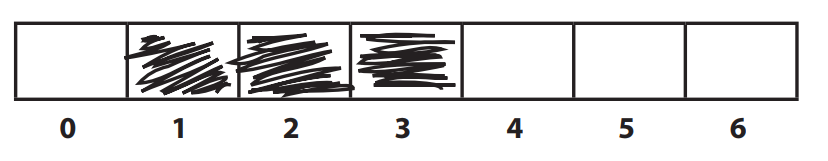

- **Game play begins.** Prompt user for a guess,then check to see if it hit any of the DotCom's three cells. If a hit,increment the numOfHits variable.

- **Game finishes** when all three cells have been hit,and tells the user how many guesses it took to sink the DotCom.

# Developing a Class

When we create a Java class as a "learning experience",we usually do it like this:

- Figure out what the class is supposed to do.
- List the **instance variables and methods.**
- Write **prepcode** for the methods.
- Write **test code** for the methods.
- **Implement** the class.
- **Test** the methods.
- **Debug** and **reimplement** as needed.
- Express gratitude that we don't have to test our so-called learning experience app on actual live users.

# The three things we'll write for each class:

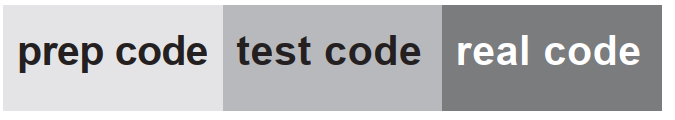

This bar is displayed on the next set of pages to tell you which part you're working on. 

### prep code

A form of pseudocode,to help you focus on the logic without stressing about syntax.

### test code

A class or methods that will test the real code and validate that it's doing the right thing.

### real code

The actual implementation of the class.

# SimpleDotCom class prep code

You'll get the idea of how prepcode works as you read through this example. It's sort of half-way between real Java code and a plain English description of the class. Most prepcode includes three parts: instance variable declarations,method declarations,method logic. The most important part of prepcode is the method logic,because it defines what has to happen,which we later translate into how,when we actually write the method code.

**DECLARE** an **int array** to hold the location cells. Call it **locationCells**.

**DECLARE** an **int** to hold the number of hits. Call it **numOfHits** and **SET** it to 0.

------

**DECLARE** a **checkYourself()** method that takes a **String** for the user's guess,check it,and returns a result representing a "hit",or "kill".

**DECLARE** a **setLocationCells()** setter method that takes an **int array**.

------

**METHOD**: **String checkYourself(String userGuess)**

​	**GET** the user guess as a String parameter

​	**CONVERT** the user guess to an **int**

​	**REPEAT** with each of the location cells in the **int** array

​			//**COMPARE** the user guess to the location cell

​			**IF** the user guess matches

​					**INCREMENT** the number of hits

​					//**FIND OUT** if it was the last location cell:

​					**IF** number of hits is 3,**RETURN** "kill" as the return

​					**ELSE** it was not a kill,so **RETURN** "hit"

​					END IF

​					**ELSE** the user guess did not match,so **RETURN** "miss"

​			END IF

​	END REPEAT

END METHOD


**METHOD**: **void setLocationCells(int[] cellLocations)**

​		**GET** the cell locations as **int array** parameter

​		**ASSIGN** the cell locations parameter to the cell locations instance variable

END METHOD

# Writing the method implementations

### let's write the real method code now,and get this puppy working

Before we start coding the methods,though,let's back up and write some code to test the methods. That's right,we're writing the test code before there's anything to test!

The concept of writing the test code first is one of the practices of Extreme Programming(XP),and it can make it easier for you to write code. We're not necessarily saying you should use XP,but we do like the part about writing tests first. And XP just sounds cool.

### Extreme Programming(XP)

Extreme Programming(XP) is a newcomer to the software development methodology world. Considered by many to be "the way programmers really want to work",XP emerged in the late 90's and has been adopted by companies ranging from the two-person garage shop to the Ford Motor Company. The thrust of XP is that the customer gets what he wants,when he wants it,even when the spec changes late in the game.

XP is based on a set of proven practices that are all designed to work together,although many folks do pick and choose,and adopt only a portion of XP's rules. These practices include things like:

Make small,but frequent,releases.

Develop in iteration cycles.

Don't put in anything that's not in the spec.

Write the test code first.

No killer schedules;work regular hours.

Refactor whenever and wherever you notice the opportunity.

Don't release anything until it passes all the tests.

Set realistic schedules,based around small releases.

Keep it simple.

Program in pairs,and move people around so that everybody knows pretty much everything about the code.

# Writing test code for the SimpleDotCom class

We need to write test code that can make a SimpleDotCom object and run its methods. For the SimpleDotCom class,we really care about only the checkYourself() method,although we will have to implement the setLocationCells() method in order to get the checkYourself() method to run correctly.

 Take a good look at the prepcode. Then ask yourself,"If the checkYourself() method were implemented,what test code could I write that would prove to me the method is working correctly?"

### Here's what we should test:

1. Instantiate a SimpleDotCom object.
2. Assign it a location.
3. Create a String to represent a user guess.
4. Invoke the checkYourself() method passing it the fake user guess.
5. Print out the result to see if it's corret.

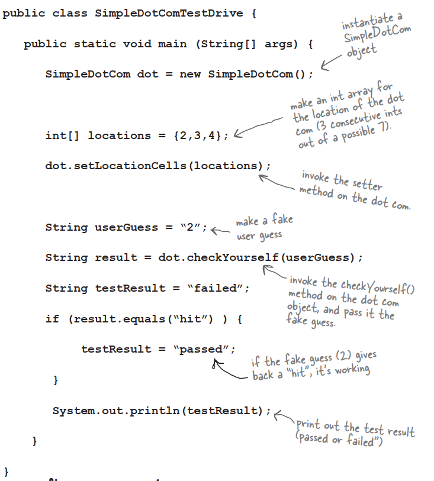

### **Q**:Maybe I'm missing something here,but how exactly do you run a test on something that doesn't yet exist!?

**A**:You don't. We never said you start by running the test;you start by writing the test. At the time you write the test code,you won't have anything to run it against,so you probably won't be able to compile it until you write 'stub' code that can compile,but that will always cause the test to fail.

### **Q**:Then I still don't see the point. Why not wait until the code is written,and then whip out the test code?

**A**:The act of thinking through the test code helps clarify your thoughts about what the method itself needs to do. As soon as your implementation code is done,you already have test code just waiting to validate it. Besides,you know if you don't do it now,you'll never do it. There's always something more interesting to do. Ideally,write a little test code ,then write only the implementation code you need in order to pass that test. Then write a little more test code and write only the new implementation code needed to pass that new test. At each test iteration,you run all the previously-written tests,so that you always prove that your latest code additions don't break previously-tested code.

# The checkYourself() method

There isn't a perfect mapping from perpcode to javacode;you'll see a few adjustments. The prepcode gave us a much better idea of what the code needs to do,and now we have to find the Java code that can do the how.

In back of your mind,be thinking about parts of this code you might want to improve. The numbers are for things you haven't seen yet. They're explained on the opposite page.

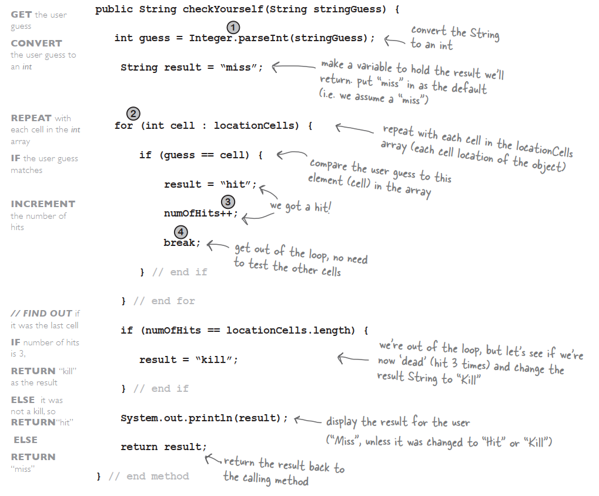

# Just the new stuff

The things we haven't seen before are on this page. Stop worrying! The rest of the details are at the end of the chapter. This is just enough to let you keep going.

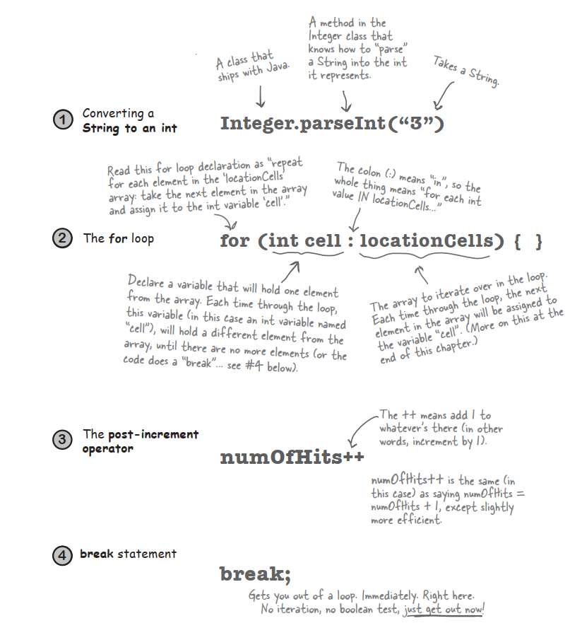

### **Q**:What happens in Integer.parseInt() if the thing you pass isn't a number?And does it recognize spelled-out numbers,like "three"? 

**A**:Integer.paeseInt() works only on Strings that represent the ascii values for digits (0,1,2,3,4,5,6,7,8,9). If you try to parse something like "two" or "blurp",the code will blow up at runtime.

### **Q**:In the beginning of the book,there was an example of a for loop that was really different from this one—are there two different styles of for loops?

**A**:Yes! From the first version of Java there has been a single kind of for loop that looks like this:

```java
for(init i=0;i<10;i++){
	//do something 10 times
}
```

You can use this format for any kind of for loop you need. But...beginning with Java 5.0,you can also use enhanced for loop when your loop needs to iterate over the elements in an array. You can always use the plain old for loop to iterate over an array,but the enhanced for loop makes it easier.

# Prepcode for the SimpleDotComGame class

# Evrything happens in main()

There are some things you'll have to take on faith. For example,we have one line of prepcode that says,"Get user input from command-line". Let me tell you,that's a little more than we want to implement from search right now. But happily,we're using OO. And that means you get to ask some other class/object to do something for you,without worrying about how it does it. When you write prepcode,you should assume that somehow you'll be able to do whatever you need to do,so you can put all your brainpower into working out the logic.

# Bullet Points

- Your Java program should start with a high-level design.
- Typically you'll write three things when you create a new class:
  - **prepcode**
  - **testcode**
  - **real**
- Prepcode should describe what to do,not how to do it. Implementation comes later.
- User the prepcode to help design the test code.
- Write test code before you implement the methods.
- Choose for loops over while loops when you know many times you want to repeat the loop code.
- Use the pre/post increment operator to add 1 to a variable(x++)
- Use the pre/post decrement to subtract 1 from a variable(x--;)
- Use **Integer.parseInt()** to get the int value of a String.
- **Integer.parseInt()** works only if the String represents a digit.
- Use break to leave a loop early.

# random() and getUserInput()

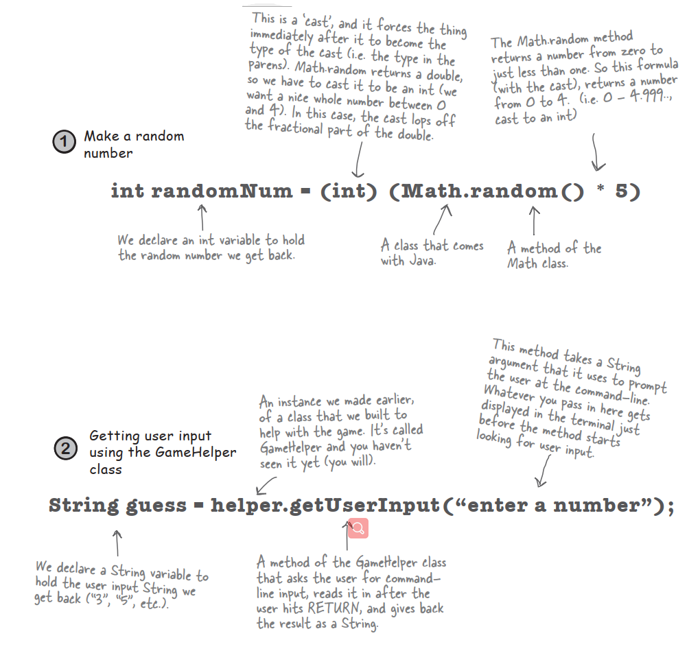

# One last class: GameHelper

**We made the dot com class.**

**We made the game class.**

**All that's left is the helper class** —the one with the getUserInput() method. The code to get command-line input is more than we want to explain right now. It opens up way too many topics best left for later.

# More about <u>for</u> loops

We've covered all the game code for this chapter. We didn't want to interrupt your work with some of the details and background info,so we put it back here. We'll start with the details of for loops.

### Regular (non-enhanced) for loops

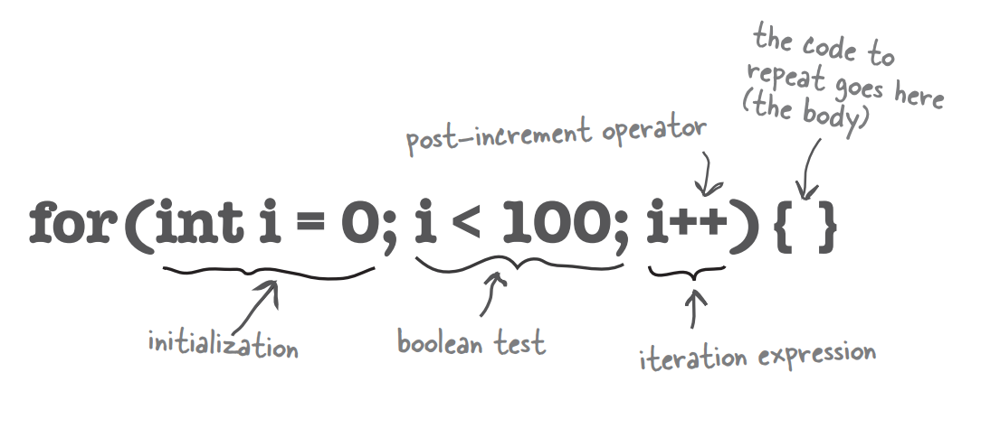

**What it means in plain English**: "Repeat 100 times."

**How the compiler sees it:**

- create a variable i and set it to 0
- repeat while i is less than 100
- at the end of each loop iteration,add 1 to i

**Part One: initialization**

Use this part to declare and initialize a variable to use within the loop body. You'll most often use this variable as a counter. You can actually initialize more than one variable here,but we'll get to that later in the book.

**Part Two: boolean test**

This is where the conditional test goes. Whatever's in there,it must resolve to a boolean value. You can have a test,like,or you can even invoke a method that returns a boolean.

**Part Three: iteration expression**

In this part,put one or more things you want to happen with each trip through the loop. Keep in mind that this stuff happens at the end of each loop.

# Trip through a loop

```java
for(int i=0;i<8;i++){
	System.out.println(i);
}
System.out.println("done");
```

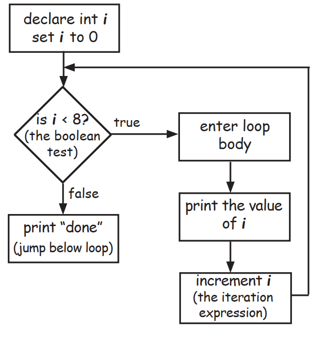

# Difference between <u>for</u> and <u>while</u>

A while loop has only the boolean test;it doesn't have a built-in initialization or iteration expression. A while loop is good when you don't know how many times to loop and just want to keep going while some condition is true. But if you know how many times to loop,a for loop is cleaner. Here's the loop above rewritten using while:

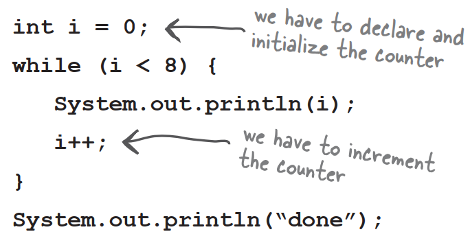

### ++  --

**Pre and Post Increment/Decrement Operator**

The shortcut for adding or subtracting 1 from a variable.

**x++;**

is the same as:

**x = x + 1;**

They both mean the same thing in this context:"add 1 to the current value of x" or "*increment* x by 1"

And:

**x--;**

is the same as:

**x = x - 1;**

Of course that's never the whole story. The placement of the operator can affect the result. Putting the operator before the variable,means,"first,increment x by 1,and then use this new value of x." This only matters when the ++x is part of some larger expression rather than just in a single statement.

```java
int x = 0;
int z = ++x;
```

produces: x is 1,z is 1

But putting the ++ after the give you a different result:

```java
int x = 0;
int z = x++;
```

produces: x is 1,but z is 0! z gets the value of x and then x is incremented.

# The <u>enhanced</u> for loop

Beginning with Java 5.0,the Java language has a second kind of for loop called the *enhanced for*,that means it easier to iterate over all the elements in an array or other kinds of collections. That's really all that the enhanced for gives you—a simpler way to walk through all the elements in the collection,but since it's the most common use of a for loop,it was worth adding it to the language. We'll revisit the enhanced for loop in the next chapter,when we talk about collections that aren't arrays.

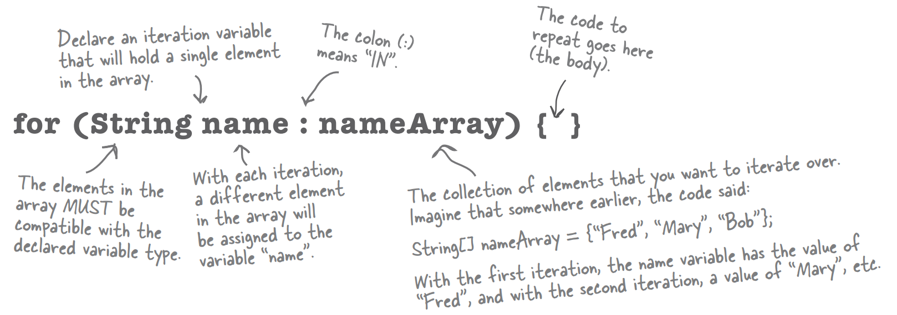

**What it means in plain English**: "For each element in nameArray,assign the element to the 'name' variable,and run the body of the loop."

### How the compiler sees it:

- Create a String variable called name and set it to null
- Assign the first value in nameArray to name
- Run the body of the loop
- Assign the next value in nameArray to name
- Repeat while there are still elements in the array

### Part One: iteration variable declaration

Use this part to declare and initialize a variable to use within the loop body. With each iteration of the loop,this variable will hold a different element from the collection. The type of this variable must be compatible with the elements in the array!For example,you can't declare an int iteration variable to use with a String[] array

### Part Two: the actual collection

This must be a reference to an array or other collection. Again,don't worry about the other non-array kinds of collections yet—you'll see them in the next chapter

# Converting a String to an int

`int guess = Integer.parseInt(stringGuess);`

The user types his guess at the command-line,when the game prompts him. That guess comes in as a String,and the game passes that String into the checkYourself() method.

But the cell locations are simply ints in an array,and you can't compare an int to a String.

So to get around the whole apples and oranges thing,we have to make the String "2" into the int 2. Built into the Java class library is a class called Integer,and one of its jobs is to take Strings that represent numbers and convert them into actual numbers.

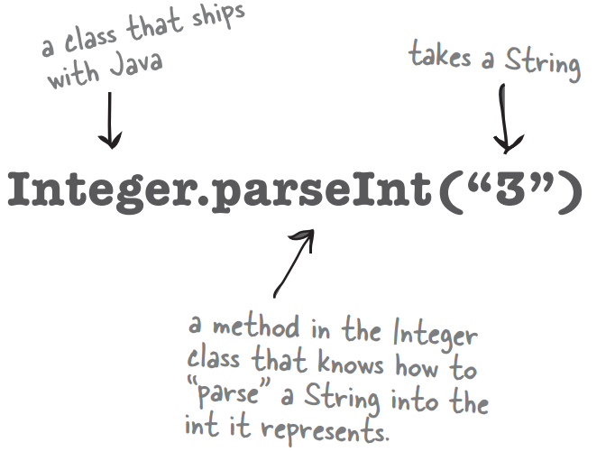

# Casting primitives

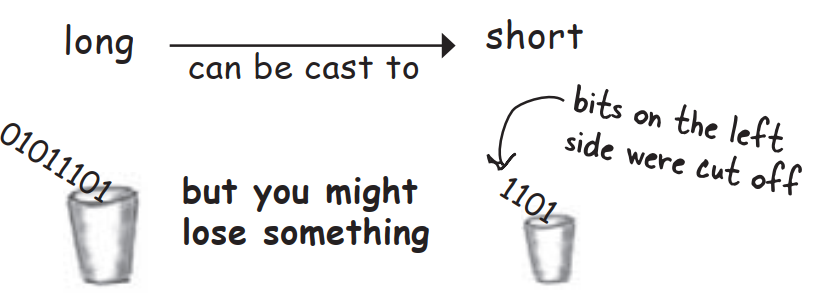

In chapter 3 we talked about the sizes of the various primitives,and how you can't shove a big thing directly into a small thing:

```java
long y = 42;
int x = y;	//won't compile
```

A long is bigger than an int and the compiler can't be sure where that long has been. It might have been out drinking with other longs,and taking on really big values. To force the compiler to jam the value of a bigger primitive variable into a smaller one,you can use the **cast** operator. It looks like this:

```java
long y = 42;	//so far so good
int x = (int)y;	//x = 42 cool!
```

Putting in the cast tells the compiler to take the value of y,chop it down to int size,and set x equal to whatever is left. If the value of y was bigger than the maximum value of x,then what's left will be a weird number:

```java
long y = 40002; //40002 exceeds the 16-bit limit of a short
short x = (short)y; //x now equals -25534!
```

Still,the point is that the compiler lets you do it. And let's say you have a floating point number,and you just want to get at the whole number part of it:

```java
float f = 3.14f;
int x = (int)f;	//x will equal 3
```

And don't even think about casting anything to a boolean or vice versa—just walk away.