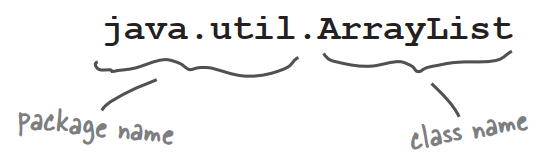

# In our last chapter,we left you with the cliff-hanger. A bug.

In the current version,once you get a hit,you can simply repeat that hit two more times for the kill!

# So what happened?


# How do we fix it?

We need a way to know whether a cell has already been hit. Let's run through some possibilities,but first,we'll look at what we know so  far...

We have a virtual row of 7 cells,and a DotCom will occupy three consecutive cells somewhere in that row. This virtual row shows a DotCom placed at cell locations 4,5 and 6.


The DotCom has an instance variable—an int array—that holds that DotCom object's cell locations.


### Option one

We could make a second array,and each time the user makes a hit,we store that hit in the second array,and then check that array each time we get a hit,to see if that cell has been hit before.


# Option one is too clunky

Option one seems like more work than you'd expect. It means that each time the user makes a hit,you have to change the state of the second array(the 'hitCells' array),but first you have to CHECK the 'hitCells' array to see if that cell has already been hit anyway. It would work,but there's got to be something better...

### Option two

We could just keep the one original array,but change the value of any hit cell to -1. That way,we only have ONE array to check and manipulate.


# Option two is a little better,but still pretty clunky

Option two is a little less clunky than option one,but it's not very efficient. You'd still have to loop through all three slots in the array,even if one or more are already invalid because they've been 'hit'. There has to be something better...

### Option three

We delete each cell location as it gets hit,and then modify the array to be smaller. Except arrays can't change their size,so we have to make a **new** array and copy the remaining cells from the old array into the new smaller array.


**Option three would be much better if the array could shrink,so that we wouldn't have to make a new smaller array,copy the remaining value in,and reassign the reference.**

### Life would be good if only we could change it to:

**REPEAT** with each of the **remaining** location cells

​		//COMPARE the user guess to the location cell

​		**IF** the user guess matches

​				**REMOVE** this cell from the array

​				//FIND OUT if it was the last location cell:

​				**IF** the array in now empty,**RETURN** "kill"

​				**ELSE** it was not a kill,so **RETURN** "hit"

​				END IF

​		**ELSE** user guess did not match,so **RETURN** "miss"

​		END IF

END REPEAT

# Wake up and smell the library

**As if by magic,there really is such a thing.**

**But it's not an array,it's an ArrayList.**

**A class in  the core Java library(the API).**

The Java Standard Edition ships with hundreds of pre-built classes. Just like our Ready-Bake code except that these built-in classes are already compiled.

**That means no typing.**

Just use 'em.

# Some things you can do with <u>ArrayList</u>

- Make one

  

- Put something in it

  

- Put another thing in it

  

- Find out how many things are in it

  

- Find out if it contains something

  

- Find out where something is

  

- Find out if it's empty

  

- Remove something from it

  

# **Q**:So ArrayList is cool,but how would I know it exists?

**A**:The question is really,"How do I know what's in the API?" and that's the key to your success as a Java programmer. Not to mention your key to being as lazy as possible while still managing to build software. You might be amazed at how much time you can save when somebody else has already done most of the heavy lifting,and all you have to do is step in and create the fun part.

But we digress... the short answer is that you spend some time learning what's in the core API. The long answer is at the end of this chapter,where you'll learn how to do that.

# **Q**:But that's a pretty big issue. Not only do I need to know that the Java library comes with ArrayList,but more importantly I have to know that ArrayList is the thing that can do what I want!So how do I go from a need-to-do-something to a-way-to-do-it using the API?

**A**:Now you've really at the heart of it. By the time you've finished this book,you'll have a good grasp of the language,and the rest of your learning curve really is about knowing how to get from a problem to a solution,with you writing the least amount of code. If you can be patient for a few more pages,we start talking about it at the end of this chapter.

# Comparing ArrayList to a regular array

### ①A plain old array has to know its size at the time it's created.

But for ArrayList,you just make an objects of type ArrayList. Every time. It never needs to know big it should be,because it grows and shrinks as objects are added or removed.


### ②To put an object in a regular array,you must assign it to a specific location.


If that index is outside the boundaries of the array,it blows up at runtime.

With ArrayList,you can specify an index using the *add(anInt,anObject)* method,or you can just keep saying *add(anObject)* and the ArrayList will keep growing to make room for the new thing.


### ③Arrays use array syntax that's not used anywhere else in Java.

But ArrayLists are plain old Java objects,so they have no special syntax.


### ④ArrayLists in Java 5.0 are parameterized.

We just said that unlike arrays,ArrayLists have no special syntax. But they do use something special that was added to Java 5.0—***parameterized types***.


Prior to Java 5.0,there was no way to declare the type of things that would go in the ArrayList,so to the compiler,all ArrayLists were simply heterogenous collections of objects. But now,using the <typeGoesHere> syntax,we can declare and create an ArrayList that knows the types of objects it can hold.

# Super Powerful Boolean Expressions

So far,when we're used boolean expressions for our loops or if tests,they're been pretty simple. We will be using more powerful boolean expressions in some of the Ready-Bake code you're about to see,and even though we know you wouldn't peek,we thought this would be a good time to discuss how to energize your expressions.

### 'And' and 'Or' Operators(&&,||)

Let's say you're writing a chooseCamera() method,with lots of rules about which camera to select. Maybe you can choose cameras ranging from `$50` to `$1000`,but in some cases you want to limit the price range more precisely. You want to say something like:

'if the price range is between `$300` **and** `$400` then choose X.'

```java
if(price >= 300 && price < 400){
	camera = "X";
}
```

 Let's say that of the camera brands available,you have some logic that applies to only a few of the list:

```java
if(brand.equals("A") || brand.equals("B")){
	//do stuff for only brand A or brand B
}
```

Boolean expressions can get really big and complicated:

```java
if((zoomType.equals("optical") && (zoomDegree >= 3 && zoomDegree <= 8)) || (zoomType.equals("digital") && (zoomDegree >= 5 && zoomDegree <= 12))){  
    //do appropriate zoom stuff
}
```

If you want to get really technical,you might wonder about the precedence of these operators. Instead of becoming an expert in the arcane world of precedence,we recommend that you **use parentheses** to make your code clear.

### Not equals(!= and !)

Let's say that you have a logic like,"of the ten available camera models,a certain thing is true for all but one."

```java
if(model != 200){
    //do nod-model 2000 stuff
}
```

or for comparing objects like strings...

```java
if(!brand.equals("X")){
	//do non-brand X stuff
}
```

### Short Circuit Operators(&&,||)

The operator we've looked at so far,&& and ||,are known as **short circuit** operators. In the case of &&,the expression will be true only if both side of the && are true. So if the JVM sees that the left side of a && expression is false,it stops right there! Doesn't even bother to look at the right side.

Similarly,with ||,the expression will be true if either side is true,so if the JVM sees that the left side is true,it declares the entire statement to be true and doesn't bother to check the right side.

Why is this great?Let's say that you have a reference variable and you're not sure whether it's been assigned to an object. If you try to call a method using this null reference variable,you'll get a NullPointException. So try this:

```java
if(refVar != null && refVar.isValidType()){
	//fo 'got a valid type' stuff
}
```

### Non Short Circuit Operators(&,|)

When used in boolean expressions,the & and | operators act like their && and || counterparts,except that they force the JVM to always check both sides of the expression. Typically,& and | are used in another context,for manipulating bits.

# Using the Library(the Java API)

You made it all the way through the DotComBust game,thanks to the help of ArrayList. And now,as promised,it's time to learn how to fool around in the Java library.

# In the Java API,classes are grouped into packages.

### To use a class in the API,you have to know which <u>package</u> the class is in.

Every class in the Java library belongs to a package. The package has a name,like **javax.swing**. ArrayList is in the package called **java.util**,which surprise surprise,holds a pile of *utility* classes. You'll learn a lot more about packages in chapter 16,including how to put your *own* classes into your *own* packages. For now though,we're just looking to *use* some of the classes that come with Java.

Using a class from the API,in your own code,is simple. You just treat the class as though you wrote it yourself...as though you compiled it,and there it sits,waiting for you to use it. With one big difference: somewhere in your code you have to indicate the *full* name of the library class you want to use,and that means package name+class name.

Even if you didn't know it,***you're already been using classes from a package.*** System,String,and Math,all belong to the **java.lang** package.

# You have to know the <u>full</u> name of the class you want to use in your code.

ArrayList is not the *full* name of ArrayList,just as 'Kathy' isn't a full name. The full name of ArrayList is actually:



### You have to tell Java which ArrayList you want to use. You have two options:

- **IMPORT**

  Put an import statement at the top of your source code file:

  ```java
  import java.util.ArrayList;
  public class MyClass{...}
  ```

- **TYPE**

  Type the full name everywhere in your code. Each time you use it. Anywhere you use it.

  When you declare and/or instantiate it:

  `java.util.ArrayList<Dog> list = new java.util.ArrayList<Dog>();`

  When you use it as an argument type:

  `public void go(java.util.ArrayList<Dog> list){}`

  When you use it as a return type:

  `public java.util.ArrayList<Dog> foo(){...}`

### **Q**:Why does these have to be a full name?Is that the only purpose of a package?

**A**:Packages are import for three main reasons. First,they help the overall organization of a project or library. Rather than just having one horrendously large pile of classes,they're all grouped into packages for specific kinds of functionality.

Second,packages give you a name-scoping,to help prevent collisions if you and 12 other programmers in your company all decide to make a class with the same name. If you have a class named Set and someone else has a class named Set,you need some way to tell the JVM which Set class you're trying to use.

Third,packages provide a level of security,because you can restrict the code you write so that only other classes in the same package can access it. You'll learn all about that in chapter 16.

### **Q**:OK,back to the name collision thing. How does a full name really help?What's to prevent two people from giving a class the same package name?

**A**:Java has a naming convention that usually prevents this from happening,as long as developers adhere to it.

### **Q**:Does **import** make my class bigger?Does it actually compile the imported class or package into my code?

**A**:Perhaps you're a C programmer?An **import** is not the same as an **include**. So the answer is no and no. Repeat after me:"an **import** statement saves you from typing." That's really it. You don't have to worry about your code becoming bloated,or slower,from too many imports. An **import** is simply the way you give Java the full name of a class.

### **Q**:OK,how come I never had to import the String class?Or System?

**A**:Remember,you get the java.lang package sort of "pre-imported" for free. Because the classes in java.lang are so fundamental,you don't have to use the full name. There is only one java.lang.String class,and one java.lang.System class,and Java darn well knows where to find them.

### **Q**:Do I have to put my own classes into packages?How do I do that?Can I do that?

**A**:In the real world,yes,you will want to put your classes into packages.

# How to play with the API

Two things you want to know:

1. What classes are in the library?
2. Once you find a class,how do you know what it can do?

### 1.Browse a Book

Flipping through a reference book is the best way to find out what's in the Java library. You can easily stumble on a class that looks useful,just by browsing pages.

### 2.Use the HTML API docs

Java coms with a fabulous set of online docs called,strangely,the Java API. The API docs are the best reference for getting more details about a class and its methods. Let's say you were browsing through the reference book and found a class called Calendar,in java.util. The book tells you a little about it,enough to know that this is indeed what you want to use,but you still need to know more about the methods.