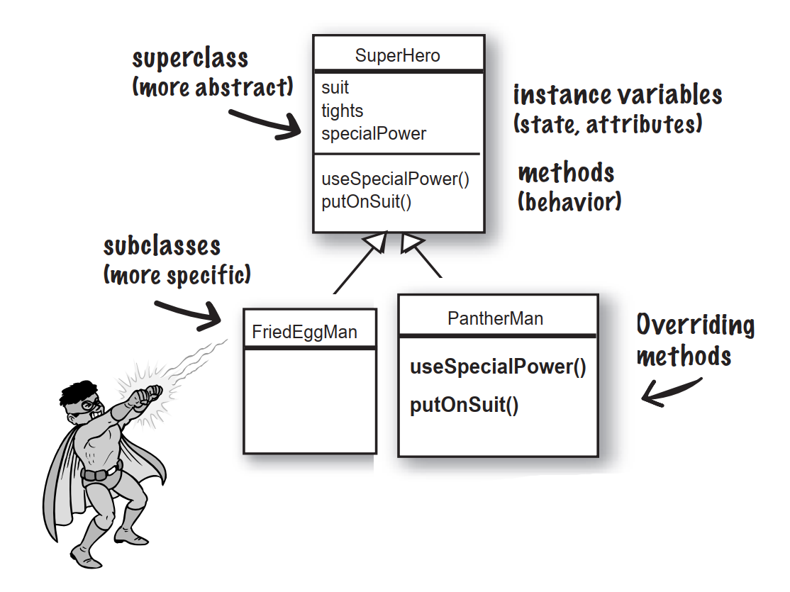
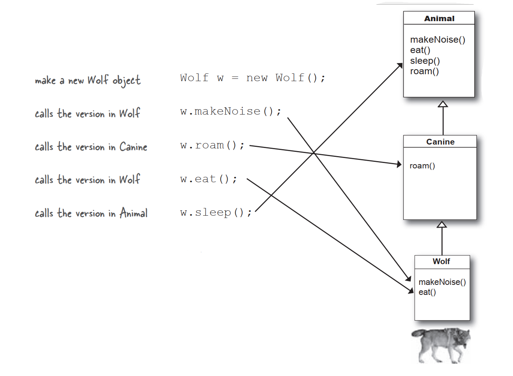
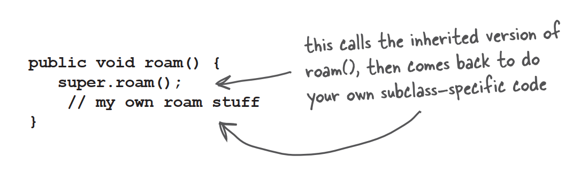
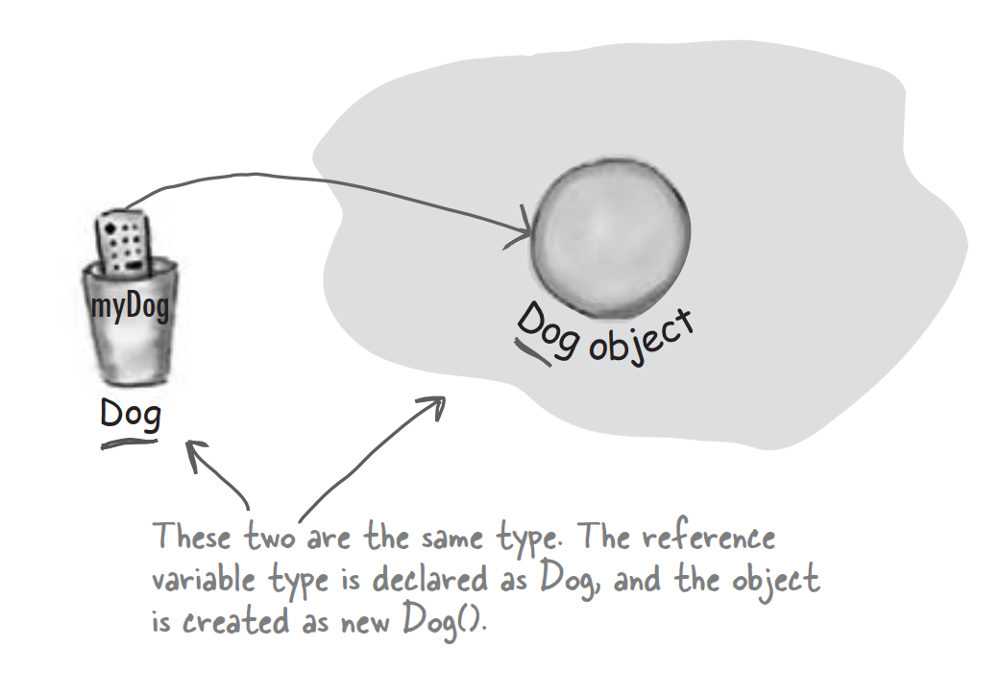
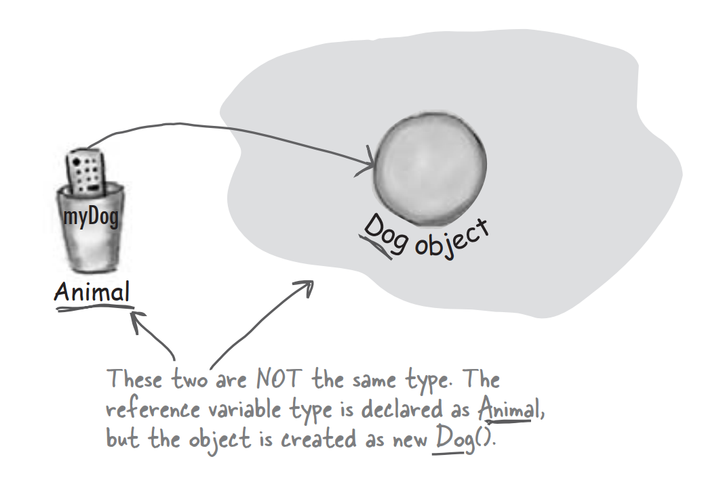

# Understanding Inheritance

When you design with inheritance,you put common code in a class and then tell other more specific classes that the common class is their superclass. When one class inherits from another,**the subclass inherits from the superclass.**

In Java,we say that the **subclass *extends* the superclass.** An inheritance relationship means that the subclass inherits the **members** of the superclass. When we say "members of a class" we mean the instance variables and methods.

For example,if PantherMan is a subclass of SuperHero,the PantherMan class automatically inherits the instance variables and methods common to all superheroes including suit,tights,specialPower,useSpecialPower() and so on. But the PantherMan **subclass can add new methods and instance variables** of its own,and it **can override the method it inherits from the superclass** SuperHero.

FriedEggMan doesn't need any behavior tat's unique,so he doesn't override any methods. The methods and instance variables in SuperHero are sufficient. 

PantherMan,though,has specific requirements for his suit and special powers,so useSpecialPower() and putOnSuit() are both overridden in the PantherMan class.

**Instance variables are not overridden** because they don't need to be. They don't define any special behavior,so a subclass can give an inherited instance variable any value it chooses. PantherMan can set hie inherited tights to purple,while FriedEggMan sets his to white.

# Which method is called?

The Wolf class has four methods. One inherited from Animal,one inherited from Canine,and two overridden in the Wolf class. When you create a Wolf object and assign it to a variable,you can use the dot operator on that reference variable to invoke all four methods. But which *version* of those methods gets called?

When you call a method on an object reference,you're calling the most specific versions of the method for that object type. In other words,***the lowest one wins!*** "Lowest" meaning lowest on the inheritance tree. Canine is lower than Animal,and Wolf is lower than Canine,so invoking a method on a reference to a Wolf object means the JVM starts looking first in the Wolf class. If the JVM doesn't find a version of the method in the Wolf class,it starts walking back up the inheritance hierarchy until it finds a match.

### **Q**:You said that the JVM starts walking at the class type you invoked the method. But what happens if the JVM doesn't ever find a match?

**A**:The compiler guarantees that a particular method is callable for a specific reference type,but it doesn't say from which class that method actually comes from at runtime. With the Wolf example,the compiler checks for a sleep() is actually defined in class Animal. Remember that if a class inherits a method,it has the method. Where the inherited method is defined makes no difference to the compiler. But at runtime,**the JVM will always pick the right one.** And the right one means,**the most specific version for that particular object.**

# Using IS-A and HAS-A

Remember that when one class inherits from another,we say that the subclass *extends* the superclass. When you want to know if one thing should extend another,apply the IS-A test.

To know if you've designed your types correctly,ask,"Does it make sense to say type X IS-A type Y?" If it doesn't,you know there's something wrong with the design.

Tub and Bathroom *are* related,but not through inheritance. Tub and Bathroom are joined by a HAS-A relationship. Does it make sense to say "Bathroom HAS-A Tub"?If yes,then it means that Bathroom has a Tub instance variable. In other words,Bathroom has a *reference* to a Tub,but Bathroom does not *extend* Tub and vice-versa. 

# But wait!There's more!

The IS-A works *anywhere* in the inheritance tree. If your inheritance tree is well-designed,the IS-A test should make sense when you ask any subclass if it IS-A any of its supertypes. 

**If class B extends class A,class B IS-A class A. This is true anywhere in the inheritance tree. If class C extends class B,class C passes the IS-A test for both B and A.**

# How do you know if you've got your inheritance right?

**Keep in mind that the inheritance IS-A relationship works in only one direction!**

### **Q**:So we see how a subclass gets to inherit a superclass method,but what if the superclass wants to use the subclass version of the method?

**A**:A superclass won't necessarily know about any of its subclass. You might write a class and much later someone else comes along and extends it. But even if the superclass creator does know about a subclass version of a method,there's no sort of reverse or backwards inheritance. Think about it,children inherit from parents,not the other way around.

### **Q**:In a subclass,what if I want to use BOTH the superclass version and my overriding subclass version of a method?In other words,I don't want to completely replace the superclass version,I just want to add more stuff to it.

**A**:You can do this! And it's an important design feature. Think of the word "extends" as meaning,"I want to extend the functionality of the superclass".

You can design your superclass methods in such a way that they contain method implementations that will work for any subclass,even though the subclass may still need to 'append' more code. In your subclass overriding method,you can call the superclass version using the keyword **super**. It's like saying,"first go run the superclass version,then come back and finish with my own code..."

# Who gets the Porsche,who gets the porcelain?(how to know what a subclass can inherit from its superclass)

A subclass inherits members of the superclass. Members include instance variables and methods. A superclass can choose whether or not it wants a subclass to inherit a particular member by the level of access the particular member in given.

There are four access levels that we'll cover in this book. Moving from most restrictive to least,the four access levels are:

**Access levels control *who sees what***,and are crucial to having well-designed,robust Java code.

**public members <u>are</u> inherited**

**private members are <u>not</u> inherited**

When a subclass inherits a member,it is **as if the subclass defined the member itself.** In the Shape example,Square inherited the rotate() and playSound() methods and to the outside world the Square class simply has a rotate and playSound() method.

The members of a class include the variables and methods defined in the class plus anything inherited from a superclass.

# When designing with inheritance,are you using or abusing?

**DO** use inheritance when one class is a more specific type of a superclass.

**DO** consider inheritance when you have behavior that should be shared among multiple classes of the same general type. Be aware,however,that while inheritance is one of the key features of object-oriented programming,it's not necessarily the best way to achieve reuse. It'll get you started,and often it's the right design choice,but flexible options.

**DO NOT** use inheritance just so that you can reuse code from another class,if the relationship between the superclass and subclass violate either of the above two rules.

**DO NOT** use inheritance if the subclass and superclass do not pass the IS-A test. Always ask yourself if the subclass IS-A more specific type of the superclass.

# So what does all this inheritance really buy you?

You get a lot of OO mileage by designing with inheritance. You can get rid of duplicate code by abstracting out the behavior common to a group of classes,and sticking that code in a superclass. That way,when you need to modify it,you have only one place to update,and *the change is magically reflected in all the classes that inherit that behavior.* Well,there's no magic involved,but it is pretty simple: make the change and compile the class again. That's it. **You don't have to touch the subclass!**

**Just deliver the newly-changed superclass,and all classes that extend it will automatically use the new version.**

A Java program is nothing but a pile of classes,so the subclasses don't have to be recompiled in order to use the new version of the superclass. As long as the superclass doesn't break anything for the subclass,everything's fine.

# Inheritance lets you guarantee that all classes grouped under a certain supertype have all the methods that the supertype has.

### In other words,you define a common protocol for a set of classes related through inheritance.

When you define methods in a superclass,that can be inherited by subclasses,you're announcing a kind of protocol to other code that says,"All my subtypes can do these things,with these methods that look like this..."

In other words,you establish a contract.

But we're not even at the really cool part yet,because we saved the best—*polymorphism*—for last.

When you define a supertype for a group of classes,*any subclass of that supertype can be substituted where the supertype is expected.*

### To see how polymorphism works,we have to step back and look at the way we normally declare a reference and create an object...

### The important point is that the reference type AND the object type are the same.

Dog myDog = new Dog();

### But with polymorphism,the reference and the object can be different.

<u>Animal</u> myDog = new <u>Dog</u>();

# With polymorphism,the reference type can be a superclass of the actual object type.

When you declare a reference variable,any object that passes the IS-A test for the declared type of the reference variable can be assigned to that reference. In other words,anything that extends the declared reference variable type can be *assigned* to the reference variable.**This lets you do things like make polymorphic arrays.**

# But wait!There's more!

**You can have polymorphic <u>arguments</u> and <u>return</u> types.**

If you can declare a reference variable of a supertype,and assign a subclass object to it,think of how that might work when the reference is an argument to a method...

### With polymorphism,you can write code that doesn't have to change when you introduce new subclass types into the program.

### **Q**:Are there any practical limits on the levels of subclassing?How deep can you go?

**A**:If you look in the Java API,you'll see that most inheritance hierarchies are wide but not deep. Most are no more than one or two levels deep,although there are exceptions. You'll come to realize that it usually makes more sense to keep your inheritance trees shallow,but there isn't a hard limit.

### **Q**:Hey,I just thought of something...if you don't have access to the source code for a class,but you want to change the way a method of the class works,could you use subclassing to do that? To extend the "bad" class and override the method with your own better code?

**A**:Yep. That's one cool feature of OO,and sometimes it saves you from having to rewrite the class from scratch,or track down the programmer who hid the source code.

### **Q**:Can you extend any class? Or is it like class members where if the class is private you can't inherit it...

**A**:There's no such thing as a private class,except in a very special case called an inner class. But there are three things that can prevent a class from being subclassed.

The first is access control. Even though a class don't be marked **private**,a class can be non-public. A non-public class can be subclassed only by classes in the same package as the class. Classes in a different package won't be able to subclass the non-public class.

The second thing that stops a class from being subclassed is the keyword modifier **final**. A final class means that it's the end of the inheritance line. Nobody,ever,can extend a final class.

The third issue is that if a class has only **private** constructors,it can't be subclassed.

### **Q**:Why would you ever want to make a final class? What advantage would there be in preventing a class from being subclassed?

**A**:Typically,you won't make your classes final. But if you need security—the security of knowing that the methods will always work the way that you wrote them,a final class will give you that. A lot of classes in the Java API are final for that reason. The String class,image the havoc if somebody came along and changed the way Strings behave!

### **Q**:Can you make a method final,without making the whole class final?

**A**:If you want to protect a specific method from being overridden,mark the method with the **final** modifier. Mark the whole class as final if you want to guarantee that none of the methods in that class will ever be overridden.

# Keeping the contract: rules for overriding

When you override a method from a superclass,you're agreeing to fulfill the contract. The contract that says,for example,"I take no arguments and I return a boolean." In other words,the arguments and return types of your overriding method must look to the outside world *exactly* like the overridden method in the superclass.

**The method are the contract.**

If polymorphism is going to work,the Toaster's version of the overridden method from Appliance has to work at runtime. Remember,the compiler looks at the reference type to decide whether you can call a particular method on that reference. With an Appliance reference to a Toaster,the compiler cares only if class *Appliance* has the method you're invoking on an Appliance reference. But at runtime,the JVM looks not at the *reference* type but at the actual *Toaster* object on the heap. So if the compiler has already *approved* the method call,the only way it can work is if the overriding method has the same arguments and return types. Otherwise,someone with an Appliance reference will call turnOn() as a no-arg method,even though there's a version in Toaster that takes an int. Which one is called at runtime?The one in Appliance. In other words,***the turnOn(int level) method in Toaster is not an override!***

### Arguments must be the same,and return types must be compatible.

### The method can't be less accessible.

# Over<u>load</u>ing a method

Method overloading is nothing more than having two methods with the same name but different argument lists. Period. There's no polymorphism involved with overloaded methods!

Overloading lets you make multiple versions of a method,with different argument lists,for convenience to the callers. For example,if you have a method that takes only an int,the calling code has to convert,say,a double into an int before calling your method. But if you overloaded the method with another version that takes a double,then you've made things easier for the caller.

Since an overloading method isn't trying to fulfill the polymorphism contract defined by its superclass,overloaded methods have much more flexibility.

### The return types can be different.

### You can't change ONLY the return type.

### You can vary the access level in any direction.