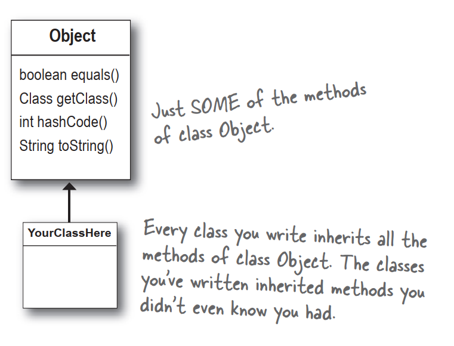
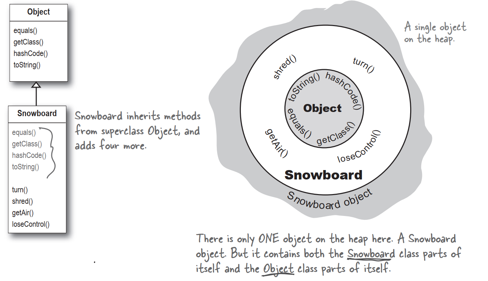
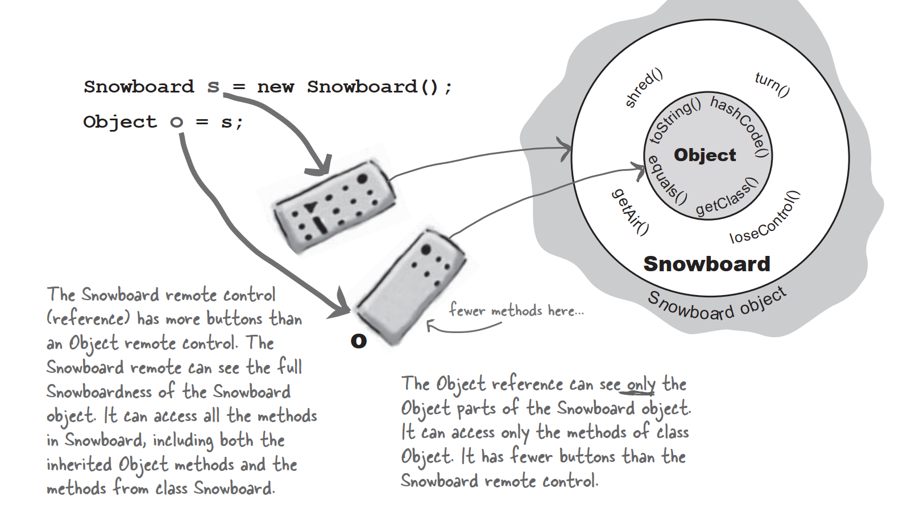
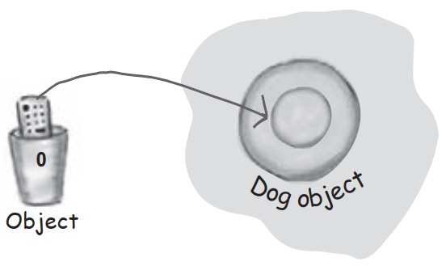
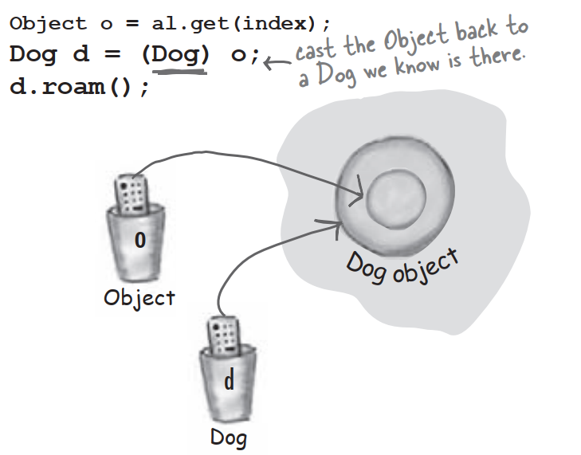
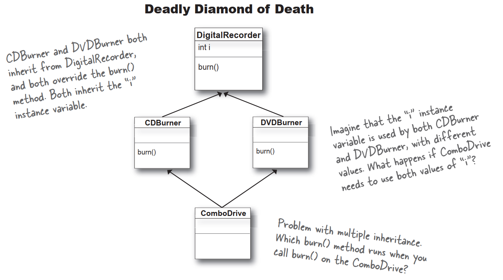
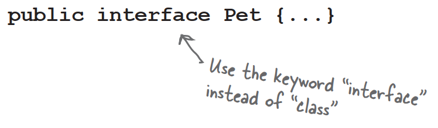
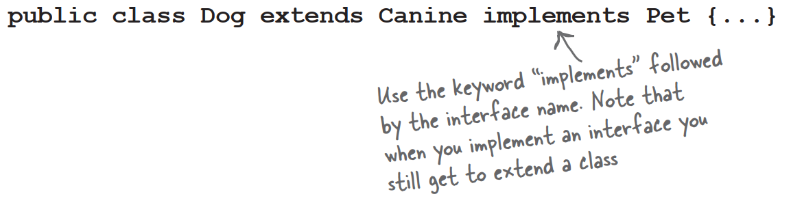
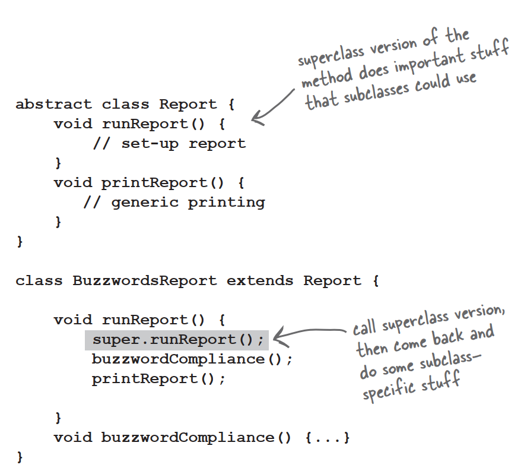
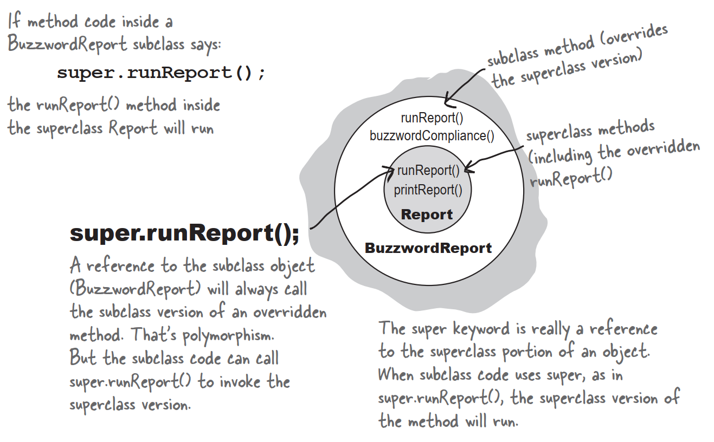

# Some classes just should <u>not</u> be instantiated!

It make sense to create a Wolf object or a Hippo object or a Tiger object,but what exactly *is* an Animal object? What shape is it? What color,size,number of legs...

Trying to create an object of type Animal is like **a nightmare Star Trek transporter accident.** The one where somewhere in the beam-me-up process something bad happened to the buffer.

But how do we deal with this? We *need* an Animal class,for inheritance and polymorphism. But we want programmers to instantiate only the less abstract *subclass* of class Animal,not Animal itself. We want Tiger objects and Lion objects,***not Animal objects.***

Fortunately,there's a simple way to prevent a class from ever being instantiated. In other words,to stop anyone from saying "**new**" on that type. By marking the class as **abstract**,the compiler will stop any code,anywhere,from ever creating an instance of that type.

You can still use that abstract type as a reference type. In fact,that's a big part of why you have that abstract class in the first place.

When you're designing your class inheritance structure,you have to decide which classes are *abstract* and which are *concrete*. Concrete classes are those that are specific enough to be instantiated. A *concrete* class just means that it's OK to make objects of that type.

Making a class abstract is easy—put the keyword **abstract** before the class declaration:

```java
abstract class Canine extends Animal{
	public void roam(){}
}
```

# The compiler won't let you instantiate an abstract class

 An abstract class means that nobody can ever make a new instance of that class. You can still use that abstract class as a declared reference type,for the purpose of the polymorphism,but you don't have to worry about somebody making objects of that type. The compiler *guarantees* it.

An **abstract class** has virtually no use,no value,no purpose in life,unless it is **extended**.

With an abstract class,the guys doing the work at runtime are **instances of a subclass** of your abstract class.

# Abstract vs. Concrete

A class that's not abstract is called a *concrete* class. In the Animal inheritance tree,if we make Animal,Canine,and Feline abstract,that leaves Hippo,Wolf,Dog,Tiger,Lion,and Cat as the concrete subclass.


# Abstract method

Besides classes,you can make *methods* abstract,too. An abstract class means the class must be *extended*;an abstract method means the method must be *overridden*. You might decide that some behaviors in an abstract class don't make any sense unless they're implemented by a more specific subclass. In other words,you can't think of any generic method implementation that could possibly be useful for subclass. What would a generic eat() method look like?

**An abstract method has no body!**

Because you've already decided there isn't any code that would make sense in the abstract method,you won't put in a method body. So no curly braces—just end the declaration with a semicolon.


**If you declare an abstract method,you MUST mark the class abstract as well. You can't have an abstract method in a non-abstract class.**

But you can mix both abstract and non-abstract methods in the abstract class.

### **Q**:What is the point of an abstract method? I thought the whole point of an abstract class was to have common code that could be inherited by subclasses.

**A**:Inheritable method implementations are A Good Thing to put in a superclass. When it makes sense. And in an abstract class,it often doesn't make sense,because you can't come up with any generic code that subclasses would find useful. The point of an abstract method is that even though you haven't put in any actual method code,you've still defined part of the protocol for a group of subtypes.

### **Q**:Which is good because...

**A**:Polymorphise! Remember,what you want is the ability to use a superclass type as a method argument,return type,or array type. That way,you get to add new subtypes to your program without having to rewrite new methods to deal with those new types. Imagine how you'd have to change the Vet class,if it didn't use Animal as its argument type for methods. You'd have to have a separate method for every single Animal subclass! One that takes a Lion,one that takes a Wolf,one that takes a...you get the idea. So with an abstract method,you're saying,"All subtypes of this type have THIS method."for the benefit of polymorphism.

# You MUST implement all abstract methods

**Implementing an abstract method is just like overriding a method.**

Abstract methods don't have a body;they exist solely for polymorphism. That means the first concrete class in the inheritance tree must implement all abstract methods.

When we say "you must implement the abstract method",that means you must provide a body. That means you must create a non-abstract method in your class with the same method signature and return type that is compatible with the declared return type of the abstract method. What you put in that method is up to you. All Java cares about is up to you. All Java cares is that the method is there,in your concrete subclass.

# Every class in Java extends class object

Class Object is the mother of all classes;it's the superclass of *everything*.

Even if you take advantage of polymorphism,you still have to create a class with methods that take and return *your* polymorphic type. Without a common superclass for everything in Java,there'd be no way for developers of Java to create classes with methods that could take *your* custom types...*types they never knew about when they wrote the ArrayList class.*

So you were making subclass of class Object from the very beginning and you didn't even know it. **Every class you write extends Object**,without your ever having to say it. But you can think of it as though a class you write looks like this:

`public class Dog extends Object{}`

**Any class that doesn't explicitly extend another class,implicitly extends Object.**

# So what's in this ultra-super-megaclass Object?



### **Q**:Is class Object abstract?

**A**:No. Well,not in formal Java sense anyway. Object is a non-abstract class because it's got method implementation code that all classes can inherit and use out-of-the-box,without having to override the methods.

### **Q**:Then can you override the methods in Object?

**A**:Some of them. But some of them are marked final,which means you can't override them. You're encouraged to override hashCode(),equals(),and toString() in your own classes. But some of the methods,like getClass(),do things that must work in a specific,guaranteed way.

### **Q**:If ArrayList methods are generic enough to use Object,then what does it mean to say ArrayList<DotCom>? I thought I was restricting the ArrayList to hold only DotCom objects?

**A**:You were restricting it. Prior to Java 5.0,ArrayLists couldn't be restricted. They were all essentially what you get in Java 5.0 today if you write ArrayList<Object>. In other words,**an ArrayList restricted to anything that's an Object,**which means any object in Java,instantiated from any class type!

### **Q**:How can you let somebody make an Object object?Isn't that just as weird as making an Animal object?

**A**:Why is it acceptable to make a new Object instance? Because sometimes you just want a generic object to use as,well,as an object. A lightweight object. By far,the most common use of an instance of type Object is for thread synchronization. On the back burner and assume that you will rarely make objects of type Object,even though you can.

### **Q**:So is it fair to say that the main purpose for type Object is so that you can use it for a polymorphic argument and return type? Like ArrayList?

**A**:The Object class serves two main purpose: to act as a polymorphic type for methods that need to work on any class that you or anyone else makes,and to provide real method code that all objects in Java need at runtime. Some of the most important methods in Object are related to threads.

### **Q**:If it's so good to use polymorphic types,why don't you just make ALL your methods take and return type Object?

**A**:Ahhh...think about what would happen. For one thing,you would defeat the whole point of 'type-safety',one of Java's greatest protection mechanisms for your code. With type-safety,Java guarantees that you won't ask the wrong object to do something you meant to ask of another object type. But the truth is,you don't have to worry about that fiery Ferrari scenario,even if you do use Object references for everything. Because when objects are referred to by an Object reference type,Java thinks it's referring to an instance of type Object. And that means the only methods you're allowed to call on that object are the ones declared in class Object! So if you were to say:

```java
Object o = new Ferrari();

o.goFast();	//Not legal!
```

You wouldn't even make it past the compiler.

Because Java is a strong-typed language,the compiler checks to make sure that you're calling a method on an object that's actually capable of responding. In other words,you can call a method on an object reference only if the class of the reference type actually has the method.

# Using polymorphic reference of type Object has a price...

Before you run off and start using type Object for all your ultra-flexible argument and return types,you need to consider a little issue of using type Object as a reference. And keep in mind that we're not talking about making instances of type Object;we're talking about making instances of some other type,but using a references of type Object.

When you put an object into an ArrayList<Dog>,it goes in as a Dog,and comes out as a Dog.

But what happens when you declare it as ArrayList<Object>? If you want to make an ArrayList that will literally take any kind of Object,you declare it like this:

```java
ArrayList<Object> myDogArrayList = new ArrayList<Object>();
Dog aDog = new Dog();
myDogArrayList.add(aDog);
```

But what happens when you try to get the Dog object and assign it to a Dog reference?

```java
Dog d = myDogArrayList.get(0);
//NO!!!Won't compile!!!When you use ArrayList<Object>,the get() method returns type Object. The compiler knows only that the object inherits from Object but it doesn't know it's a Dog!!
```

**Everything comes out of an ArrayList<Object> as a reference of type Object,regardless of what the actual object is,or what the reference type was when you added the object to the list.**

# Get in touch with your inner Object!

An object contains *everything* it inherits from each of its superclass. That means *every* object—regardless of its actual class type—is also an instance of class Object. That means any object in Java can be treated not just as a Dog,Button,or Snowboard,but also as an Object. When you say **new Snowboard()**,you get a single object on the heap—a Snowboard object—but that Snowboard wraps itself around an inner representing the Object portion of itself.



# 'Polymorphism' means 'many forms'.

**You can treat a Snowboard a Snowboard as a Snowboard or as an Object.**

If a reference is like a remote control,the remote control takes on more and more buttons as you move down the inheritance tree. A remote control of type Object has only a few buttons—the buttons for the exposed methods of class Object. But a remote control of type Snowboard includes all the buttons from class Object,plus any new buttons of class Snowboard. The more specific the class,the remote buttons it may have.

Of course that's not always true; a subclass might not add any new methods,but simply override the methods of its superclass. The key point is that even if the object is of type Snowboard,an Object *reference* to the Snowboard object can't see the Snowboard-specific methods.

**When you put an object in an ArrayList<Object>,you can treat it only as an Object,regardless of the type it was when you put it in.**

**When you get a reference from an ArrayList<Object>,the reference is always of type Object.**

**That means you get an Object remote control.**



# Casting an object reference back to its real type.



It's really still a Dog object,but if you want to call Dog-specific methods,you need a reference declared as type Dog. If you're sure the object is really a Dog,you can make a new Dog reference to it by copying the Object reference,and forcing that copy to go into a Dog reference variable,using a cast (Dog). You can use the new Dog reference to call Dog methods.



If you're not sure it's a Dog,you can use the **instanceof** operator to check. Because if you're wrong when you do the cast,you'll get a ClassCastException at runtime and come to a grinding halt.

```java
if(o instanceof Dog){
	Dog d = (Dog)o;
}
```

# So now you've seen how much Java cares about the methods in the class of the <u>reference</u> variable.

**You can call a method on an object only if the class of the reference variable has that method.**

**Think of the public methods in your class as your contract,your promise to the outside world about things you can do.**

When you write a class,you almost always expose some of the methods to code outside the class. To expose a method means you make a method accessible,usually by making it public.

**Just remember that the compiler checks the class of the reference variable,not the class of the actual object at the other end of the reference.**

# It's called "multiple inheritance" and it can be a Really Bad Thing.

That is,if it were possible to do in Java.

But it isn't,because multiple inheritance has a problem known as The Deadly Diamond of Death.



A language that allows the Deadly Diamond of Death can lead to some ugly complexities,because you have to have special rules to deal with the potential ambiguities. And extra rules means extra work for you both in learning those rules and watching out for those "special cases". Java is supposed to be simple,with consistent rules that don't blow up under some scenarios. So Java protects you from having to think about the Deadly Diamond of Death.

# Interface to the rescue!

Not a GUI interface,not the generic use of the word interface as in,"That's the public interface for the Button class API,"but the Java *keyword* **interface**.

A Java interface solves your multiple inheritance problem by giving you much of the polymorphic *benefits* of multiple inheritance without the pain and suffering from the Deadly Diamond of Death(DDD).

The way in which interfaces side-step the DDD is surprisingly simple: **make all the methods abstract!** That way,the subclass **must** implement the methods,so at runtime the JVM isn't confused about which of the two inherited versions it's supposed to call.

### To <u>DEFINE</u> an interface:



### To <u>IMPLEMENT</u> an interface:



### **Q**:Interface don't really give you multiple inheritance,because you can't put any implementation code in them. If all the methods are abstract,what does an interface really buy you?

**A**:Polymorphism,polymorphism,polymorphism. Interfaces are the ultimate in flexibility,because if you use interfaces instead of concrete subclass as arguments and return types,you can pass anything that implements that interface. And think about it—with an interface,a class doesn't have to come from just one inheritance tree. A class can extend one class,and implement an interface. But another class might implement the same interface,yet come from a completely different inheritance tree! So you get to treat an object by the role it plays,rather than by the class type from which it was instantiated. In fact,if you wrote your code to use interfaces,you wouldn't even have to give anyone a superclass that they had to extend. You could just give them the interface and say,"Here,I don't care what kind of class inheritance structure you come from,just implement this interface and you'll be good to go."

The face that you can't put in implementation code turns out not to be a problem for most good designs,because most interface methods wouldn't make sense if implemented in a generic way. In other words,most interface methods would need to be override even if the methods weren't forced to be abstract.

**Better still,a class can implement multiple interfaces!**

### How do you know whether to make a class,a subclass,an abstract class,or an interface?

- Make a class that doesn't extend anything when your new class doesn't pass IS-A test for any other type.
- Make a subclass only when you need to make a **more specific** version of a class and need to override or add new behaviors.
- Use an abstract class when you want to define a **template** for a group of subclasses,and you have at least some implementation code that all subclasses could use. Make the class abstract when you want to guarantee that nobody can make objects of that type.
- Use an interface when you want to define a **role** that other classes can play,regardless of where those classes are in the inheritance tree.

# Invoking the superclass version of a method

### **Q**:What if you make a concrete subclass and you need to override a method,but you want the behavior in the superclass version of the method? In other words,what if you don't need to replace the method with an override,but you just want to add to it with some additional specific code.

**A**:Think about the meaning of the word "extends". One area of good OO design looks at how to design concrete code that's meant to be overridden. In other words,you write method code in,say,an abstract class,that does work that's generic enough to support typical concrete implementations. But,the concrete code isn't enough to handle all of the subclass-specific work. So the subclass overrides the method and extends it by adding the rest of the code. The keyword super lets you invoke a superclass version of an overridden method,from within the subclass.





### **Q**:How it is that ArrayList<Dog> gives back Dog references that don't need to be cast,yet the ArrayList class uses Object in its methods,not Dog. What's the special trick going on when you say ArrayList<Dog>?

**A**:In face it is a special trick that ArrayList<Dog> gives back Dogs without you having to do any cast,since it looks like ArrayList methods don't know anything about Dogs,or any type besides Object.

The short answer is that the compiler puts in the cast for you! When you say ArrayList<Dog>,there is no special class that has methods to take and return Dog objects,but instead the <Dog> is a signal to the compiler that you want the compiler to let you put ONLY Dog objects in and to stop you if you try to add any other type to the list. And since the compiler stops you from adding anything but Dogs to the ArrayList,the compiler also knows that its safe to cast anything that coms out of that ArrayList do a Dog reference. In other words,using ArrayList<Dog> saves you from having to cast the Dog you get back. But it's much more important than that...because remember,a cast can fail at runtime,and wouldn't you rather have your errors happen at compile time rather than,say,when you customer is using it for something critial?

