# The Stack and the Heap: where things live

Before we can understand what really happens when you create an object,we have to step back a bit. We need to learn more about where everything lives in Java. That means we need to learn more about the Stack and the Heap. In Java,we care about two areas of memory—the one where objects live,and the one where method invocations and local variables live. When a JVM starts up,it gets a chunk of memory form the underlying OS,and uses it to run your Java program. How much memory,and whether or not you can tweak it,is dependent on which version of the JVM you're running. But usually you won't have anything to say about it. And with good programming,you probably won't care.

We know that all *objects* live on the garbage-collectible heap,but we haven't yet looked at where *variables* live. And where a variable lives depends on what kind of variable it is. And by "kind",we don't mean type. The two *kinds* of variable whose lives we care about now are *instance* variables and *local* variables. Local variables are also known as *stack* variables,which is a big clue for where they live.

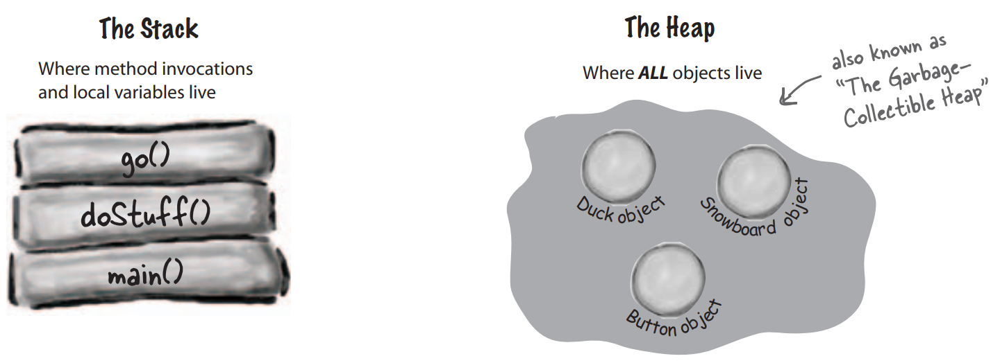

### Instance Variables

**Instance variables are declared inside a class but not inside a method.** They represent the "fields" that each individual object has (which can be filled with different values for each instance of the class). Instance variables live inside the object they belong to.

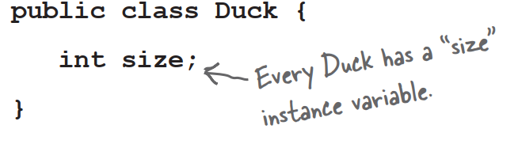

### Local Variable

**Local variable are declared inside a method,including method parameters.** They're temporary,and live only as long as the method is on the stack (in other words,as long as the method has not reached the closing curly brace).

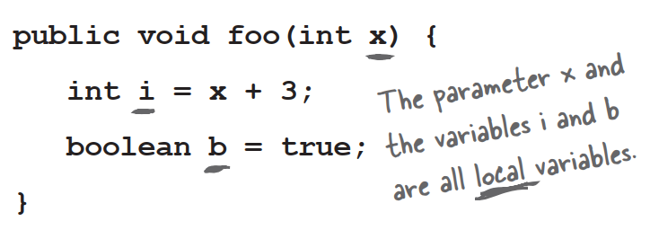

# Method are stacked

When you call a method,the method lands on the top of a call stack. That new thing that's actually pushed onto the stack is the stack *frame*,and it holds the state of the method including which line of code is executing,and the values of all local variables.

The method at the top of the stack is always the currently-running method for that stack. A method stays on the stack until the method hits its closing curly brace. If method foo() calls method bar(),method bar() is stacked on top of method foo().

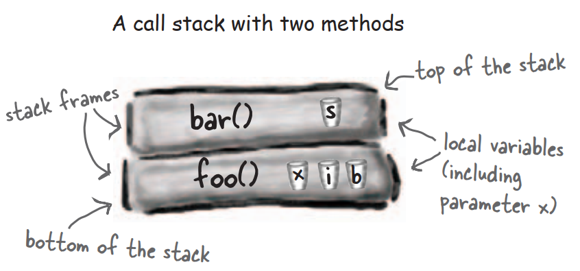

**The method on the top of the stack is always the currently-executing method.**

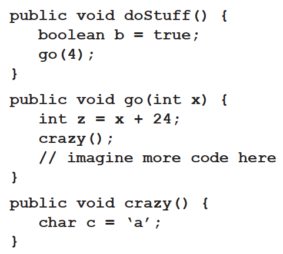

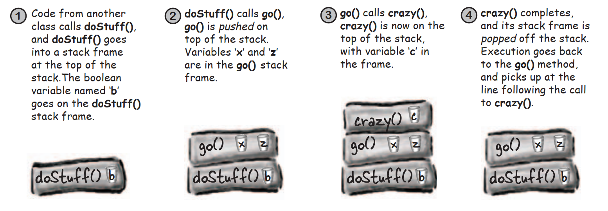

# What about local variables that are <u>objects</u>?

Remember,a non-primitive variable holds a *reference* to an object,not the object itself. You already know where objects live—on the heap. It doesn't matter where they're declared or created. **If the local variable is a reference to an object,only the variable (the reference/remote control) goes on the stack.** The object itself still goes in the heap.

```java
public class StackRef{
	public void foof(){
		barf();
	}

	public void barf(){
		Duck d = new Duck(24);
	}
}
```

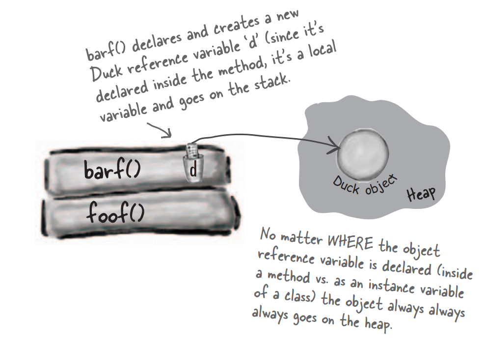

### **Q**:One more time,WHY are we learning the whole stack/heap thing? How does this heap me? Do I really need to learn about it?

**A**:Knowing the fundamentals of the Java Stack and Heap is crucial if you want to understand variable scope,object creation issues,memory management,threads and exception handing in later chapters but the others you'll learn in this one. You do not need to know anything about how the Stack and Heap are implemented in any particular JVM and/or platform. Everything you need to know about the Stack and Heap is on this page and the previous one. If you nail these pages,all the other topics that depend on your knowing this stuff will go much,much,much easier. Once again,some day you will SO thank us for shoving Stacks and Heaps down your throat.

### BULLET POINTS

- Java has two areas of memory we care about: the Stack and the Heap
- Instance variables are variables declared inside a class but outside any method
- Local variables are variables declared inside a method or method parameter
- All local variables live on the stack,in the frame corresponding to the method where the variables are declared
- Object reference variables work just like primitive variable—if the reference is declared as a local variable,it goes on the stack
- All objects live in the heap,regardless of whether the reference is a local or instance variable

# If <u>local</u> variables live on the stack,where do <u>instance</u> variables live?

When you say new CellPhone(), Java has to make space on the Heap for that CellPhone. But how much space? Enough for the object,which means enough to house all of the object's instance variables. That's right,instance variables live on the Heap,inside the object they belong to.

Remember that the *values* of an object's instance variables live inside the object. If the instance variables are all primitives,Java makes space for the instance variables based on the primitive type. An int needs 32 bits,a long 63 bits,etc. Java doesn't care about the value inside primitive variables;the bit-size of an int variable is the same (32 bits) whether the value of the int is 32000000 or 32.

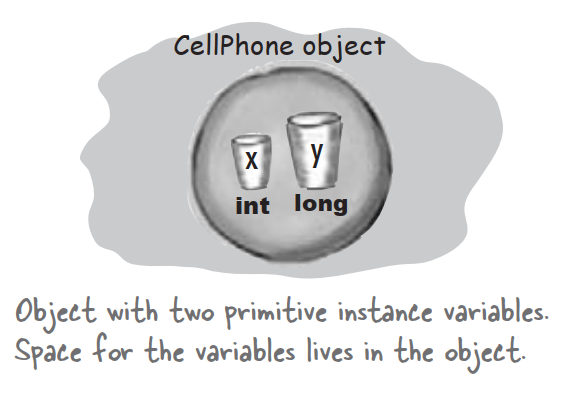

But what if the instance variables are objects? What if CellPhone HAS-A Antenna? In other words,CellPhone has a reference variable of type Antenna.

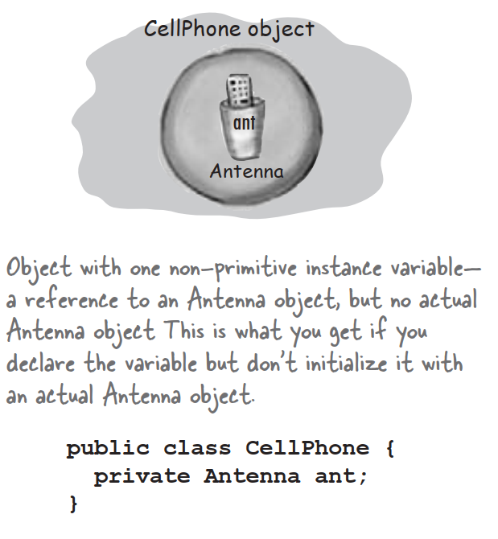

When the new object has instance variables that are object references rather than primitives,the real question is: does the object need space for all of the objects it holds references to? The answer is,not exactly. No matter what,Java has to make space for the instance variable values. But remember that a reference variable value is not the whole object,but merely a *remote control* to the object. So if CellPhone has an instance variable declared as the non-primitive type Antenna,Java makes space within the CellPhone object only for the Antenna's remote control but not the Antenna object.

Well then when does the Antenna object get space on the Heap? First we have to find out when the Antenna object itself is created. That depends on the instance variable declaration. If the instance variable is declared but no object is assigned to it,then only the space for the reference variable is created.

`private Antenna ant;`

No actual Antenna object is made on the heap unless or until the reference variable a new Antenna object.

`private Antenna ant = new Antenna();`

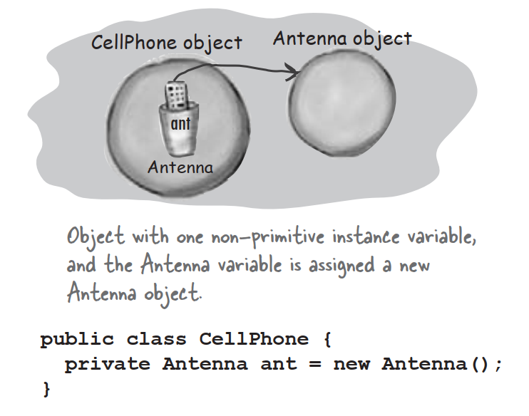

# The miracle of object creation

Now that you know where variables and objects live,we can dive into the mysterious world of object creation. Remember the three steps of object declaration and assignment: declare a reference variable,create an object,and assign the object to the reference.

But until now,step two—where a miracle occurs and the new object is "born"—has remained a Big Mystery. Prepare to learn the facts of object life. Hope you're not squeamish.

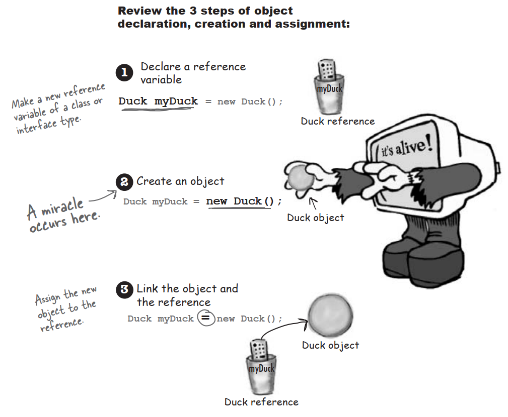

# Are we calling a method named Duck()?Because it sure looks like it.

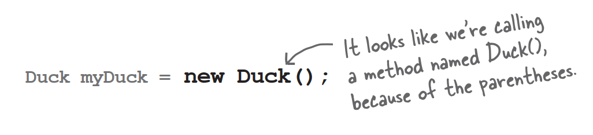

**No.**

**We're calling the Duck constructor.**

A constructor *does* look and feel a lot like a method,but it's not a method. It's got the code that runs when you say **new**. In other words,*the code that runs when you instantiate an object.*

The only way to invoke a constructor is with the keyword **new** followed by the class name. The JVM finds that class and invokes the constructor in that class.

**But where is the constructor? If we didn't write it,who did?**

You can write a constructor for your class,but if you don't,***the compiler writes one for you!***

Here's what the compiler's default constructor looks like:

```java
public Duck(){

}
```

**Notice something missing? How is this different from a method?**

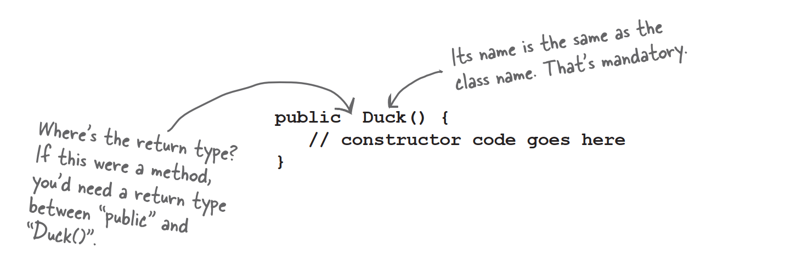

### **Q**:Why do you need to write a constructor if the compiler writes one for you?

**A**:If you need code to help initialize your object and get it ready for use,you'll have to write your own constructor. You might,for example,be dependent on input from the user before you can finish making the object ready. There's another reason you might have to write a constructor,even if you don't need any constructor code yourself. It has to do with your superclass constructor,and we'll talk about that in a few minutes.

### **Q**:How can you tell a constructor from a method? Can you also have a method that's the same as the class?

**A**:Java lets you declare a method with the same as your class. That doesn't make it a constructor,though. The thing that separates a method from a constructor is the return type,but constructors cannot have a return type.

### **Q**:Are constructors inherited? If you don't provide a constructor but your superclass does,do you get the superclass constructor instead of the default?

**A**:Nope. Constructor are not inherited.

# Doesn't the compiler <u>always</u> make a no-arg constructor for you?

You might think that if you write only a constructor with arguments,the compiler will see that you don't have a no-arg constructor,and stick one in for you. But that's not how it works. The compiler gets involved with constructor-making *only if you don't say anything at all about constructors.*

**If you write a constructor that takes arguments,and you still want a no-arg constructor,you'll have to build the no-arg constructor yourself.**

As soon as you provide a constructor,ANY kind of constructor,the compiler backs off and says,"OK Buddy,looks like you're in charge of constructors now."

**If you have more than one constructor in a class,the constructors MUST have different argument lists.**

The argument list includes the order and types of the arguments. As long as they're different,you can have more than one constructor. You can do this with methods as well.

# <u>Overloaded</u> constructors means you have more than one constructor in your class.

**To compile,each constructor must have a different argument list!**

The class below is legal because all four constructors have different argument lists. If you had two constructors that took only an int,for example,the class wouldn't compile. What you name the parameter variable doesn't count. It's the variable type and order that matters. You can have two constructors that have identical types,***as long as order is different***. A constructor that takes a String followed by an int,is not the same as one that takes an int followed by String.

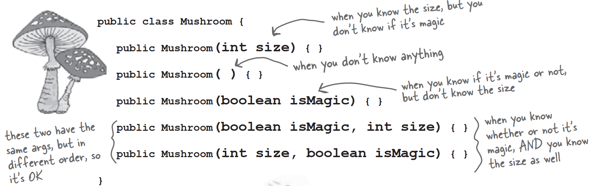

# BULLET POINTS

- Instance variable live with the object they belong to,on the Heap
- If the instance variable is a reference to an object,both the reference and the object it refers to are on the Heap
- A constructor is the code that runs when you say **new** on a class type
- A constructor must have the same name as the class,and must not have a return type
- You can use a constructor to initialize the state of the object being constructed
- If you don't put a constructor in your class,the compiler will put in a default constructor
- The default constructor is always a no-arg constructor
- If you put a constructor—any constructor—in your class,the compiler will not build the default constructor
- If you want a no-arg constructor,and you've already put in a constructor with arguments,you'll have to build the no-arg constructor yourself
- Always provide a no-arg constructor if you can,to make it easy for programmers to make a working object. Supply default values
- Overloaded constructors means you have more than one constructor in your class
- Overloaded constructors must have different argument lists
- You cannot have two constructors with the same argument list. An argument list includes the order and/or type of arguments
- Instance variables are assigned a default value,even when you don't explicitly assign one. The default values are 0/0.0/false for primitives,and null for references

# Nanoreview: four things to remember about constructors

- A constructor is the code that runs when somebody says **new** on a class type

  Duck d = <u>new Duck()</u>;

- A constructor must have the same name as the class,and **no** return type

  public<u> Duck</u>(int size){}

- If you don't put a constructor in your class,the compiler puts in a default constructor. The default constructor is always a no-arg constructor

  public Duck(){}

- You can have more than one constructor in your class,as long as the argument lists are different. Having more than one constructor in a class means you have **overloaded** constructors

  public Duck(){}

  public Duck(int size){}

  public Duck(String name){}

  public Duck(String name, int size){}

### **Q**:Do constructors have to be public?

**A**:No. Constructors can be **public,private**,or default.

### **Q**:How could a private constructor ever be useful? Nobody could ever call it,so nobody could ever make a new object!

**A**:But that's not exactly right. Marking something **private** doesn't mean nobody can access it,it just means that nobody outside the class can access it, Bet you're thinking "Catch 22". Only code from the same class as the class-with-private-constructor can make a new object from that class,but without first making an object,how do you ever get to run code from that class in the first place?How do you ever get to anything in that class?Patience grasshopper.

# Wait a minute...we never DID talk about superclass and inheritance and how that fits in with constructors

Here's where it gets fun. Remember from the last chapter,the part where we looked at the Snowboard object wrapping around an inner core representing the Object portion of the Snowboard class? The Big Point there was that every object holds not just its own declared instance variables,but also *everything from its superclass*.

So when an object is created (because somebody said **new**;there is **no other way** to create an object other than someone,somewhere saying **new** on the class type),the object gets space for all instance variables,from all the way up the inheritance tree. Think about it for a moment...a superclass might have setter methods encapsulating a private variable. But that variable has to live somewhere. When an object is created,it's almost as though multiple objects materialize—the object being new'd and one object per each superclass. Conceptually,though,it's much better to think of it like the picture below,where the object being created has layers of itself representing each superclass.

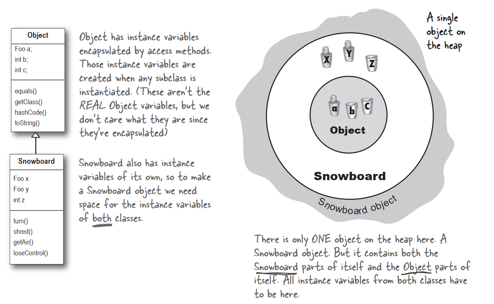

# The role of superclass constructors in an object's life

***All the constructors in an object's inheritance tree must run when you make a new object.***

Let that sink in.

That means every superclass has a constructor,and each constructor up the hierarchy runs at the time an object of a subclass is created.

Saying **new** is a Big Deal. It starts the whole constructor chain reaction. And yes,even abstract classes have constructors. Although you can never say new on an abstract class,an abstract class is still a superclass,so its constructor runs when someone makes an instance of a concrete subclass.

The super constructors run to build out the superclass parts of the object. Remember,a subclass might inherit methods that depend on superclass state. For an object to be fully-formed,all the superclass parts of itself must be fully-formed,and that's why the super constructor must run. All instance variables from every class in the inheritance tree have to be declared and initialized. Even if Animal has instance variables that Hippo doesn't inherit,the Hippo still depends on the Animal methods that use those variables. When a constructor runs,it immediately calls its superclass constructor,all the way up the chain until you get to the class Object constructor.

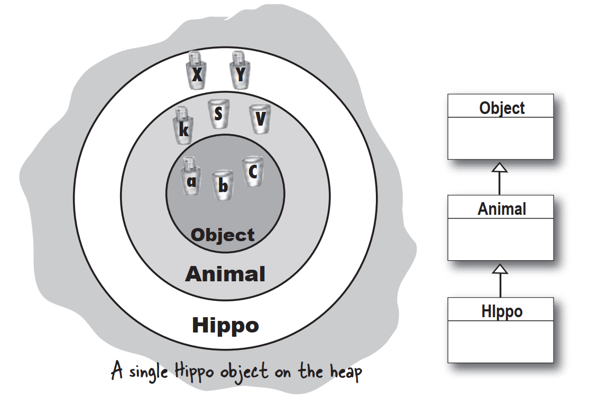

### A new **Hippo** object also IS-A **Animal** and IS-A **Object**. If you want to make a **Hippo**,you must also make the **Animal** and **Object** parts of the **Hippo**.

### This all happens in a process called **Constructor Chaining**.

# Making a Hippo means making the Animal and Object parts too...

```java
public class Animal{
	public Animal(){
		System.out.println("Making an Animal");
	}
}
```

```java
public class Hippo extends Animal{
	public Hippo(){
		System.out.println("Making a Hippo");
	}
}
```

```java
public class TestHippo{
	public static void main(String[] args){
		System.out.println("Starting...");
		Hippo h = new Hippo();
	}
}
```

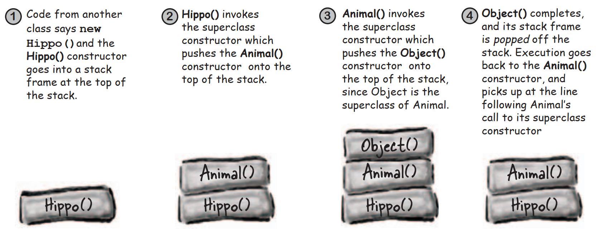

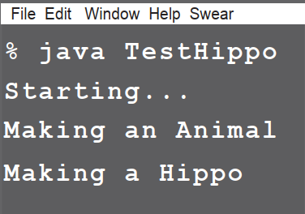

# How do you invoke a superclass constructor?

You might think that somewhere in,say,a Duck constructor,if Duck extends Animal you'd call Animal(). But that's not how it works:

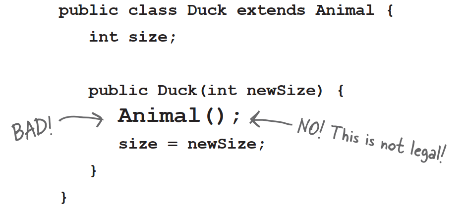

The only way to call a super constructor is by calling ***super()***. That's right—***super()*** calls the ***super constructor***.

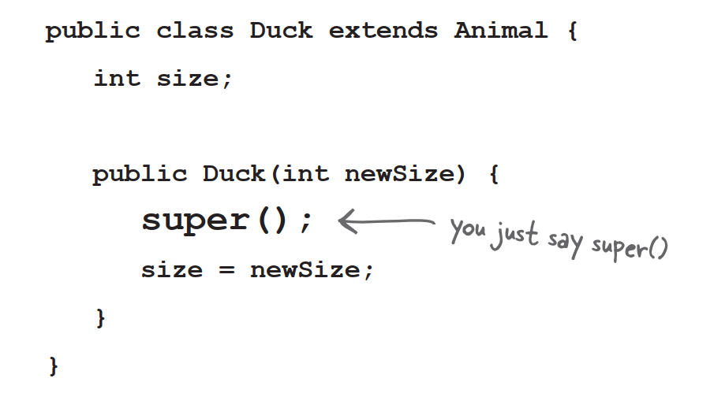

A call the super() in your constructor puts the superclass constructor on the top of the Stack. And what do you think that superclass constructor does? *Call its superclass constructor.* And so it goes until the Object constructor is on the top of the Stack. Once Object() finished,it's popped off the Stack and the next thing down the Stack is now on top. That constructor finishes and so it goes until the original constructor is on the top of the Stack,where it can now finish.

### And how is it that we've gotten away without doing it?

You probable figured that out.

**Our good friend the compiler puts in a call to super() if you don't.**

So the compiler gets invoked in constructor-making in two ways:

- **If you don't provide a constructor**

  The compiler puts one in that looks like:

  ```java
  public ClassName(){
  	super();
  }
  ```

- **If you do provide a constructor but you do not put in the call to super()**

  The compiler will put a call to super() in each of your overloaded constructors. The compiler-supplied call looks like:

  ```java
  super();
  ```

It always looks like that. The compiler-inserted call to super() is always a no-arg call. If the superclass has overloaded constructors,only the no-arg one is called.

# Can the child exist before the parents?

If you think of a superclass as the parent to the subclass child,you can figure out which has to exist first. ***The superclass parts of an object have to be fully-formed before the subclass parts can be constructed.*** Remember,the subclass object might depend on things it inherits from the superclass,so it's important that those inherited things be finished. No way around it. The superclass constructor must finish before its subclass constructor.

### The call to super() must be the first statement in each constructor!

# Superclass constructors with arguments

What if the superclass constructor has arguments? Can you pass something in to the super() call? Of course. If you couldn't,you'd never be able to extend a class that didn't have a no-arg constructor. Imagine this scenario: all animals have a name. There's a getName() method in class Animal that returns the value of the name instance variable. The instance variable is marked private,but the subclass inherits the getName() method. So here's the problem: Hippo has a getName() method,but does not have the name instance variable. Hippo has to depend on the Animal part of himself to keep the name instance variable,and return it when someone calls getName() on a Hippo object. But...how does the Animal part get the name? The only reference Hippo has to the Animal part of himself is through super(),so that's the place where Hippo sends the Hippo's name up to the Animal part of himself,so that the Animal part can store it in the private name instance variable.

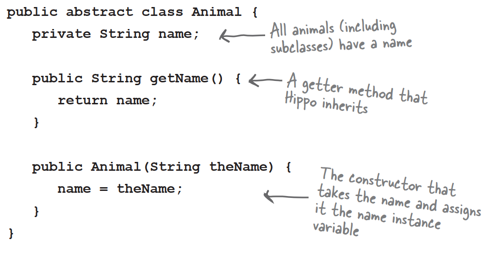

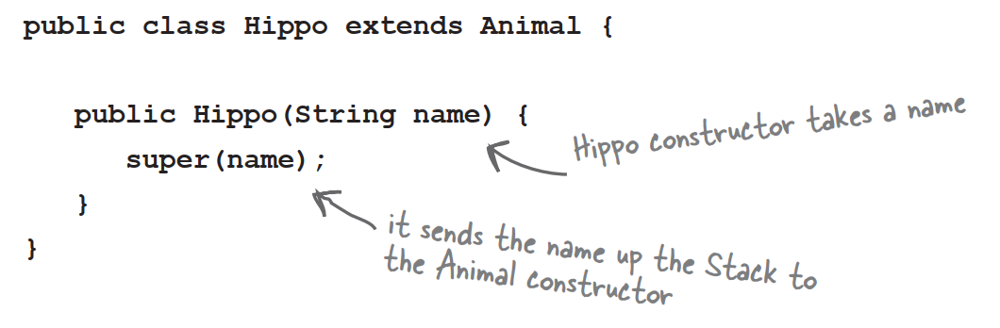

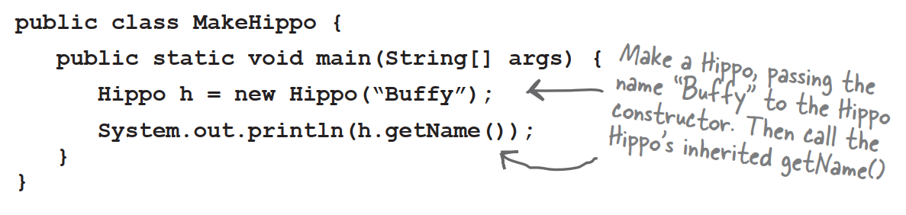

# Invoking one overloaded constructor from another

What if you have overloaded constructors that,with the exception of handling different argument types,all do the same thing? You know that you don't want duplicate code sitting in each of the constructors,so you'd like to put the bulk of the constructor is first invoked constructors. You want whichever constructor is first invoked to call The Real Constructor and let The Real Constructor finish the job of construction. It's simple: just say this(). Or this(aString). Or this(27,x). In other words,just imagine that the keyword this is a reference to **the current object**. You can say this() only within a constructor,and it must be the first statement in the constructor!

But that's problem,isn't it? Earlier we said that super() must be the first statement in the constructor. Well,that means you get a choice.

### Every constructor can have a call to super() or this(),but never both!

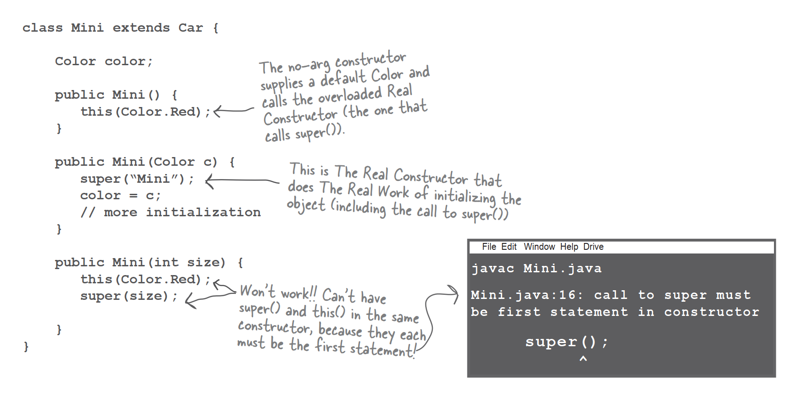

### Use <u>this()</u> to call a constructor from another overloaded constructor in the same class. The call to this() can be used only in a constructor,and must be the <u>first</u> statement in a constructor.

### A constructor can have a call to super() OR this(),but never both!

# Now we know how an object is born,but how long does an object live?

An object's life depends entirely on the life of references referring to it. If the reference is considered "alive",the object is still alive on the Heap. If the reference dies,the object will die.

### So if an object's life depends on the reference variable's life,how long does a variable live?

That depends on whether the variable is a local variable or an instance variable. The code below show the life of a local variable. In the example,the variable is a primitive,but variable lifetime is the same whether it's a primitive or reference variable.

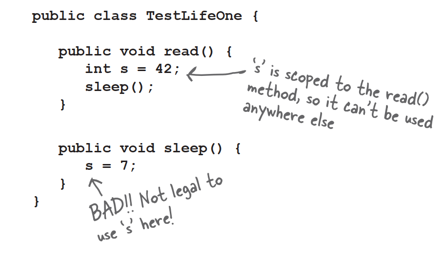

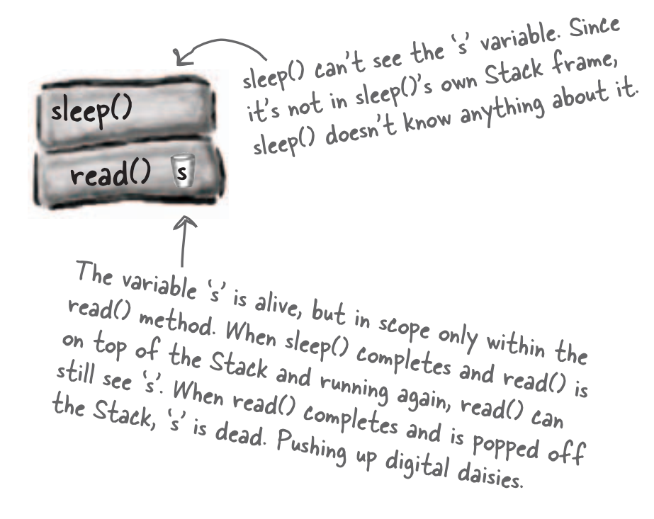

- ### A <u>local</u> variable lives only within the method that declared the variable

- ### An <u>instance</u> variable lives as long as the object does. If the object is still alive,so are its instance variables.

# The different between life and **scope** for local variables:

- **Life**

  A local variable is alive as long as its Stack frame is on the Stack. In other words,*until the method completes.*

- **Scope**

  A local variable is in scope only within the method in which the variable was declared. When its own method calls another,the variable is alive,but not in scope until its method resumes. **You can use a variable only when it is in scope.**

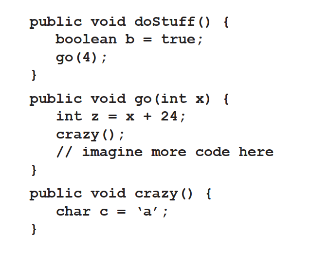

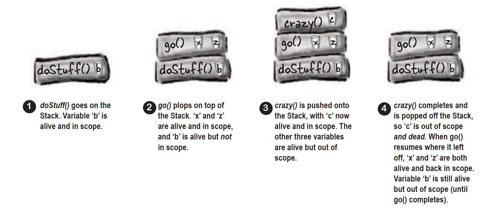

While a local variable is alive,its state persists. As long as method doStuff() is on the Stack,for example,the "b" variable keeps its value. But the "b" variable can be used only while doStuff()'s Stack frame is at the top. In other words,you can use a local variable only while that local variable's method is actually running.

# What about reference variables?

The rules are the same for primitives and references. A reference variable can be used only when it's in scope,which means you can't use an object's remote control unless you've got a reference variable that's in scope. The *real* question is,

### "How does *variable* life affect *object* life?"

An object is alive as long as there are live references to it. If a reference variable goes out of scope but is still alive,the object it *refers* to is still alive on the Heap. And then you have to ask..."What happens when the Stack frame holding the reference gets popped off the Stack at the end of the method?"

If that was the only live reference to the object,the object is now abandoned on the Heap. The reference variable disintegrated with the Stack frame,so the abandoned object is now,officially,toast. The trick is to know the point at which an object becomes ***eligible for garbage collection.***

Once an object is eligible for garbage collection(GC),you don't have to worry about reclaiming the memory that object was using. If your program gets low on memory,GC will destroy some or all of the eligible objects,to keep you from running out of RAM. You can still run out of memory,but not before all eligible objects have been hauled off to the dump. Your job is to make sure that you abandon objects when you're done with them,so that the garbage collector has something to reclaim. If you hang on to objects,GC can't help you and you run the risk of your program dying a painful out-of-memory death.

### An object's life has no value,no meaning,no point,unless somebody has a reference to it. If you can't get to it,you can't ask it to do anything and it's just a big fat waste of bits. But if an object is unreachable,the Garbage Collector will figure that our. Sooner or later,that object's goin' down.

### An object becomes eligible for GC when its last live reference disappears.

### Three ways to get rid of an object's reference:

- The reference goes out of scope,permanently

  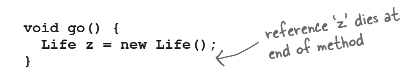

- The reference is assigned another object

  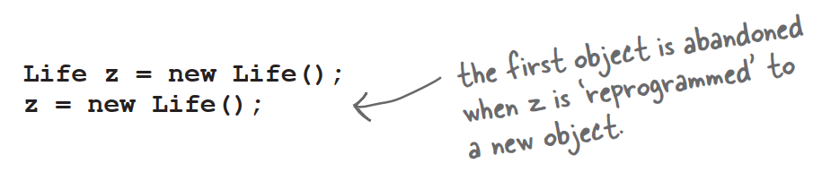

- The reference is explicitly set to null

  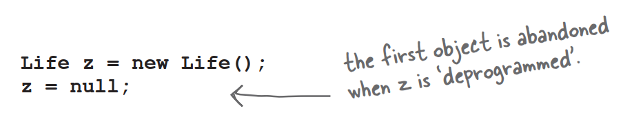

# Reference goes out of scope,permanently

```java
public class StackRef{
	public void foof(){
		barf();
	}

	public void barf(){
		Duck d = new Duck();
	}
}
```

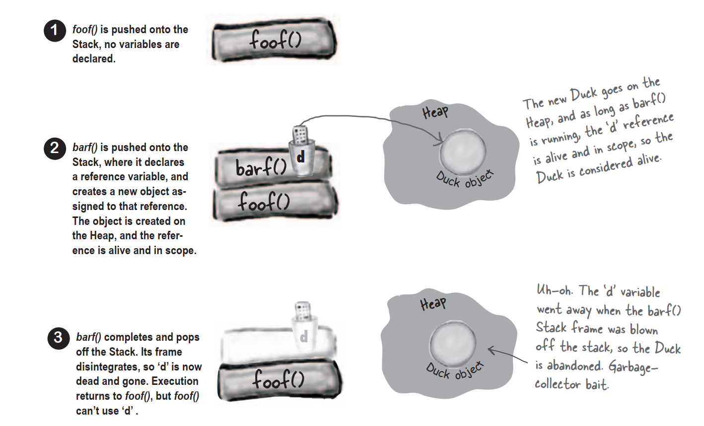

# Assign the reference to another object

```java
public class ReRef{
	Duck d = new Duck();
	
	public void go(){
		d = new Duck();
	}
}
```

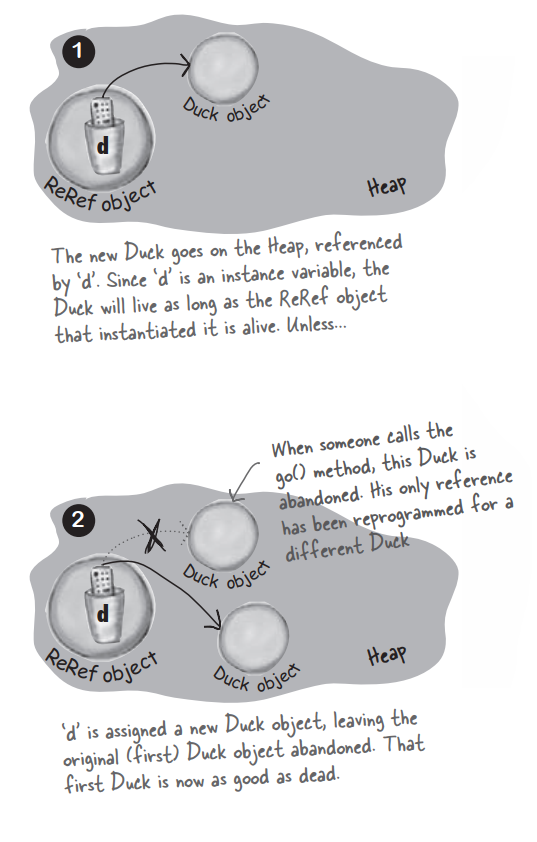

# Explicitly set the reference to null

```java
public class ReRef{
	Duck d = new Duck();
	
	public void go(){
		d = null;
	}
}
```

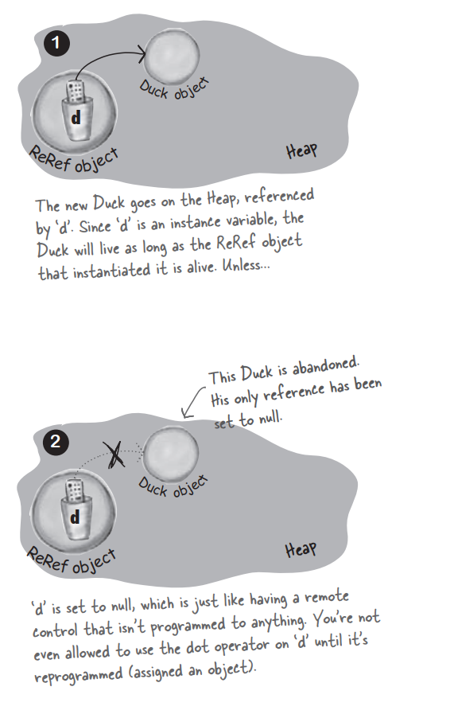

### The meaning of null

When you set a reference to null,you're deprogramming the remote control. In other word,you've got a remote control,but no TV at the other end. A null reference has bits representing 'null'.

If you have an unprogrammed remote control,in the real world,the buttons don't do anything when you press them. But in Java,you can't press the buttons on a null reference,because the JVM knows that you've expecting a bark but there's no Dog there to do it!

**If you use the dot operator on a null reference,you'll get a NullPointException at runtime.**