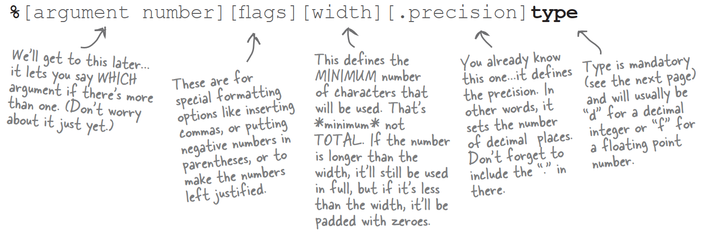

# MATH methods: as close as you'll ever get to a global method

***These methods never use instance variable values.*** In fact the Math class doesn't *have* any instance variables. So there's nothing to be gained by making an instance of class Math. So guess what? You don't have to. As a matter of fact,you can't.

### If you try to make an instance of class Math:

`Math mathObject  = new Math();`

### You'll get this error:


### Methods in the Math class don't use any instance variable values. And because the methods are "static",you don't need to have an <u>instance</u> of Math. All you need is the Math <u>class</u>.


# The difference between regular (non-static) and static methods

Java is object-oriented,but once in a while you have a special case,typically a utility method,where there is no need to have an instance of the class. The keyword **static** lets a method run ***without any instance of the class***. A static method means "behavior not dependent on an instance variable,so no instance/object is required. Just the class."


# What it means to have a class with static methods.

Often,a class with static methods is not meant to be instantiated.

But you can restrict other code from instantiating a non-abstract class by marking the constructor **private**. Remember,a *method* marked private means that only code from within the class can invoke the method. A *constructor* marked private means essentially the same thing—only code from within the class can invoke the constructor. Nobody can say 'new' from *outside* the class.

This does *not* mean that a class with one or more static methods should never be instantiated. In fact,every class you put a main() method in is a class with a static method in it!

Typically,you make a main() methods so that you can launch or test another class,nearly always by instantiating a class in main,and the invoking a method on that new instance.

So you're free to combine static and non-static methods in a class,although even a single non-static method means there must be some way to make an instance of the class. The only ways to get a new object are through 'new' or deserialization. No other way.

# Static methods can't use non-static (instance) variables!

Static methods run without knowing about any particular instance of the static method's class. And as you saw in the previous pages,there might not even be any instances of that class. Since a static method is called using the class as apposed to an instance reference,a static method can't refer to any instance variables of the class. The static method doesn't know which instance's variable value to use.

### If you try to use an instance variable from inside a static method,the compiler thinks,"I don't know which object's instance variable you're talking about!" If you have ten Duck objects on the heap,a static method doesn't know about any of them.

# Static methods can't use non-static <u>methods</u>,either!

What do non-static methods do? ***They usually use instance variable state to affect the behavior of the method.*** A getName() method returns the value of the name variable. Whose name? The object used to invoke the getName() method.

### **Q**:What if you try to call a non-static method from a static method,but the non-static method doesn't use any instance variables. Will the compiler allow that?

**A**:No! The compiler knows that whether you do or do not use instance variables in a non-static method,you can. And think about the implications...if you were allowed to compile a scenario like that,then what happens if in the future you want to change the implementation of that non-static method so that one day it does use an instance variable? Or worse,what happen if a subclass overrides the method and uses an instance variable in the overriding version?

# Static variable: value is the same for ALL instances of the class


### Static variables are shared.

### All instance of the same class share a single copy of the static variables.

instance variables: 1 per **instance**

static variables: 1 per **class**

# Initializing a static variable

Static variables are initialized when a class is loaded. A class is loaded because the JVM decides it's time to load it. Typically,the JVM loads a class because somebody's trying to make a new instance of the class,for the first time,or use a static method or variable of the class. As a programmer,you also have the option of telling the JVM to load a class,but you're not likely to need to do that. In nearly all cases,you're better off letting the JVM decide when to load the class.

And there are two guarantees about static initialization:

Static variables in a class are initialized before any object of that class can be created.

Static variables in a class are initialized before any static method of the class runs.


# static <u>final</u> variables are constants

A variable marked **final** means that—once initialized—it can never change. In other words,the value of the static final variable will stay the same as long as the class is loaded.

There is no other way to designate a variable as a constant,but there's a naming convention that helps you to recognize one.

***Constant variable names should be in all caps!***

A **static initializer** is a block of code that runs when a class is loaded,before any code can use the class,so it's a great place to initialize a <u>static</u> final variable.

```java
class Foo{
	final static int x;
	static{
		x = 42;
	}
}
```

### Initialize a final static variable:

- At the time you declare it:

  

- In a static initializer:

  

# final isn't just for static variables...

You can use the keyword **final** to modify non-static variables too,including instance variables,local variables,and even method parameters. In each case,it means the same thing: the value can't be changed. But you can also use final to stop someone from overriding a method or making a subclass.

### A final **variables** means you can't **change** its value.

### A final **method** means you can't **override** the method.

### A final **class** means you can't **extend** the class.

### **Q**:A static method can't access a non-static variable. But can a non-static method access a static variable?

**A**:Of course. A non-static method in a class can always call a static method in the class or access a static variable of the class.

# Wrapping a primitive


Sometimes you want to treat a primitive like an object. For example,in all versions of Java prior to 5.0,you cannot put a primitive directly into a collection like ArrayList or HashMap:


There's a wrapper class for every primitive type,and since the wrapper classes are in the java.lang package,you don't need to import them. You can recognize wrapper classes because each one is named after the primitive type it wraps,but with the first capitalized to follow the class naming convention.

For reasons absolutely nobody on the planet is certain of,the API designers decided not to map the names *exactly* from primitive type to class type. You'll see what we mean:


### **Q**:Why not declare an ArrayList<int> if you want to hold ints?

**A**:Because...you can't. Remember,the rule for generic types is that you can specify only class or interface types,not primitives. So ArrayList<int> will not compile. But as you can see from the code above,it doesn't really matter,since the compiler lets you put this into the ArrayList<Integer>. In face,there's really no way to prevent you from putting primitives into an ArrayList where the type of the list is the type of that primitive's wrapper,if you're using  a Java 5.0-compliant compiler,since autoboxing will happen automatically. So,you can put boolean primitives in an ArrayList<Boolean> and chars into an ArrayList<Character>.

# But wait! There's more! Wrappers have static utility methods too!

Besides acting like a normal class,the wrappers have a bunch of really useful static methods.

The parse methods take a String and give you back a primitive value.

### Converting a String to a primitive value is easy:


# And now in reverse...turning a primitive number into a String

There are several ways to turn a number into a String. The easiest is to simply concatenate the number to an existing String.


# Number formatting

**Formatting a number to use commas**


# Formatting deconstructed

At the most basic level,formatting consists of two main parts:

- **Formatting instructions**

  You use special format specifiers that describe how the argument should be formatted

- **The argument to be formatted**

  Although there can be more than one argument,we'll start with just one. The argument type can't be just anything...it has to be something that can be formatted using the format specifiers in the formatting instructions. For example,if your formatting instructions specify a floating point number,you can't pass in a Dog or even a String that looks like a floating point number


### What do these instructions actually say?

"Take the second argument to this method,and format it as a **d**ecimal integer and insert **commas**."

### How do they say that?

Any time you see the percent sign (%) in a format String,think of it as representing a variable,and the variable is the other argument to the method. The rest of the characters after the percent sign describe the formatting instructions for the argument.

# The percent(%) says,"insert argument here"(and format it using these instructions)

The first argument to a format() method is called the format String,and it can actually include characters that you just want printed as-is,without extra formatting. When you see the % sign,though,think of the percent sign as a variable that represents the other argument to the method.


# The format String uses its own little language syntax

You obviously can't put just everything after "%" sign. The syntax for what goes after the percent sign follows very specific rules,and describes how to format the argument that gets inserted at that point in the result String.

**%,d** means "insert commas and format the number as a decimal integer"

**%,2f** means "format the number as a floating point with a precision of two decimal places"

**%,.2f** means "insert commas and format the numbers as a floating point with a precision of two decimal places"

The real question is really,"How do I know what to put after the percent sign to get it to do what I want?" And that includes knowing the symbols as well as the order in which the instructions must be placed following the percent sign.

# The format specifier

Everything after the percent sign up to and including the type indicator are part of the formatting instructions. After the type indicator,the formatter assumes the next set of characters are meant to be part of the output String,until or unless it hits another percent sign. Hmmmm...is that even possible? Can you have more than one formatted argument variable?

### A format specifier can have up to five different parts (not including the "%"). Everything in brackets [] below is optional,so only the percent *(%) and the type are required. But the order is also mandatory,so any parts you DO use must go in this order.




# The only required specifier is for TYPE


### You must include a type in your format instructions,and if you specify things besides type,the type must always come <u>last</u>. Most of the time,you'll probably format numbers using either "d" for decimal or "f" for floating point.

# What happen if I have more than one argument?

You simply add two arguments after the format String,so that means your call to format() will have three arguments instead two. And inside that first argument,you'll have two different format specifiers. The first format specifier will insert the second argument to the method,and the second format specifier will insert the third argument to the method. In other words,the variable insertions in the format String use the order in which the other arguments are passed into the format() method.


# So much for numbers,what about dates?


# Moving backward and forward in time

### For a time-stamp of "now" use Date. But for everything else,use Calendar.

# Getting an object that extends Calendar

Use the static "getInstance()" method:


### You can't get an instance of Calendar,but you can get an instance of a concrete Calendar subclass.

# Working with Calendar objects

There are several key concepts you'll need to understand in order to work with Calendar objects:

- **Fields hold state**
- **Dates and Times can be incremented**
- **Dates and Times can be represented in milliseconds**


