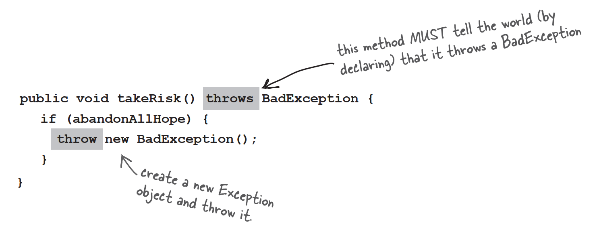

# What happens when a method you want to call (probably in a class you didn't write) is risky?

1. Let's say you want to call a method in a class that you didn't write

   

2. That method does something risky,something that might not work at runtime

   

3. You need to know that the method you're calling is risky

   

4. You then write code that can handle the failure if it does happen. You need to be prepared,just in case

   

# Methods in Java use exceptions to tell the calling code,"Something Bad Happened. I failed."

Java's exception-handing mechanism is a clean,well0lighted way to handle "exceptional situations" that pop up at runtime;it lets you put all your error-handing is risky,so that you can write code to deal with that possibility. If you know you might get an exception when you call a particular method,you can be prepared for—possibly even recover from—the problem that caused the exception.

So,how do you know if a method throw an exception? You find a **throws** clause in the risky method's declaration.

# The compiler needs to know that YOU know you're calling a risky method

If you wrap the risky code in something called a **try/catch**,the compiler will relax.

A try/catch block tells the compiler that you know an exceptional thing could happen in the method you're calling,and that you're prepared to handle it. That compiler doesn't care how you handle it;it cares only that you say you're talking care of it.

# An exception is an object...of type Exception

Which is fortunate,because it would be much harder to remember if exceptions were of type Broccoli.

Remember from your polymorphism chapters that an object of type Exception can be an instance of any subclass of Exception.


Because an Exception is an object,what you catch is an object. In the following code,the **catch** argument is declared as type Exception,and the parameter reference variable is ex.


What you write in a catch block depends on the exception that was thrown. For example,if a server is down you might use the catch block to try another server. If the file isn't there,you might ask the user for help finding it.

# If it's your code that <u>catches</u> the exception,then whose code <u>throws</u> it?

You'll spend much more of your Java coding time *handling* exceptions than you'll spend *creating* and *throwing* them yourself. For now,just know that when your code calls a risky method—a method that declares an exception—it's the risky method that throws the exception back to you,the caller.

In reality,it might be you who wrote both classes. It really doesn't matter who writes the code...what matters is knowing which method throws the exception and which method catches it. When somebody writes code that could throw an exception,they must declare the exception.

1. Risky,exception-throwing code:

   

2. Your code that calls the risky method:

   

### One method will <u>catch</u> what another method <u>throws</u>. An exception is always thrown back to the caller.

### The method that throws has to <u>declare</u> that it might throw the exception.

# The compiler checks for everything except RuntimeExceptions

### The compiler guarantees:

1. If you throw an exception in your code you must declare it using the *throws* keyword in your method declaration.
2. If you call a method that throws an exception,you must acknowledge that you're aware of the exception possibility. One way to satisfy the compiler is to wrap the call in a try/catch.


### **Q**:WHY doesn't the compiler care about those runtime exceptions? Aren't they just as likely to bring the whole show to a stop?

**A**:Most RuntimeExceptions come from a problem in your code logic,rather than a condition that fails at runtime in ways that you cannot predict or prevent. You cannot guarantee the file is there. You cannot guarantee the server is up. But you can make sure your code doesn't index off the end of an array. You WANT RuntimeExceptions to happen at development and testing time. You don't want to code in a try/catch,for example,and have the overhead that goes with it,to catch something that shouldn't happen in the first place.

A try/catch is for handing exceptional situations,not flaws in your code. Use your catch blocks to try to recover from situations you can't guarantee will succeed. Or at the very least,print out a message to the user and a stack trace,so somebody can figure out what happen.

# Finally: for the things you want to do no matter what

If you try to cook something,you start by turning on the oven.

If the thing you try is a complete **failure,*you have to turn off the oven.***

If the thing you try **succeeds,*you have to turn off the oven.***

**You have to turn off the oven no matter what!**

### A finally block is where you put code that must run regardless of an exception.

```java
try{
	turnOvenOn();
	x.bake();
}catch(BakingException ex){
	ex.printStackTrace();
}finally{
	turnOvenOff();
}
```

# When you don't want to handle an exception...

### If you don't want to handle an exception,you can **duck** it by **declaring** it.

When a method throws an exception,that method is popped off the stack immediately,and the exception is thrown to the next method down the stack—the *caller*. But if the *caller* is a *ducker*,then there's no catch for it so the *caller* pops off the stack immediately,and the exception is thrown to the next method and so on..

# Ducking (by declaring) only delays the inevitable

### Sooner or later,somebody has to deal with it. But what if main() ducks the exception?


