# Capture the Beat

### If your data will be used by only the Java program that generated it:

- **Use <u>serialization</u>**

  Write a file that holds flattened(serialized) objects. Then have your program read the serialized objects from the file and inflate them back into living,breathing,heap-inhabiting objects.

### If your data will be used by other programs:

- **Write a <u>plain text</u> file**

  Write a file,with delimiters that other programs can parse. For example,a tab-delimited file that a spreadsheet or database application can use.

# Saving State

- **Write the three serialized character objects to a file**

  Create a file and write three serialized character objects. The file won’t make sense if you try to read it as text.

- **Write a plain text file**

  Create a file and write three lines of text,one per character,separating the pieces of state with commas.

# Write a serialized object to a file

Here are the steps for serializing(saving) an object.

1. **Make a <u>FileOutputStream</u>**

   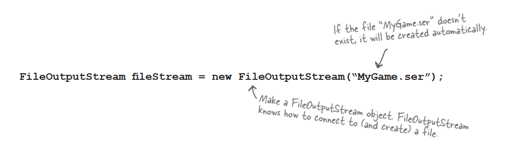

2. **Make an <u>ObjectOutputStream</u>**

   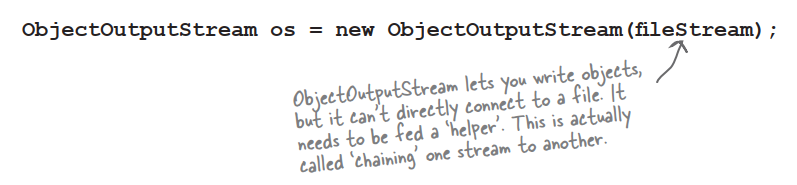

3. **<u>Write</u> the object**

   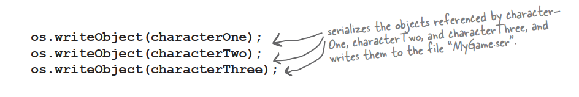

4. **<u>Close</u> the ObjectOutputStream**

   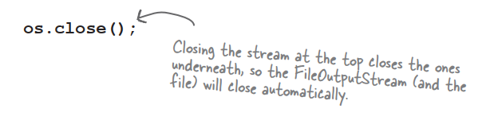

# Data moves in streams from one place to another

### **<u>Connection</u> streams represent a connection to a source or destination while <u>chain</u> streams can’t connect on their own and must be chained to a connection stream.**

The Java I/O API has ***connection*** streams,that represent connections to destinations and sources such as files or network sockects,and ***chain*** streams that work only if chained to other streams.

Often,it takes at least two streams hooked together to do something useful—one to represent the connection and *anohter* to call methods on. Why two? Because *connection* streams are usually too low-level. FileOutputStream,for example,has methods for writing *bytes*. But we don’t want to write *bytes*! We want to write *objects*,so we need a higher-level *chain* stream.

Then why not have just a songle stream that does *exactly* what you want? Once that lets you write objects but underneath converts them to bytes? Think good OO. Each class does *one* thing well.

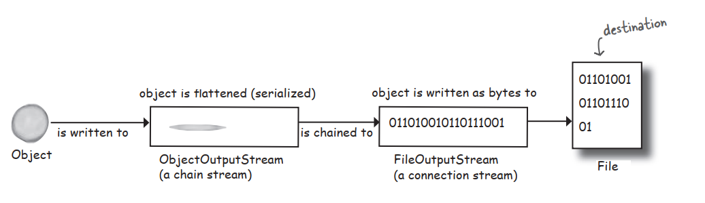

# What really happens to an object when it’s serialized?

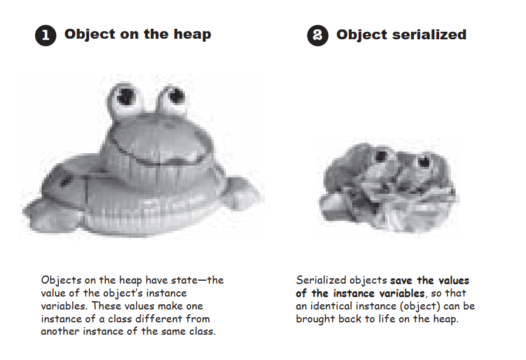

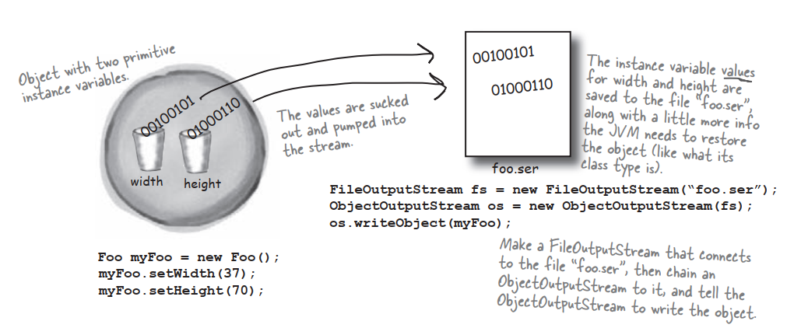

# But what exactly <u>IS</u> an object’s state? What needs to be saved?

Easy enough to save the *primitive* values 37 and 70. But what if an object has an instance variable that’s an object *reference*? What about an object that has five instance variables that are object references? What if those object instance variables themselves have instance variables?

# When an object is seriabled,all the objects it refers to from instance variables are also seriabled. And all the objects those objects refer to are seriabled. And all the objects those objects refer to are seriabled…and the best part is,it happens automatically!

This Kennel object has a reference to a Dog[] array object. The Dog[] holds references to two Dog objects. Each Dog object holds a reference to a String and a Collar object. The String objects have a collection of characters and the Collar objects have an int.

### **When you save the Kennel,<u>all</u> of  this is saved!**

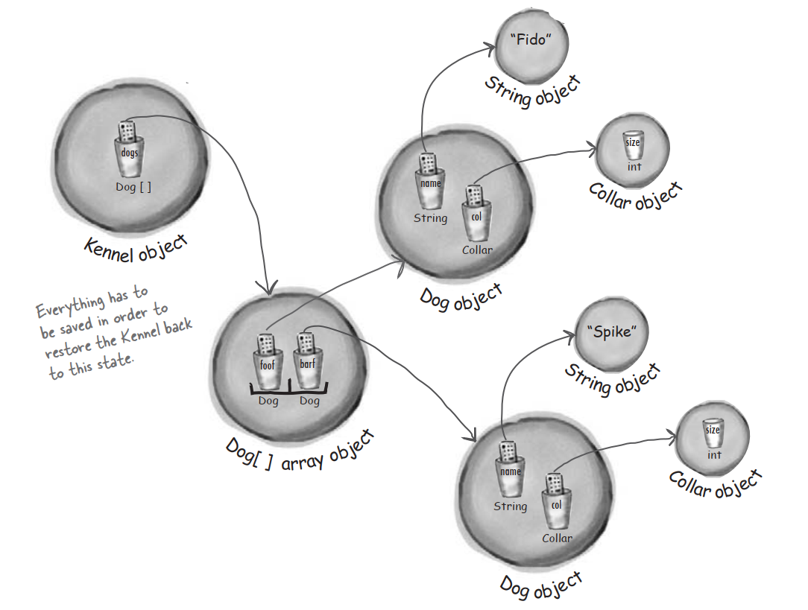

### Serialization saves the entire **object graph**. All objects referenced by instance variables,starting with the object being serialized.

# If you want your class to be serializable,implement <u>Serializable</u>

The Serializable interface is known as a *marker* or tag interface,because the interface doesn’t have any methods to implement. Its sole purpose is to announce that the class implementing it is,well,*serializable*. In other words,objects of that type are savable through the serialization mechanism. If any superclass of a class is serializable,the subclass is automatically serializable even if the subclass doesn’t explicitly declare implements *Serializable*.

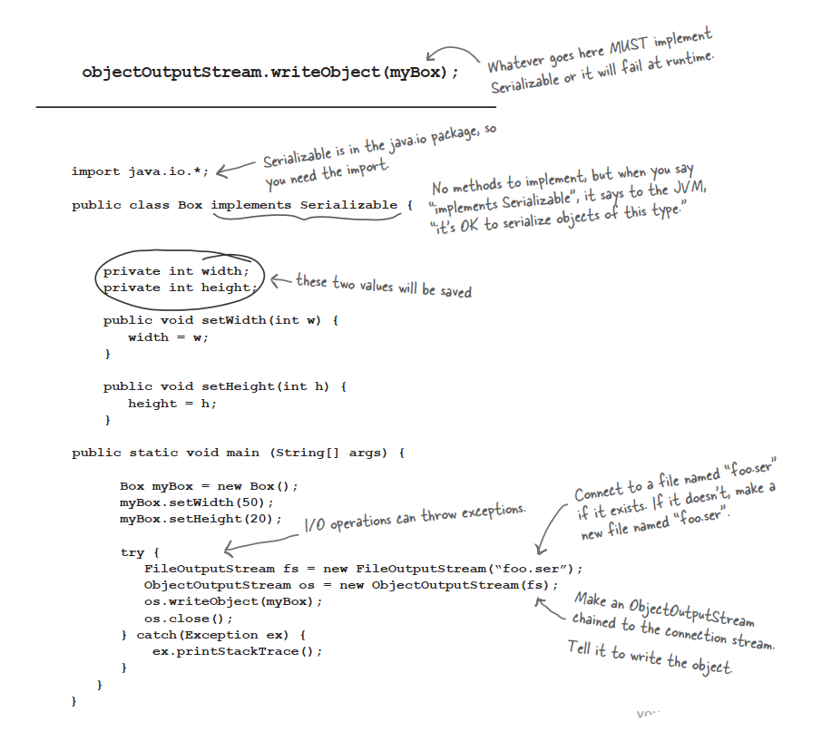

# Serialization is all or nothing.

### Can you imageine what would happen if some of the object’s state didn’t save correctly?

### Either the entire object graph is serialized correctly or serialization fails.

### You can’t serialize a Pone object if its Duck instance variable refuses to be serialized.

### Mark an instance variable as <u>transient</u> if it can’t (or shouldn’t) be saved.

If you want an instance variable to be skipped by the serialization process,mark the variable with the **transient** keyword.

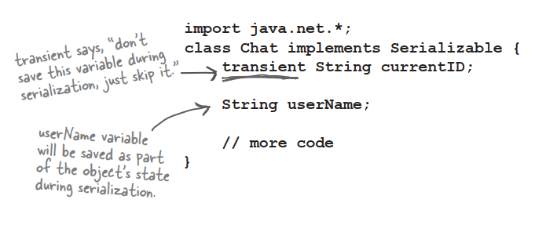

### **Q: If serialization is so important,why isn’t it the default for all classes? Why doesn’t class Object implement Serializable,and then all subclasses will be automatically Serializable.**

**A:**Even though most classes will,and should,implement Serializable,you always have a choice. And you must make a conscious decision on a class-by-class basis,for each class you design,to ‘enable’ serialization by implementing Serialiable. First of all,if serialization were the default,how would you turn if off? Interfaces indicate functionality,not a lack of functionality,so the model of polymorphism wouldn’t work correctly if you had ro say,’implements NonSerializable’ to tell the world that you cannot be saved.

# Deserialization: restoring an object

The whole point of serializing an object is so that you can restore it back to its original state at some later date,in a different ‘run’ of the JVM.

1. **Make a <u>FileInputStream</u>**

   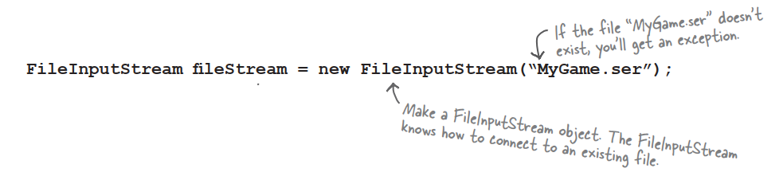

2. **Make an <u>ObjectInputStream</u>**

   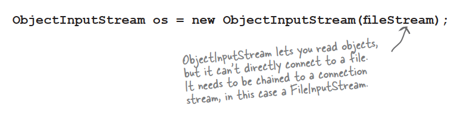

3. **<u>read</u> the objects**

   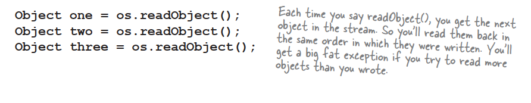

4. **<u>Cast</u> the objects**

   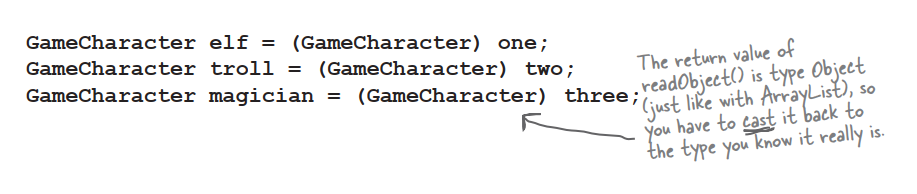

5. **<u>Close</u> the ObjectInputStream**

   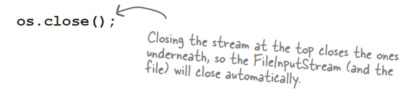

# What happens during deserialization?

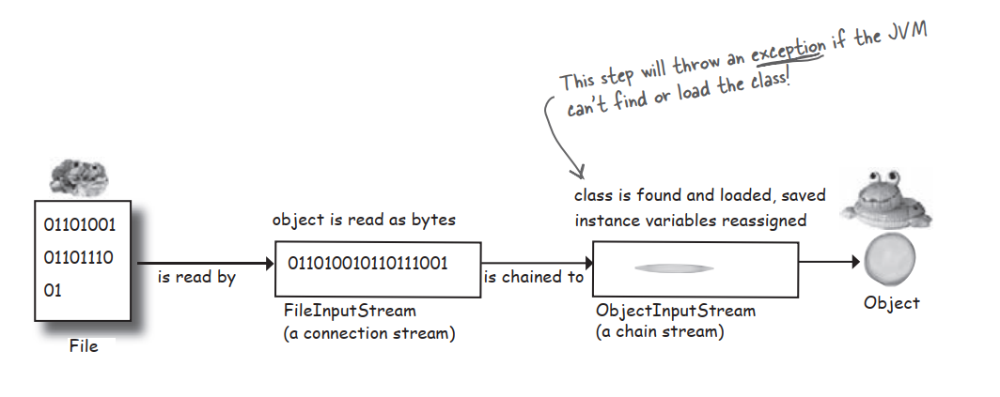

1. The object is **read** from the stream
2. The JVM determines the object’s **class type**
3. The JVM attempts to **find and load** the object’s **class**. If the JVM can’t find and/or load the class,the JVM throws an exception and the deserialization fails
4. A new object is given space on the heap,but the **serialized object’s constructor does NOT run**! Obviously,if the constructor ran,it would restore the state of the object back to its original ‘new’ state,and that’s not what we want. We want the object to be restored to the state it had when it was serialized,not when it was first created
5. If the object has a non-serializable class somewhere up its inheritance tree,the **constructor for that non-serializable class will run** along with any constructors above that. Once the constructor chaining begins,you can’t stop it,which means all superclasses,begining with the first non-serializable one,will reinitialize their state
6. The object’s **instance variables are given the values from the serialized state**. Transient variables are given a value of null for object reference and default for primitive

# Writing a String to a Text File

Writing text data is similar to writing an object,except you write a String instead of an object,and you use a FileWriter instead of a FileOutputStream.

### To write a serialized object:

```java
objectOutputStream.writeObject(someObject);
```

**To write a String:**

```java
fileWriter.write("My first String to save");
```

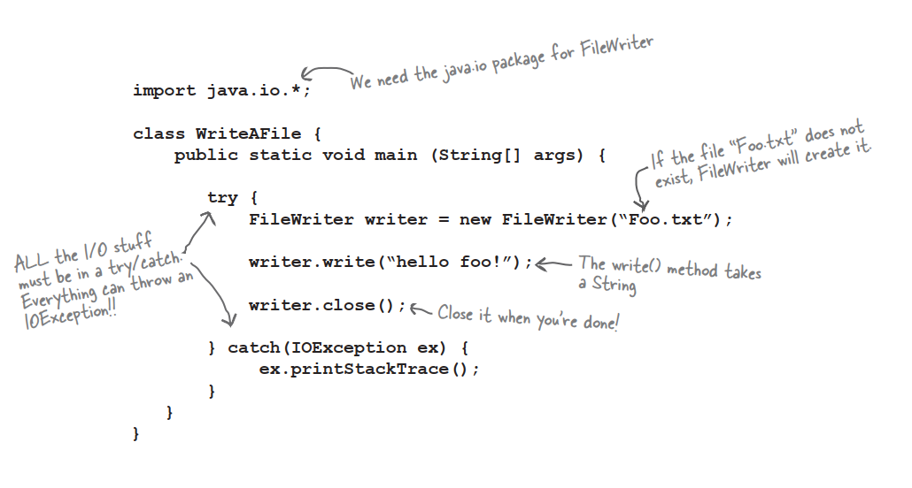

# The <u>java.io.File</u> class

### A File object represents the name and path of a file or directory on disk. But it does NOT represent,or give you access to,the data in the file!

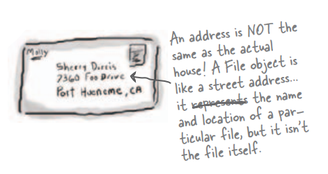

# The beauty of buffers

### If there were no buffers,it would be like shopping without a cart. You’d have to carry each thing out to your car,one soup can or toilet paper roll at a time.

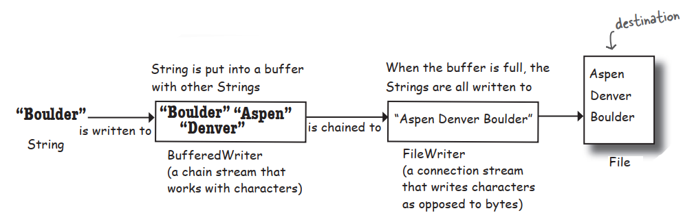

# Reading from a Text File

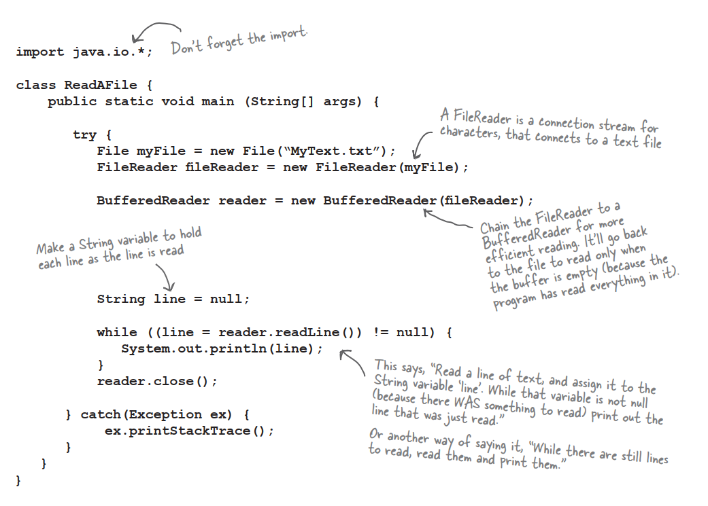

# Parse with String split()

### The split() method says,”give me a separator,and I’ll break out all the pieces of this String for you and put them in a String array.”

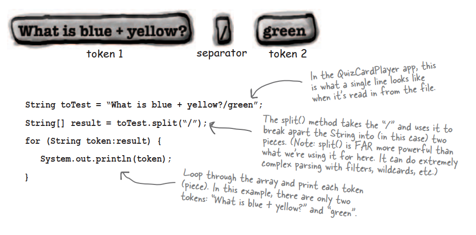

# Version ID: A Big Serialization Gotcha

### Version Control is crucial!

If you serialize an object,you must have the class in order to deserialize and use the object. OK,tha’s obvious. But what might be less obvious is what happens if you ***change the class*** in the meantime? Imagines trying to bring back a Dog object when one of its instance variables has changed from a double to a String. That violates Java’s type-safe sensibilities in a Big Way. But that’s not the only change that might hurt compatibility.

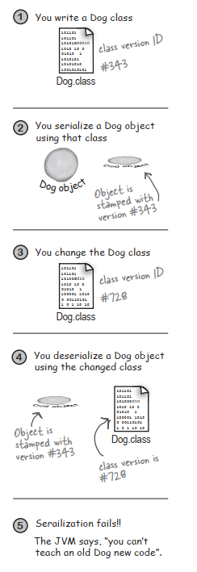

# Using the serialVersionUID

### If you think there is ANY possibility that your class might evolve,put a serial version ID in your class.