# Chat Program Overview

### The client has to know about the Server.

### The Server has to know about ALL the clients.

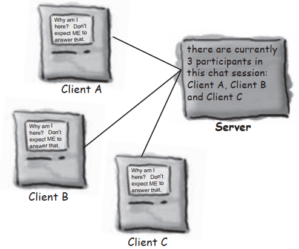

### How it works:

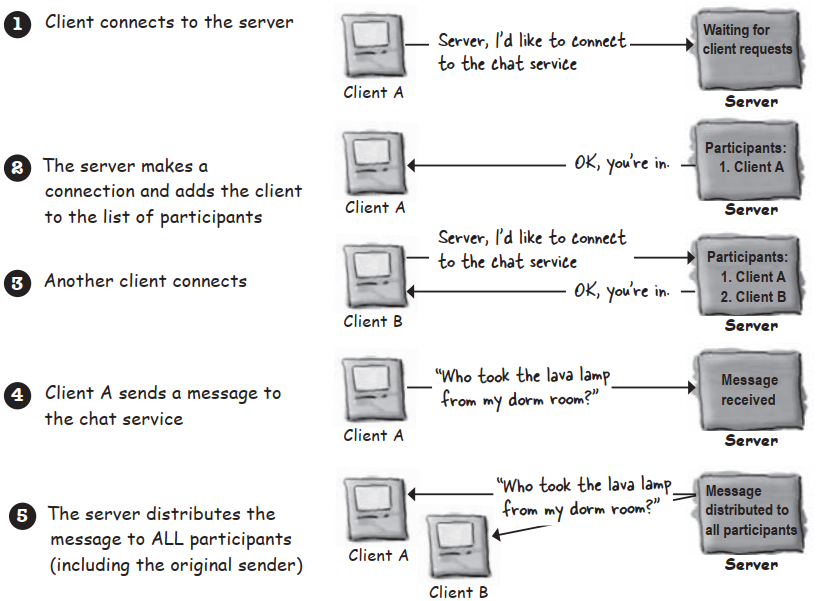

# Connecting,Sending,and Receiving

The three things we have to learn to get the client working are:

1. How to establish the initial **connection** between the client and server
2. How to **send** messages to the server
3. How to **receive** messages from the server

There’s a lot of low-level stuff that has to happen fort these things to work. But we’re lucky,because the Java API networking package makes it a piece of cake for programmers. You’ll see a lot more GUI code than networking and I/O code.

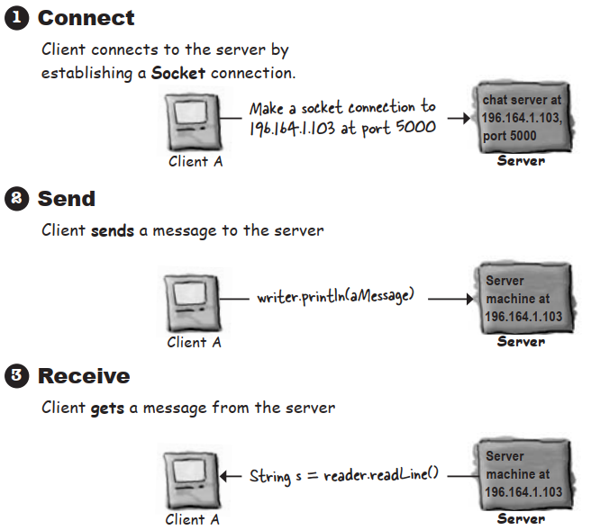

# Make a network Socket connection

### To make a Socket connection,you need to know <u>two</u> things about the server:who it is,and which port it’s running on. In other words,==IP address and TCP port number==.

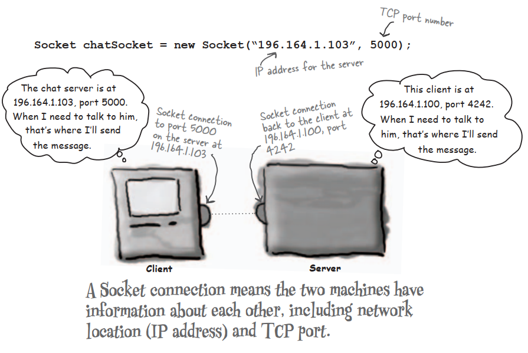

# A TCP port is just a number. A 16-bit number that identifies a specific program on the server

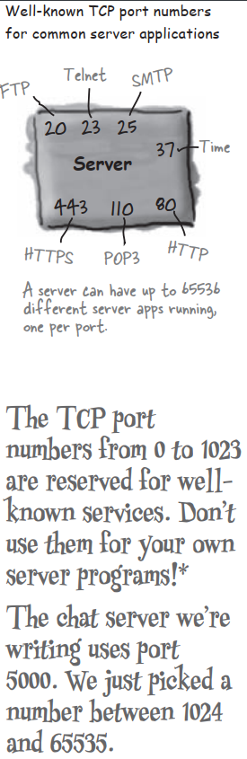

# To read data from a Socket,use a BufferReader

1. **Make a <u>Socket</u> connection to the server**

   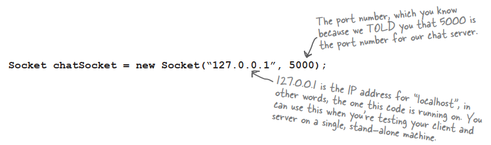

2. **Make an <u>InputStreamReader</u> chain to the Socket’s low-level (connection) input stream**

   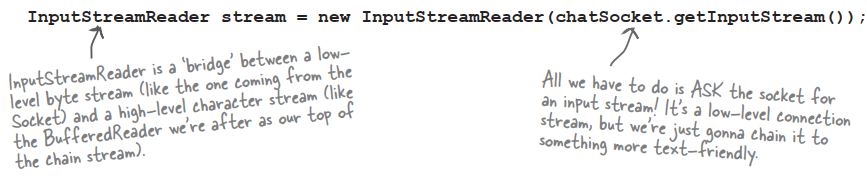

3. **Make a <u>BufferedReader</u> and read!**

   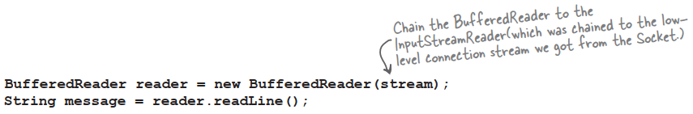

   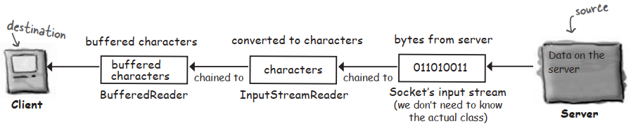

# To write data to a Socket,use a PrintWriter

1. **Make a <u>Socket</u> connetion to the server**

   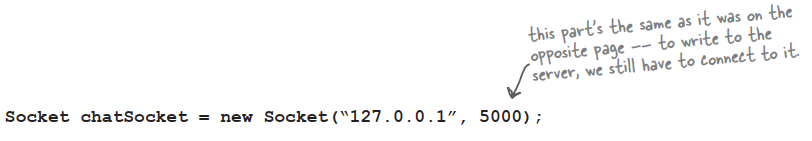

2. **Make a <u>PrintWriter</u> chained to the Socket’s low-level (connection) output stream**

   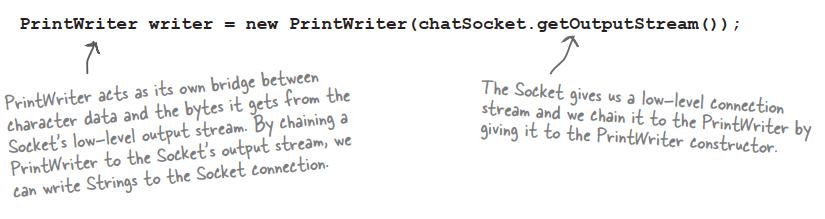

3. **<u>Write</u> (print) something**

   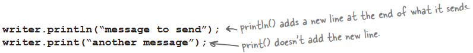

   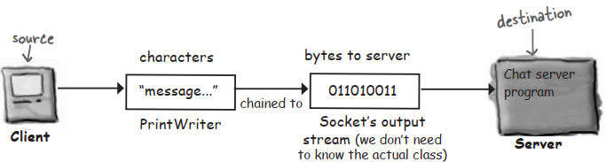

# Java has multiple threads but only one Thread class

### A thread is a separate ‘thread of execution’. In other words,a separate call stack. A Thread is a Java class that represents a thread. To make a thread,make a Thread.

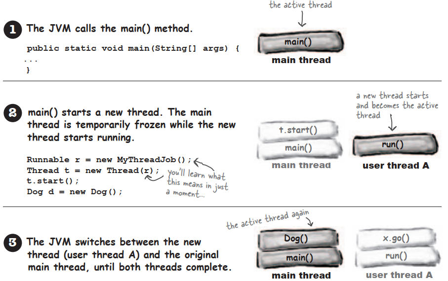

# How to launch a new thread:

1. **Make a Runnable object (the thread’s job)**

   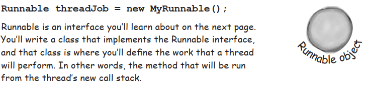

2. **Make a Thread object (the worker) and give it a Runnable (the job)**

   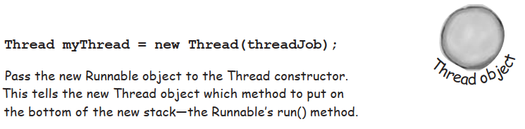

3. **Start the Thread**

   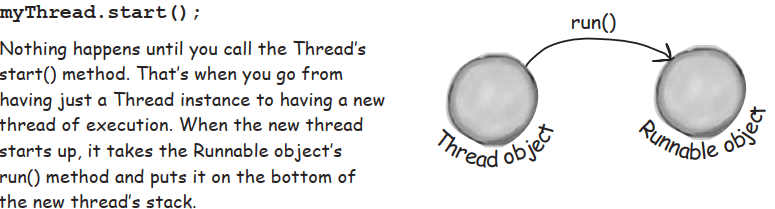

# Every Thread needs a job to do. A method to put on the new thread stack.

### Runnable is to a Thread what a job is to a worker. A Runnable is the job a thread is supposed to run.

### A Runnable holds the method that goes on the bottom of the new thread’s stack:run().

# The three states of a new thread

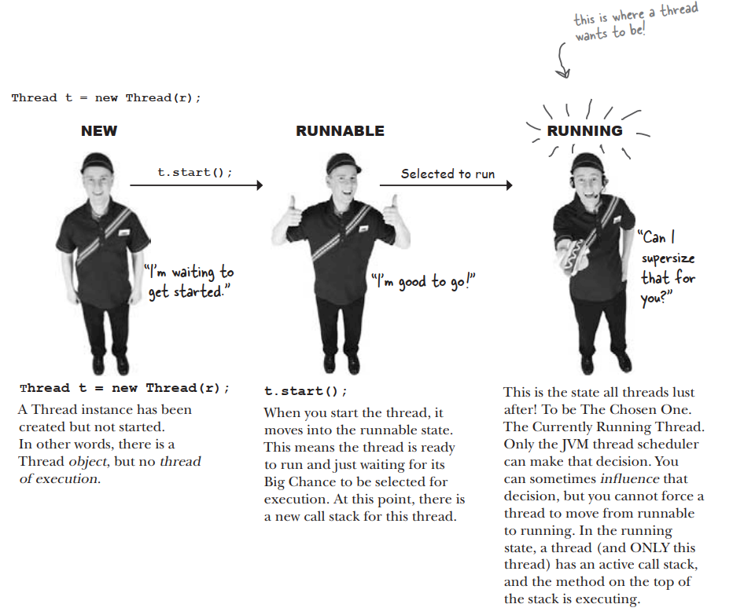

### But there’s more. Once the thread becomes runnable,it can move back and forth between runnable,running, and additional state:temporarily not runnable(also known as ‘blocked’).

### Typical runnable/running loop

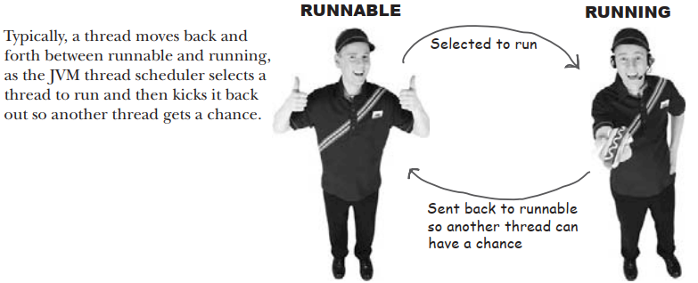

### A thread can be made temporarily not-runnable

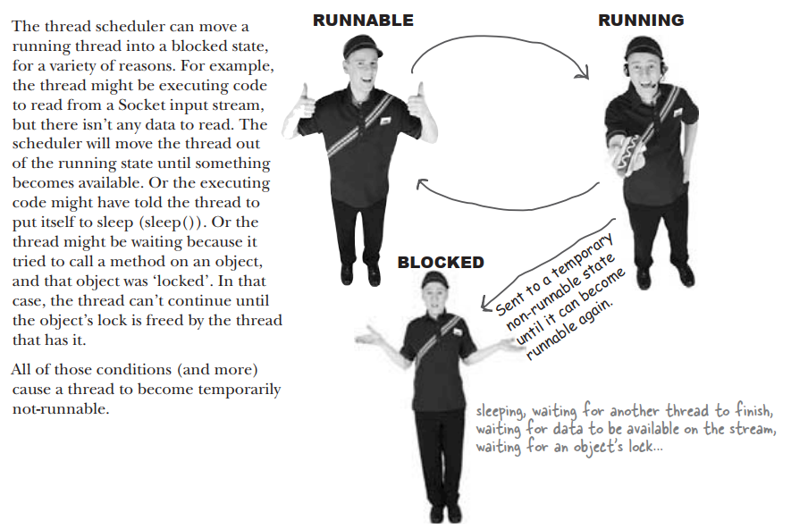

# The Thread Scheduler

The thread scheduler makes all the decisions about who moves from runnable to running,and about when a thread leaves the running state. The scheduler decides who runs,and for how long,and where the threads go when the scheduler decides to kick them out of the currently-running state.

### The thread scheduler makes all the decisions about who runs and who doesn’t. He usually makes the threads take turns,nicely. But there’s no guarantee about that. He might let one therad run to its heart’s content while the ohter threads ‘starve’.

# How did we end up with different results?

### Sometimes it runs like this:

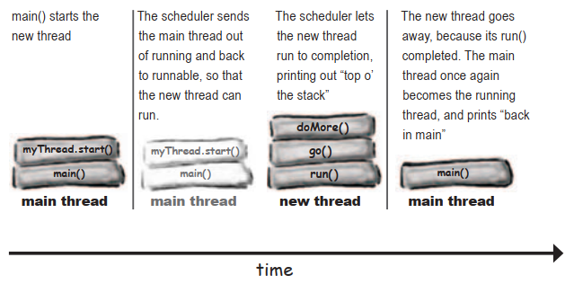

### And sometiems it runs like this:

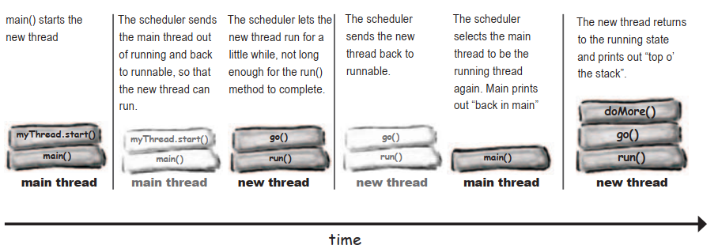

# Putting a thread to sleep

### Put your thread t o sleep if you want to be sure that other threads get a chance to run. When the thread wakes up,it always goes back to the runnable state and waits for the thread scheduler to choose it to run again.

# Using an object’s lock

### Every Java object has a lock. A lock has only one key. Most of the time,the lock is unlocked and nobody cares. But if an object has synchronized methods,a thread can enter one of  the synchronized methods ONLY if the key for the object’s lock is available. In other words,only if another thread hasn’t already grabbed the one key.

# The deadly side of synchronization

Thread deadlock happens when you have two threads,both of which are holding a key the other thread wants. There’s no way out of this scenario,so the two threads will simply sit and wait. And wait. And wait.

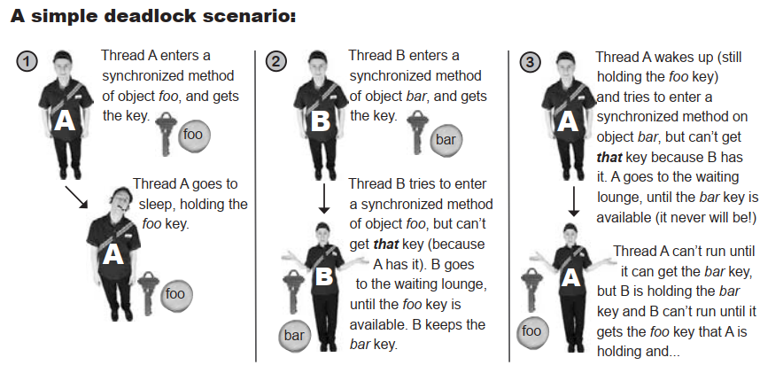

