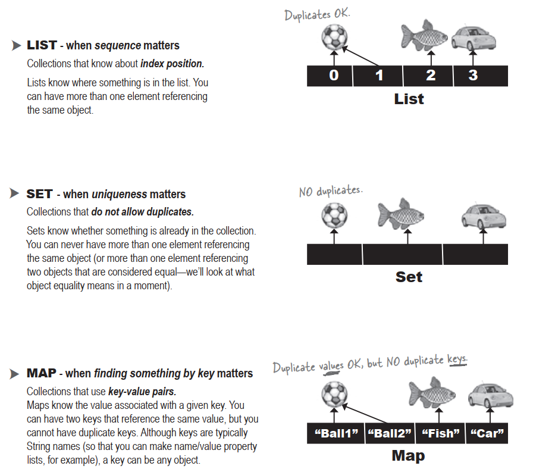

# Generics means more type-safety

### With generics,you create type-safe collections where more problems are caught at compile-time instead of runtime. Without generics,the compiler would happily let you put a Pumpkin into an ArrayList that was supposed to hold only Cat objects.

# Learning generics

1. **Create instances of generified <u>classes</u>**

   When you make an ArrayList,you have to tell it the type of objects you’ll allow in the list,just as you do with plain old arrays

2. **Declaring and assigning <u>variables</u> of generic types**

   How does polumorphism really work with generic types? If you have an ArrayList<Animal> reference variable,can you assign an ArrayList<Dog> to it? What about a List<Animal> reference? Can you assign an ArrayList<Animal> to it?

3. **Declaring (and invokiong) <u>methods</u> that take generic types**

   If you have a method that takes as a parameter,say,an ArrayList of Animal objects,what does that really mean? Can you also pass it an ArrayList of Dog objects? We’ll look at some subtle and tricky polymorphism issues that are very different from the way you write methods that take plain old arrays

# Revisiting the sort() method

### The sort() method can take only lists of Comparable objects.

# In generics,”extends” means “extends <u>or</u> implements”

### In generics,the keyword “extends” really means “is-a”,and works for BOTH classes and interfaces.

# We need a <u>Set</u> instead of a <u>List</u>

# The Collection API

# What makes two objects equal?

If two objects foo and bar are equals,foo.equals(bar) must be true,and both foo and bar must return the same value from hashCode(). For a Set to treat two objects as duplicates,you must override the hashCode() and equals() methods inherited from class Object,so that you can make two different objects be viewed as equals.

- **Reference equality**

  Two references,one object on the heap

- **Object equality**

  **Two references,two objects on the heap,but the objects are considered meaningfully equivalent**

  

# How a HashSet checks for duplicates:hashCode() and equals()

When you put an object into a HashSet,it uses the object’s hashcode value to determine where to put the object in the Set. But  it also compares the object’s hashcode to the hashcode of all the other objects in the HashSet,and if there’s no matching hashcode,the HastSet assumes that this new object is not a duplicate.

In other words,if the hashcodes are different,the HashSet assumes there’s no way the objects can be equals!

So you must override hashCode() to make sure the objects have the same value.

But two objects with the same hashCode()  might not be equal,so if the HashSet finds a matching hashcode for two objects——one you’re inserting and one already in the set——the HashSet will then call one of the object’s equals() methods to see if these hashcode-matched objects really are equal.

And if they’re equal,the HashSet knows that the object you’re attempting to add is a duplicate of something in the Set,so the add doesn’t happen.

# TreeSet elements MUST be comparable

### To use a TreeSet,one of these things must be true:

- The elements in the list must be of a type that implements Comparable

### OR

- You use the TreeSet’s overloaded constructor that takes a Comarator

# Array types are checked again at <u>runtime</u>,but collection type checks happen only when you <u>compile</u>

# Wildcards to the rescue

When you use a wildcard in your method argument,the compiler will STOP you from doing anything that could hurt the list referenced by the method parameter.

You can still invoke methods on the elements in the list,but you cannot <u>add</u> elements to the list.

In other words,you can do things with the list elements,but you can’t put new things in the list. So you’re safe at runtime,because the compiler won’t let you do anything that might be horrible at runtime.