# Deploying your application

### A Java program is a bunch of classes. That’s the output of your development. The real question is what to do with those classes when you’re done.

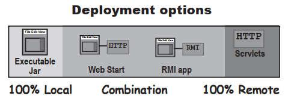

1. **Local**

   The entire application runs on the end-user’s computer,as a stand-alone,probably GUI,program,deployed as an executable JAR

2. **Combination of local and remote**

   The application is distributed with a client portion running on the user’s local system,connected to a server where other parts of the application are running

3. **Remote**

   The entire Java application runs on a server system,with the client accessing the system through some ono-Java means,probably a web brower

# Separate souece code and class file

***The key is a combination of directory structure organization and the -d compiler option.***

### Compiling with the -d (directory) flag

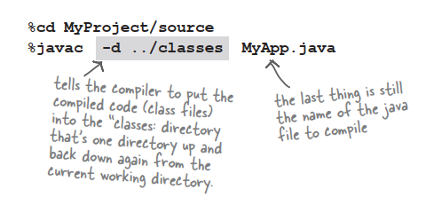

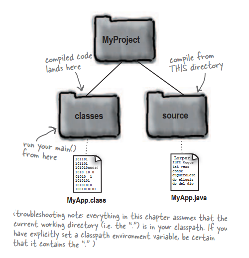

# Put your Java in a <u>JAR</u>

A **JAR** file is a **J**ava **AR**chive.

### Making an executable JAR

1. **Make sure all of your class files are in the <u>classes</u> directory**

   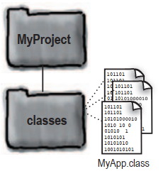

2. **Create a manifest.txt file that states which class has the main() method**

   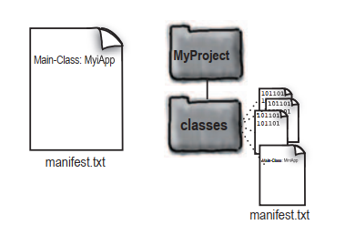

3. **Run the jar tool to create a JAR file that contains everything in the classes directory,plus the mainfest**

   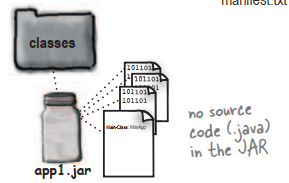

   ```
   cd MiniProject/classes
   jar -cvmf manifest.txt app.jar *.class
   OR
   jar -cvmf manifest.txt app.jar MyApp.class
   ```

# Running (executing) the JAR

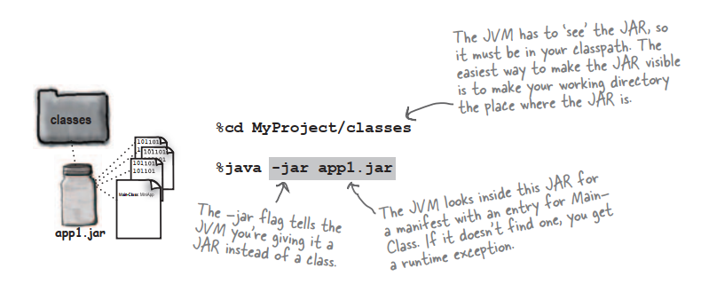

# Put your classes in packages

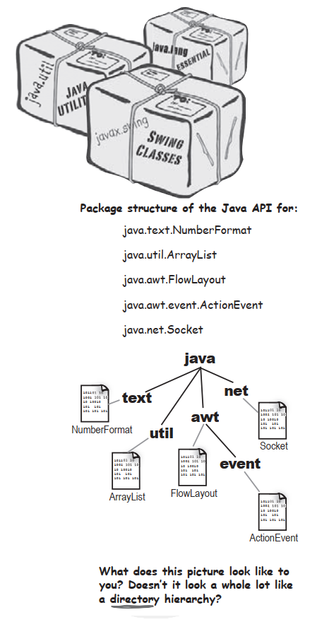

### Packages prevent class name conflicts

**Packages can prevent name conflicts,but only if you choose a packeage name that’s guaranteed to be unique. The best way to do that is to preface your packages with your reverse domain name.**

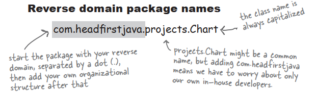

### To put your class in a package:

1. **Choose a package name**

2. **Put a package statement in your class**

   It must be the first statement in the source code file,above any import statements. There can be only one package statement per souece code file,so **all classes in a source file must be in the same package**. That includes inner classes,of course.

   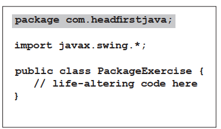

3. **Set up a matching directory structure**

You <u>must</u> put a class into a directory structure that matches the package hierarchy.

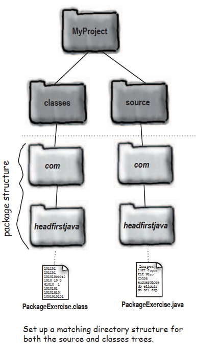

# Compiling and running with packages

### Compiling with the -d(directory) flag

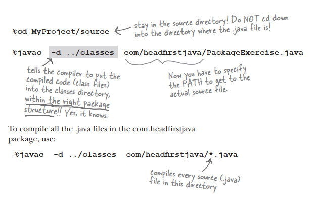

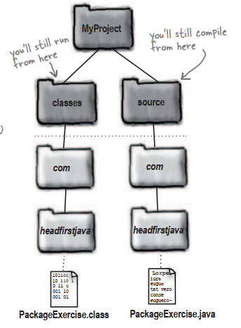

### Running your code

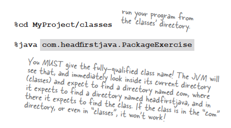

### The -d flag tells the compiler,”Put the class into its package directory structure,using the class specified after the -d has the root directory.But…if the directories aren’t there,create them first and then put the class in the right place!”

# Making an executable JAR with packages

1. **Make sure all of your class files are within the correct package structure under the classes directory**
2. **Create a manifest.txt file that states which class has the main() method,adn be sure to use the fully-qualified class name!**
3. **Run the jar tool to create a JAR file taht contains the package directories plus the manifest**

# So where did the manifest file go?

- **List the contents of a JAR**

  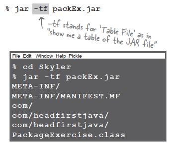

- **Extract the contents of a JAR**

  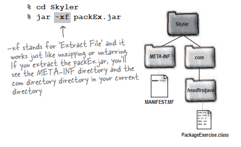

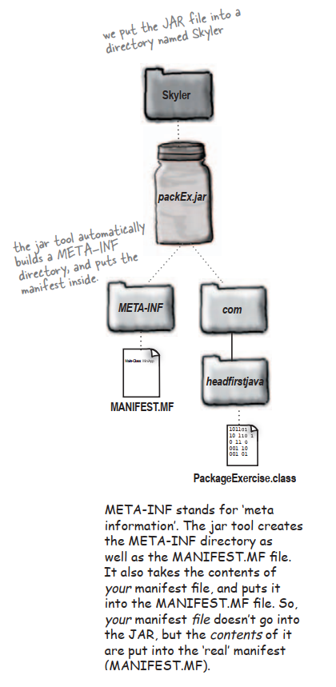

# Java Web Start

### End-users launch a Java Web Start app by clicking in a link in a web page. But once the app downloads,it runs outside the brower,just like any other stand-alone Java application. In fact,a Java Web Start app is just an executable JAR that’s distributed over the web.

# How Java Web Start works

1. The client clicks on a Web page link to your JWS application

   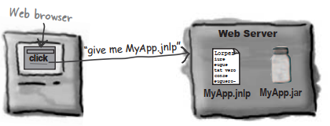

2. The Web Server gets the request and sends back a .jnlp file

   

3. Java Web Start is started up by the brower. The JWS helper app reads the .jnlp file,and asks the server for the MyApp.jar file

   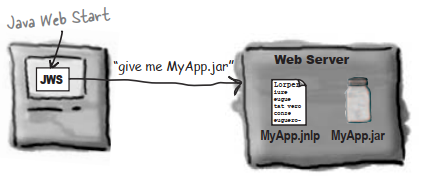

4. The Web server ‘serves’ up the requested .jar file

   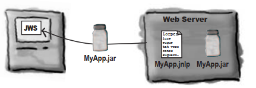

5. Java Web Start gets the JAR and starts the application by calling the specified main() method

   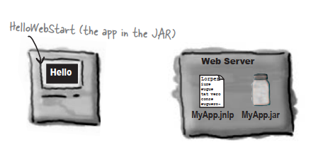

# The .jnlp(Java Network Launch Protocol) file

A .jnlp file is a simple XML document that has serveral different things you can put in,but as a minimum,it should look like this:

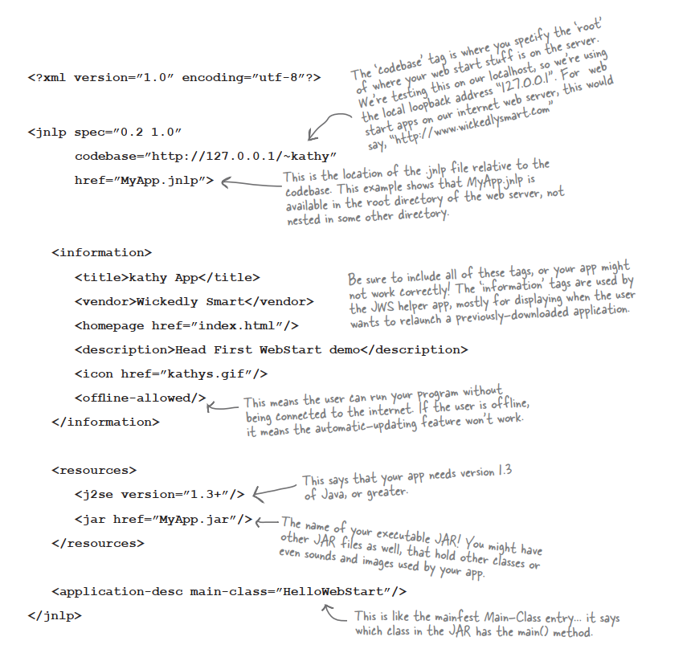

# Step for making and deploying a Java Web Start app

1. **Make an executable JAR for your application**

   

2. **Write a .jnlp file**

   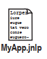

3. **Place your JAR and .jnlp files on your Web server**

   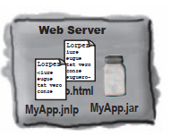

4. **Add a new mime type to your Web server**

   This causes the server to send the .jnlp file with the correct header,so that when the brower receives the .jnlp file it knows what it is and knows to start the JWS helper app

   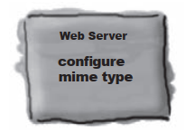

5. **Create a Web page with a link to your .jnlp file**

   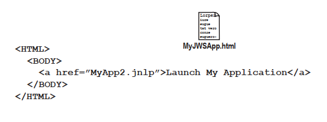


