# Method calls are always between two objects on the <u>same</u> heap

The JVM is respinsible for stuffing bits into the reference varible that represent *how to get to an object on the heap*. The JVM always knows where each object is,and how to get to it. But the JVM can know about references on only its own heap! You can’t,for example,have a JVM running on one machine knowing about the heap space of a JVM running on a different machine. In face,a JVM running on one machine can’t know anything about a difference JVM running on the same machine. It makes no difference if the JVMs are on the same or dofferent physical machines;it matters only that the two JVMs are,well,two different invocatins of the JVM.

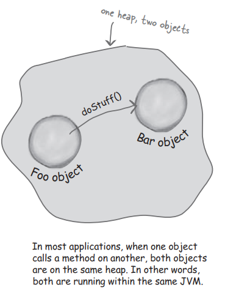

# What if you want to invoke a method on an object running on another machine?

We know how to get information from one machine to another——with Sockets and I/O. But what if we actually want to *call a method* on something running in another machine…anonther JVM? Of course we should always build our own pretocol,and when you send data to a ServerSocket the server could parse it,figure out what you meant,do the work,and send back the result on another stream. What a pain,though. Think how much nicer it would be to just get a reference to the object on the other machine,and call a method.

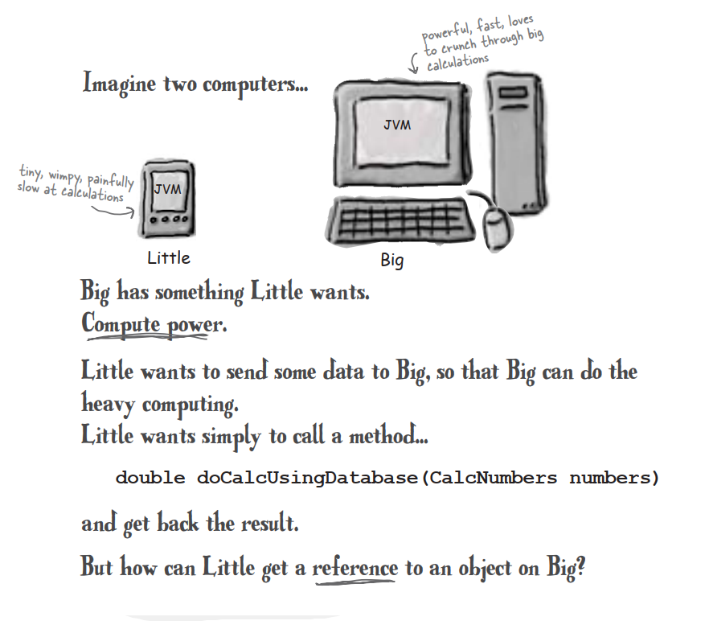

### Object A,running on Little,wants to call a method on Object B,running on Big.

The question is,how do we get an object on one machine to call a method on another machine?

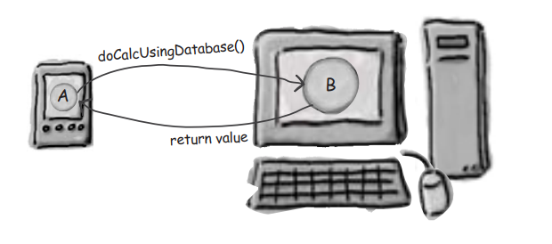

### A design for remote method calls

**Create four things:sever,client,server helper,client helper**

1. Create client and server apps. The server app is the **remote service** that has an object with the method that the client wants to invoke

   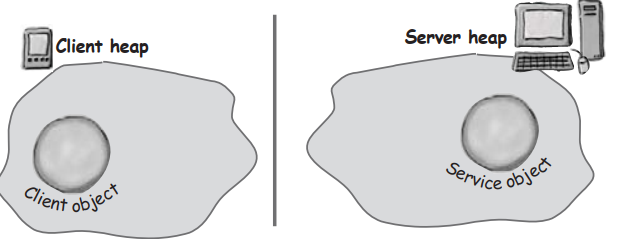

2. Create client and server ‘helpers’. They’ll handle all the low-level networking and I/O details so that your client and service can pretend like they’re in the same heap

   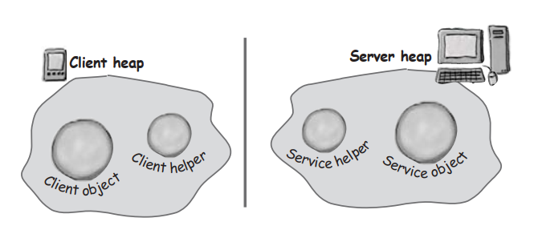

### The role of the ‘helpers’

The ‘helpers’ are the objects that actually do the communicating. The client calls a method on the client helper,*as if the client helper were the actual service. The client helper is a proxy for the Real Thing.*

In other words,the client object thinks it’s calling a method on the remote service,because the client helper is pretending to be the service object.**Pretending to be the thing with the method the client want to call!**

### Your client object gets to act like it’s making remote method calls. But what it’s <u>really</u> doing is calling methods on a heap-local ‘proxy’ object that handles al the low-level detail of Sockets and streams.

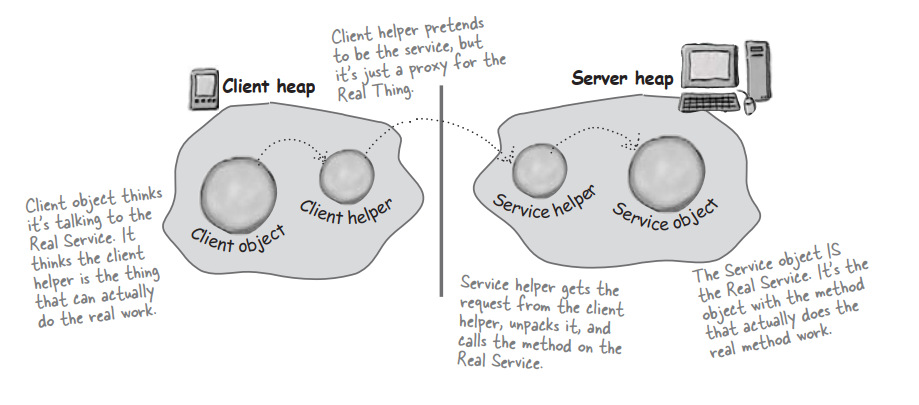

### How the method call happens

1. Client object calls doBigThing() on the client helper object

   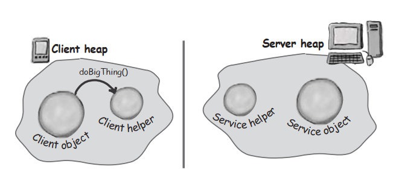

2. Client helper packages up information(arguments,method name,etc.) about the call and ship it over the network to the service helper

   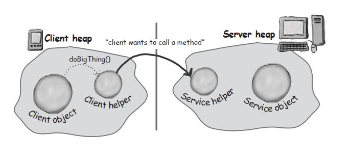

3. Service helper unpacks the information from the client helper,finds out which method to call (and on which object) and invokes the <u>real</u> method on the <u>real</u> service object

   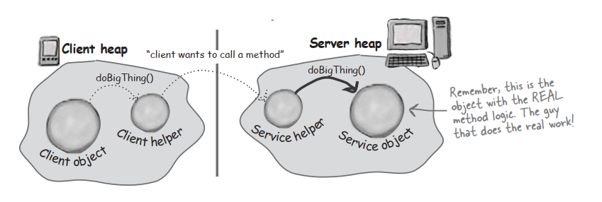

# Java RMI gives you the client and service helper objects!

In Java,RMI builds the client and service helper objects for you,and it even knows how to make the client helper look like the Real Service. In other words,RMI knows how to give the client helper object the same methods you want to call on the remote service.

**In RMI,the client helper is a ‘stub’ and the server helper is a ‘skeleton’.**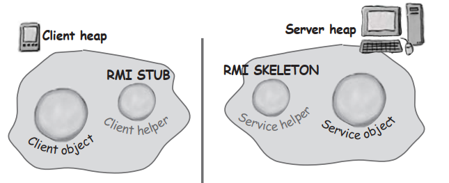

### Making the Remote Service

1. Make a **Remote interface**

   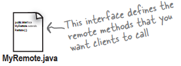

2. Make a **Remote Implementation**

   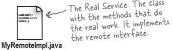

3. Generate the **stubs** and **skeletons** using rmic

   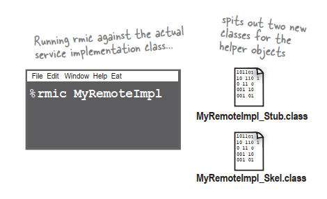

4. Start the **RMI registry**

   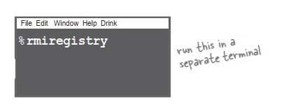

5. Start the **remote service**

   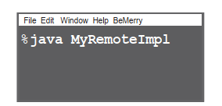

### How does the client get the stub <u>object</u>?

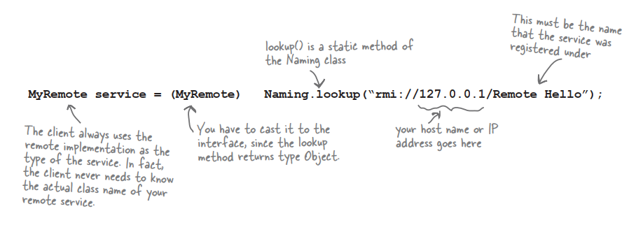

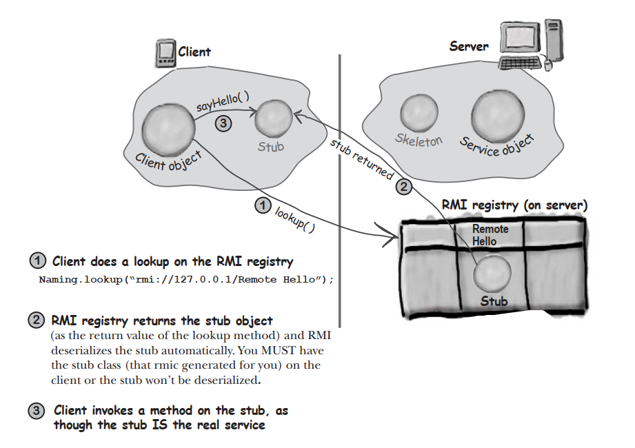

### How does the client get the stub <u>class</u>?

With dynamic class downloading,a stub object is ‘stamped’ with a URL that tells the RMI system on the client where to find the class file for that object. Then,in the process of deserializing an object,if RMI can’t find the class locally,it uses that URL to do an HTTP  Get to retrieve the class file.

# What about Servlets?

Servlets are Java programs that run on (and with) an HTTP web server.

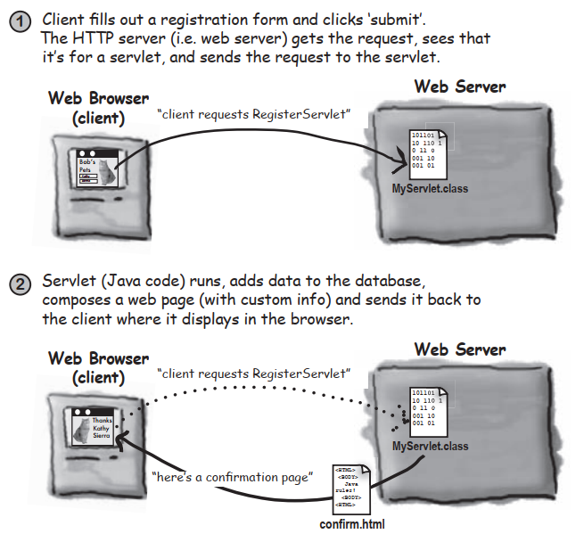

### Step for making and running a servlet

1. **Find out where your servlets need to be placed**

   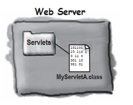

2. **Get the servlets.jar and add it to your classpath**

   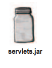

3. **Write a servlet class by extending HttpServlet**

   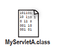

4. **Write an HTML page that invoke your servlet**

   

5. **Make your servlet and HTML page available to your server**

   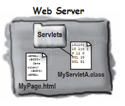

# Enterprise JavaBean: RMI on steroids

### An EJB server adds a bunch of services that you don’t get with straight RMI. Things like transactions,security,concurrency,database management,and networking. An EJB server steps into middle of an RMI call and layers in all of the services.

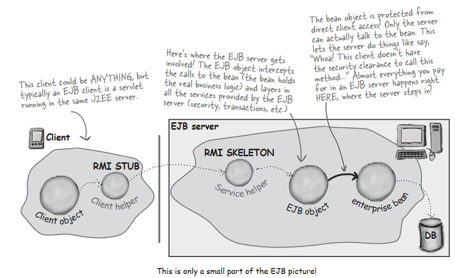

### For our final trick…a little Jini

Jini uses RMI(although other protocols can be involved),but gives you a few key features including:

**Adaptive discovery**

**Self-healing networks**

###  Adaptive discovery in action

1. Jini lookup service is launched somewhere on the network,and announces itself using IP multicast

   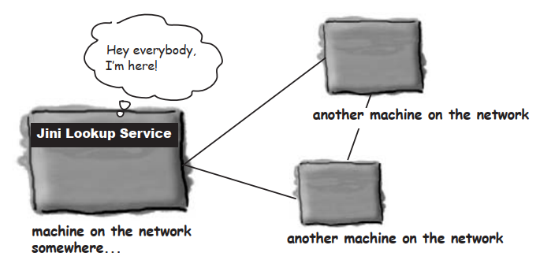

2. An already-running Jini service on another machine asks to be registered with this newly-announced lookup service. It registers by capability,rather than by name. In ohter words,it registers as the service interface it implements. It sends a serialized object to be placed in the lookup service.

   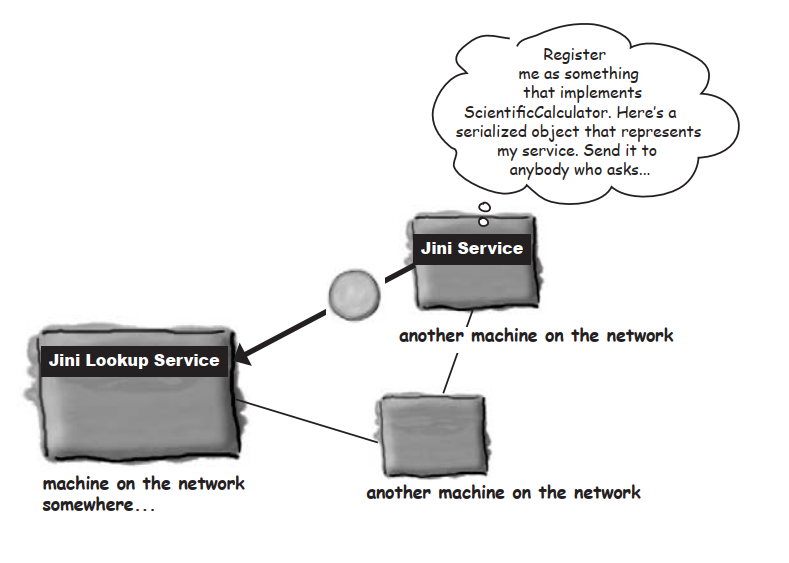

3. A client on the network wants something that implements the ScientificCalculator interface. It has no idea where that thing exists,so it takes  the loopup service.

   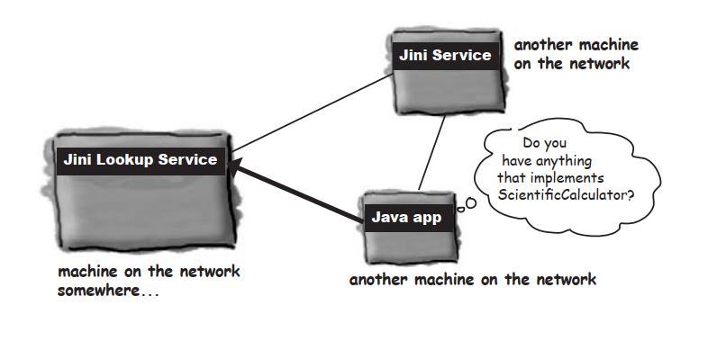

4. The lookup service responds,since it does have something registered as a ScientificCalculator interface.

   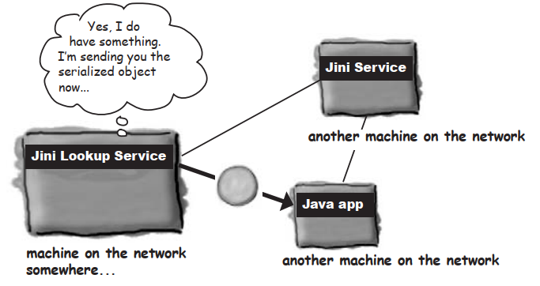

### Self-healing network in action

1. A Jini Service has asked to register with the lookup service. The lookup service responds with a ‘lease’. The newly-registered services must keep renewing the lease,or the lookup service wants always to present an accurate picture to the rest of the network about which services are available.

   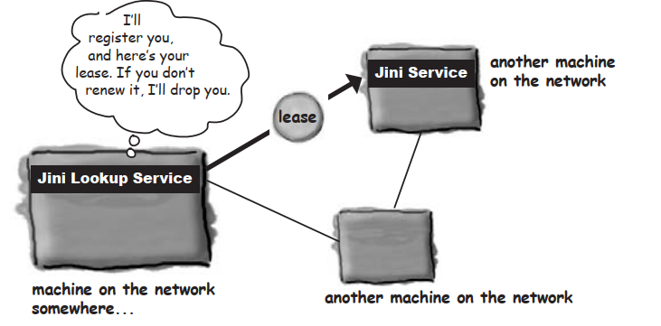

2. The service goes offline (somebody shuts it down),so it fails to renew its lease with the lookup service. The lookup service drops it.

   

