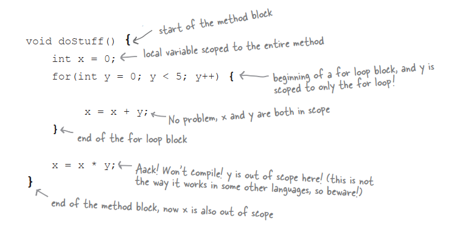
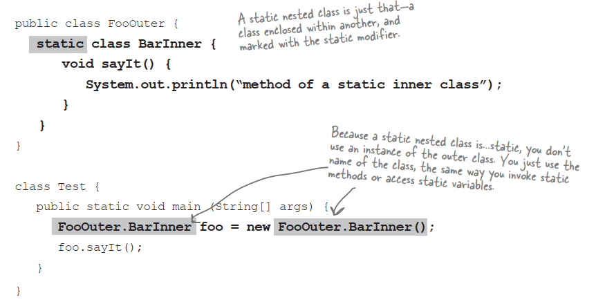
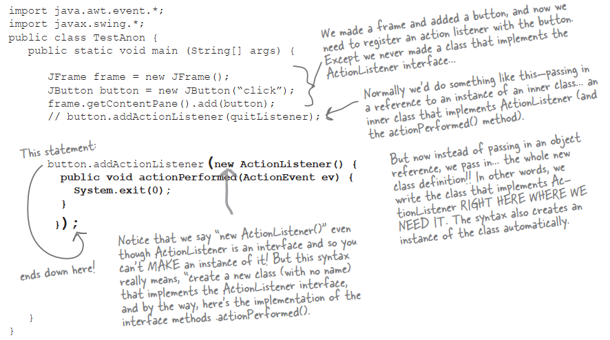
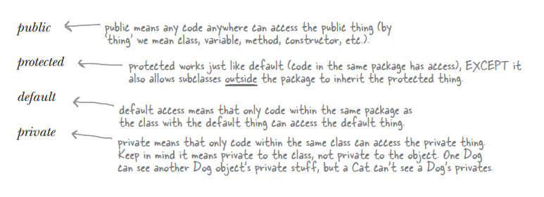
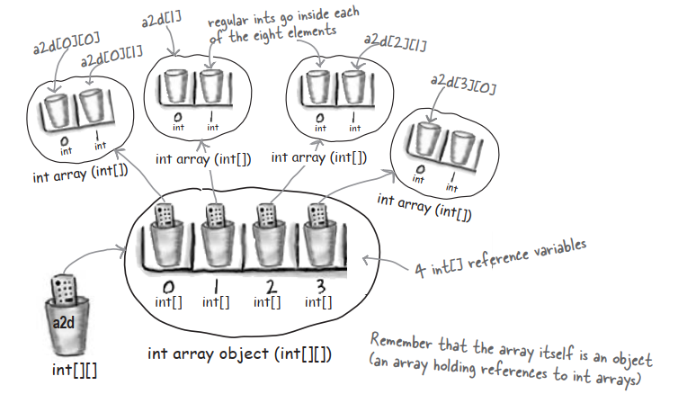
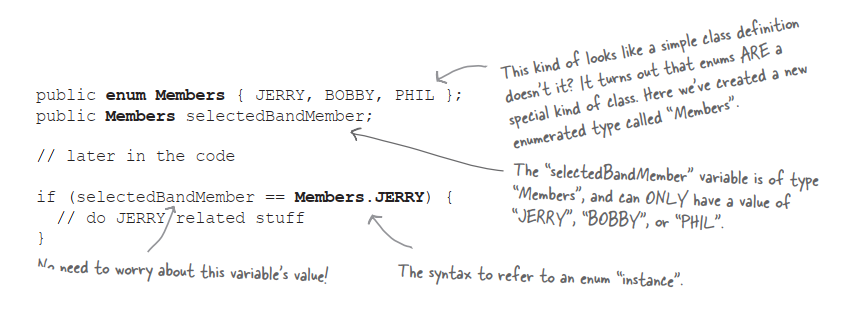
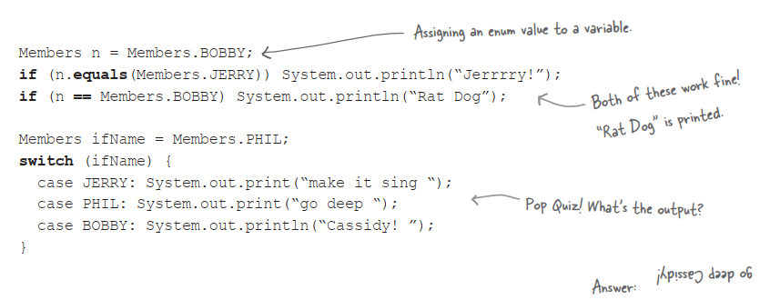

# Bit Manipulation

### Bitwise Not Operator:`~`

This operator ‘flips all the bits’ of a promitive

```java
int x = 10;	//bits are 00001010
x = ~x;	//bits are now 11110101
```

The next three operators compare two primitives on a bit by bit basis,and return a result based on comparing these bits. We’ll use the following example for the next three operators:

```java
int x = 10;	//bits are 00001010
int y = 6;	//bits are 00000110
```

### Bitwise AND Operator:`&`

This operator returns a value whose bits are turned on only if **both** original bits are turned on:

```java
int a = x & y;	//bits are 00000010
```

### Bitwise OR Operator:`|`

This operator returns a value whose bits are turned on only if **either** of the original bits are turned on:

```java
int a = x | y;	//bits are 00001110
```

### Bitwise XOR Operator:`^`

This operator returns a value whose bits are turned on only if **exactly one** of the original bits are turned on:

```java
int a = x ^ y;	//bits are 00001100
```

### The Shift Operator

These operators takes a single integer primitive and shift all of its bits in one direction or another. If you want to dust off your binary math skills,you might realize that shifting bits *left* effectively *multiplies* a number by a power of two,and shift bits *right* effectively *divides* a number by a power of two.

We’ll use the following example for the next three operators:

```java
int x = -11;	//bits are 11110101
```

The leftmost bit of an intefer number is called the **sign bit**. A negative integer number in Java always has its sign bit turned on. A positive integer number always has its sign bit turned off. Java use the two’s complement formula to store negative numbers. To change a number’s sign using two’s complement,flip all the bits,then add 1.

### Right Shift Operator:`>>`

This operator shifts all of a number’s bits right by a certain number,and fills all of the bits on the left side with whatever the original leftmost bit was. **The sign bit does not change:**

```java
int y = x >> 2;	//bits are 11111101
```

### Unsigned Right Shift Operator:`>>>`

Just like the right shift operator BUT it ALWAYS fills the leftmost bits with zeros.**The sogn bit might change:**

```java
int y = x >>> 2;	//bits are 001111101
```

### Left Shift Operator:`<<`

Just like the unsigned right shift operator,but in the other direction;the rightmost bits are filled with zeros.**The sign bit might change:**

```java
int y = x << 2;	//bits are 11010100
```

# Immutability

### Why do you care that <u>String</u> are Immutable?

What this means is that when you say:

```java
String s = "0";
for(int x = 1;x < 10;x++){
	s = s + x;
}
```

What’s actually happening is that you’re creating ten String objects. In the end s is referring to the String with the value “0123456789”,but at this point there are ten String in existence!

Whenever you make a new String,the JVM puts it into a special part of memory called the ‘String Pool’. If there is already a String in the String Pool with the same value,the JVM doesn’t create a duplicate,it simply refers your reference variable to the existing entry. The JVM can get away with this because Strings are immutable;one reference variable can’t change a String’s value out from under another reference variable referring to the same String.

The other issue with the String pool is that the Garbage Collector doesn’t go there. 

### How does this save memory?

If you understand how String immutability works,than you can sometimes take advantage of it to save memory. If you have to do a lot of String manipulations,however,there is another class StringBuilder,better suitted for that purpose.

### Why do you care that <u>Wrappers</u> are Immutable?

In the Math chapter we talked about the two main uses of the wrapper classes:

- Wrapping a primitive so it can pretend to be an object
- Using the static utility methods

It’s important to remember that when you create a wrapper object like:

```java
Integer iWrap = new Integer(42);
```

That’s it for that wrapper object. Its value will always be 42. ***There is no setter method for a wrapper object.*** You can,of course,refer iWrap to a different wrapper object,but then you’ll have two objects. Once you create a wrapper object,there’s no way to change the value of that object!

# Assertions

Assertions are like System.out.println() statements on steroids. Add them to your code as you would println statements. The Java 5.0 compler assumes you’ll be compiling source files that are 5.0 compatible,so as of Java 5.0,compiling with assertions is enabled by default.

### How to make Assertions work

Add assertion statements to your code wherever you believe that something must be true.For instance:

```java
assert(height > 0);
//if true,program continues normally
//if false,throw an AssertionError
```

You can add a little more information to the stack trace by saying:

```java
assert (height > 0):"height = " + height + " weight = " + weight;
```

The expression after the colon can be any legal Java expression ***that resolves to a non-null value.*** But whatever you do,***don’t create assertions that cahnge an object’s state!*** If you do,enabling assertions at runtime might change how your program performs.

### Compiling and running with Assertions

To compile with assertions:

```
javac TestDriveGame.java
```

To run with assertions:

```
java -ea TestDriveGame
```

# Block Scope

Let’s look at an example:



In the example,y was a block variable,declared inside a block,and y went out of scope as soon as the for loop ended. Your Java programs will be more debuggable and expandable if you use local variables instead of instance variables,and block variables instead of local variables,whenever possible. The compiler will make sure that you don’t try to use a variable that’s gone out of scope,so you don’t have to worry about runtime meltdowns.

# Linked Invocations

```java
StringBuffer sb = new StringBuffer("spring");
sb = sb.delete(3, 6).insert(2, "umme").deleteCharAt(1);
System.out.println("sb = " + sb);
```

What in the world is happening i nthe second line of the scope? Admittedly,this is a contrived example,but you need to learn how to decipher these.

1. Work from left to right

2. Find the result of the leftmost method call,in this case `sb.delete(3, 6)`. If you lookup StringBuffer in the API docs,you’ll see that the `delete()` method returns a StringBuffer object. The result of running the `delete()` method is a StrignBuffer object with the value ‘spr’

3. The next leftmost method (`insert()`) is called on the newly created StringBuffer object ‘spr’. The result of that method call,is also a StringBuffer object,adn so it goes,the returned object is used to call the next method to the right. In theory,you can link as many methods as you want in a single statement. Without linking,the second line of code from above would be more readable,and look something like this:

   ```java
   sb = sb.delete(3, 6);
   sb = sb.insert(2, "umme");
   sb = sb.deleteCharAt(1);
   ```

# Anonymous and Static Nested Classes

### Static nested classes

A static nested class looks like the non-static classes we used for event listeners,except they’re marked with the kwyword static.



Static nested classes are more like regular non-nested classes in that they don’t enjoy a special relationship with an enclosing outer object. But because static nested classes are still considered a member of the enclosing/outer class,theyt still get access to any private members of the outer class…but only the ones that are also static.Since the static nested class isn’t connected to an instance of the outer class,it doesn’t have any special way to access the non-static variables and methods.

### The difference between nested and inner

Any Java class that’s defined within the scope of another class is known as a ***nested*** class. It deosn’t matter if it’s anonymous,static,normal,whatever. If it’s inside another class,it’s technically considered a nested class. But non-static nested classes are often referred to as inner classes,which is what we called them earlier in the book. The bottom line:all inner classes are nested classes,but non all nested classes are inner classes.

### Anonymous inner classes

Imagine you’re writing some GUI code,and you need an instance of a class that implements ActionListener. You have two choices:

1. Write an inner class in your code

   OR

2. Create an anonymous inner class and instantiate it,right there,just-in-time.***Literally right where you are at the point you need the listener object.***That’s right,you create the class and the instance in the place where you’d normally be supplying just the instance. Think about that for a moment——it means you pass the entire class where you’d normally pass only an instance into a method argument!



# Access Levels and Access Modifiers(Who Sees What)

### Access Levels



### Access modifiers

- public
- protected
- private

### public 

Use public for classes,constants(static final variable),and methods that you’re exposing to other code and most constructors.

### private

Use private for virtually all instance variables,and for methods that you don’t want outside code to call.

### default

It means that only code *within the same pakage* can access code with default access.

But what does it really mean to access a class? Code that does not have access to a class is not allowed to even think about the class. And by think,we mean use the class in code.

### protected

Protected access is almost identical to default access,with one exception:it allows subclass to inherit the protected thing,even if those subclasses are outside the pavkage of the superclass they extend.

# String and StringBuffer/StringBuilder Methods

Strings are immutable,so a StringBuffer/StringBuilder can be a lot more efficient if you’re manipulating a String. As of Java 5.0 you should use the String**Builder** class instead of String**Buffer**,unless your String manipulations need to be thread-safe,which is not common.

# Multidimensional Arrays

In Java,a two dimensional array is simply an array of arrays.

```java
int[][] a2d = new int[4][2];
```

The JVM creates an array with 4 elements. Each of these four elements is actually a reference variable refering to a (newly created),int array with 2 elements.



# Enumerations

**A new,offical ‘enum’**:



### Your enum extends java.lang.Enum

When you create an enum,you’re creating a new class,and ***you’re implicitly extending java.lang.Enum.*** You can declare an enum as its own standalone class,in its own source file,or as a menber of another class.

### Using ‘if’ and ‘switch’ with Enums

Using the enum we just created,we can perform branches in our code using either the if or switch statement. Also notice that we compare enum instances using either == or the .equals() method. Usually == is considered better style.



