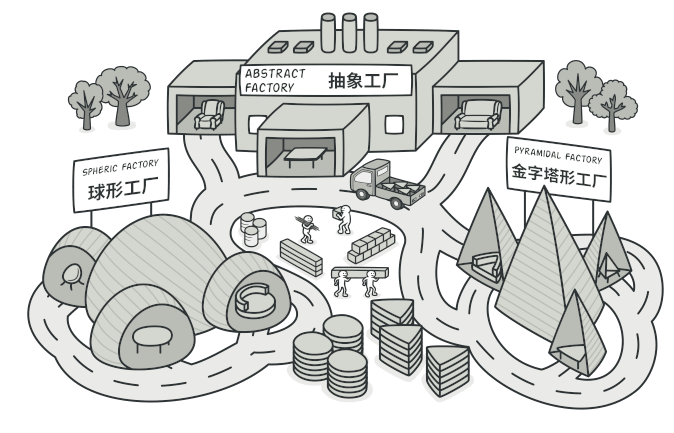
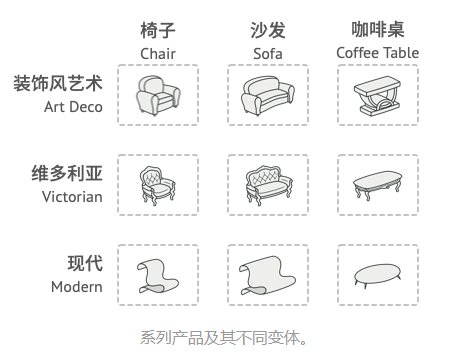
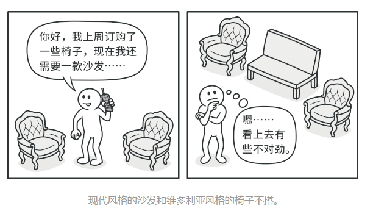
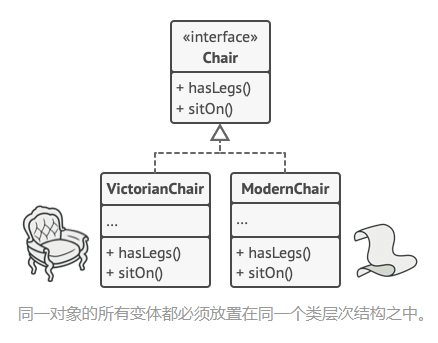
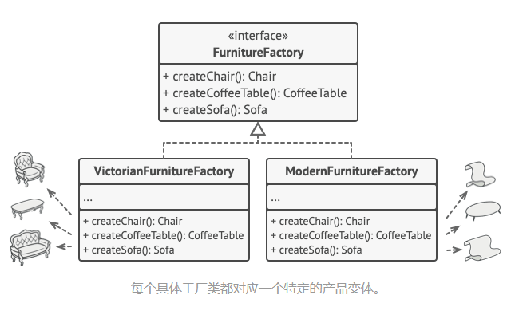
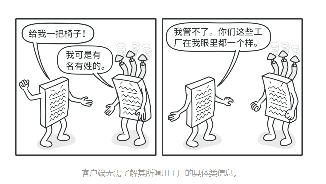
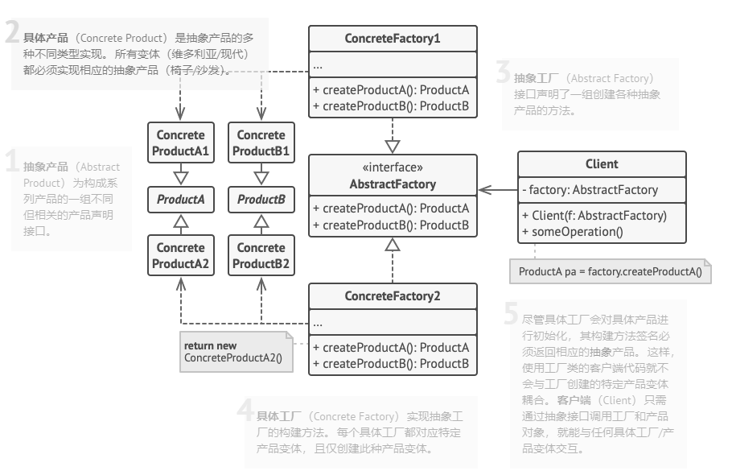

# 意图

**抽象工厂模式**是一种创建型设计模式，它能创建一系列相关的对象，而无需指定其具体类。



# 问题

假设你正在开发一款家具商店模拟器。你的代码中包括一些类，用于表示：

1. 一系列产品，例如`椅子Chair`、`沙发Sofa`和`咖啡桌CoffeeTable`
2. 系列产品的不同变体。例如，你可以使用`现代Modern`、`维多利亚Victorian`、`装饰风艺术ArtDeco`等风格生成`椅子`、`沙发`和`咖啡桌`



你需要设法单独生成每件家具对象，这样才能确保其风格一致。如果顾客收到的家居风格不一样，他们可不会开心。



此外，你也不希望在添加新产品或新风格时修改已有代码。家具供应商对于产品目录的更新非常频繁，你不会想在每次更新时都去修改核心代码的。

# 解决方案

首先，抽象工厂模式建议为系列中的每件产品明确声明接口（例如椅子、沙发或咖啡桌）。然后，确保所有产品变体都继承这些接口。例如，所有风格的椅子都是先`椅子`接口；所有风格的咖啡桌都实现`咖啡桌`接口，以此类推。



接下来，我们需要声明抽象工厂——包含系列中所有产品构造方法的接口。例如`createChair创建椅子`、`createSofa创建沙发`和`createCoffeeTable创建咖啡桌`。这些方法必须返回**抽象**产品类型，即我们之前抽取的那些接口：`椅子`、`沙发`和`咖啡桌`等等。



那么该如何处理产品变体呢？对于系列产品的每个变体，我们都基于`抽象工厂`接口创建不同的工厂类。每个工厂类都只能返回特定类别的产品，例如，`现代家具工厂ModernFurnitureFactory`只能创建`现代椅子ModernChair`、`现代沙发ModernSofa`和`现代咖啡桌ModernCoffeeTable`对象。

客户端代码可以通过相应的抽象接口调用工厂和产品类。你无需修改实际客户端代码，就能更改传递给客户端的工厂类，也能更改客户端代码接受的产品实体。



假设客户端想要工厂创建一把椅子。客户端无需了解工厂类，也不用管工厂类创建的椅子类型。无论是现代风格，还是维多利亚风格的椅子，对于客户端来说没有分别，它只需调用抽象`椅子`接口就可以了。这样一来，客户端只需知道椅子以某种方式实现了`sitOn坐下`方法就足够了。此外，无论工厂返回的是何种椅子变体，它都会和由同一工厂对象创建的沙发或咖啡桌风格一致。

最后一点说明：如果客户端仅接触抽象接口，那么谁来创建实际的工厂对象呢？一般情况下，应用程序会在初始化阶段创建具体工厂对象。而在此之前，应用程序必须根据配置文件或环境设定选择工厂类别。

# 抽象工厂模式结构




# 抽象工厂模式适合应用场景

### 如果代码需要与多个不同系列的相关产品交互，但是由于无法提前获取相关信息，或者出于对未来扩展性的考虑，你不希望代码基于产品的基本类进行构建，在这种情况下，你可以使用抽象工厂。

抽象工厂为你提供一个接口，可用于创建每个系列产品的对象。只要代码通过该接口创建对象，那么你就不会生成与应用程序已经生成的产品类型不一致的产品。

### 如果你有一个基于一组<u>抽象方法</u>的类，且其主要功能因此变得不明确，那么在这种情况下可以考虑使用抽象工厂模式。

在设计良好的程序中，每个类仅负责一件事。如果一个类与多种类型产品交互，就可以考虑将工厂方法抽取到独立的工厂类或具备完整功能的抽象工厂中。

# 实现方式

1. 以不同的产品类型与产品变体为维度绘制矩阵
2. 为所有产品声明抽象产品接口，然后让所有具体产品类实现这些接口
3. 生命抽象工厂接口，并且在接口中为所有抽象产品提供一组构建方法
4. 为每种产品变体实现一个具体工厂类
5. 在应用程序中开发初始化代码。该代码根据应用程序配置或当前环境，对特定具体工厂类进行初始化。然后将该工厂对象传递给所有需要创建产品的类
6. 找出代码中所有产品构造函数的直接调用，将其替换为对工厂对象中相应构建方法的调用

# 抽象工厂模式优缺点

优点：

- 可以确保同一工厂生成的产品相匹配
- 可以避免客户端和具体产品代码的耦合
- 单一职责原则。你可以将产品生成代码抽取到同一位置，使得代码易于维护
- 开闭原则。向应用程序中引入新产品变体时，你无需修改客户端代码

缺点：

- 由于采用该模式需要向应用中引入众多接口和类，代码可能会比之前更加复杂

# 与其他模式的关系

- 在许多设计工作的初期都会使用**<u>工厂方法模式</u>**，随后演化为使用**<u>抽象工厂模式</u>**、**<u>原型模式</u>**或**<u>生成器模式</u>**。
- **<u>生成器</u>**重点关注如何分步生成复杂对象。**<u>抽象工厂</u>**专门用于生产一系列相关对象。抽象工厂会马上返回产品，生成器则允许在获取产品前执行一些额外构造步骤。
- **<u>抽象工厂模式</u>**通常基于一组**<u>工厂方法</u>**，但你也可以使用**<u>原型模式</u>**来生成这些类的方法。
- 当只需对客户端代码隐藏子系统创建对象的方式时，你可以使用**<u>抽象工厂</u>**来代替**<u>外观模式</u>**。
- 你可以将**<u>抽象工厂</u>**和**<u>桥接模式</u>**搭配使用。如果由桥接定义的抽象只能与特定实现合作，这一模式搭配就非常有用。在这种情况下，抽象工厂可以对这些关系进行封装，并且对客户端代码隐藏其复杂性。
- **<u>抽象工厂</u>**、**<u>生成器</u>**和**<u>原型</u>**都可以用**<u>单例模式</u>**来实现。

> [以上摘自REFACTORING GURU](https://refactoringguru.cn/design-patterns/abstract-factory)

# 代码示例

定义一个抽象产品：

```java
public interface Suv {
    /**
     * 驾驶
     */
    void drive();
}
```

定义具体产品：

```java
public class BmwSuv implements Suv{
    @Override
    public void drive() {
        System.out.println("开宝马SUV...");
    }
}
```

```java
public class BenzSuv implements Suv{
    @Override
    public void drive() {
        System.out.println("开奔驰SUV...");
    }
}
```

定义另一个产品抽象：

```java
public interface SportCar {
    /**
     * 驾驶
     */
    void drive();
}
```

定义另一个产品的具体产品：

```java
public class BenzSportCar implements SportCar{
    @Override
    public void drive() {
        System.out.println("开奔驰跑车...");
    }
}
```

```java
public class BmwSportCar implements SportCar{
    @Override
    public void drive() {
        System.out.println("开宝马跑车...");
    }
}
```

定义抽象工厂：

```java
public interface CarFactory {
    /**
     * 生产SUV
     * @return
     */
    Suv createSuv();

    /**
     * 生成跑车
     * @return
     */
    SportCar createSportCar();
}
```

定义具体工厂：

```java
public class BmwCarFactory implements CarFactory{
    @Override
    public Suv createSuv() {
        return new BmwSuv();
    }

    @Override
    public SportCar createSportCar() {
        return new BmwSportCar();
    }
}
```

```java
public class BenzCarFactory implements CarFactory{
    @Override
    public Suv createSuv() {
        return new BenzSuv();
    }

    @Override
    public SportCar createSportCar() {
        return new BenzSportCar();
    }
}
```

客户端代码：

```java
public class Demo {
    public static void main(String[] args) {
        new BmwCarFactory().createSuv().drive();
        new BmwCarFactory().createSportCar().drive();

        new BenzCarFactory().createSuv().drive();
        new BenzCarFactory().createSportCar().drive();
    }
}

//开着宝马SUV...
//开宝马跑车...
//开奔驰SUV...
//开奔驰跑车...
```

