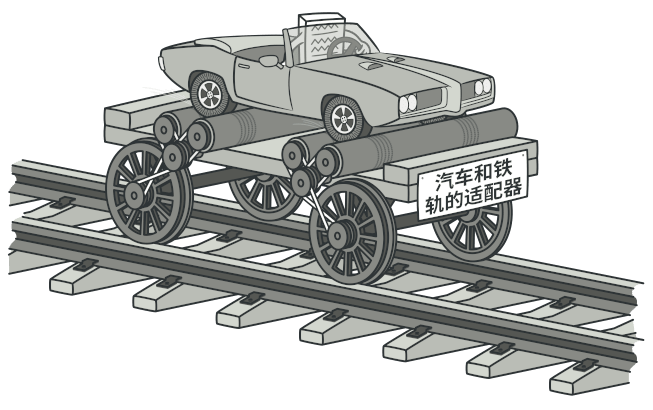
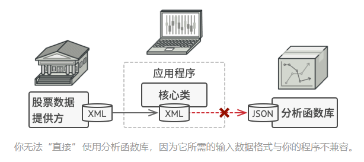
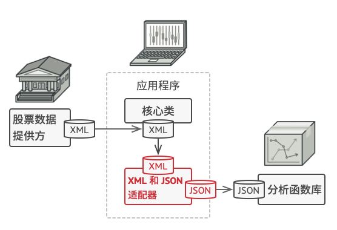
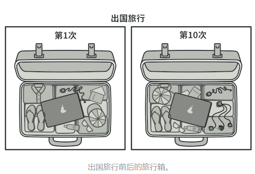
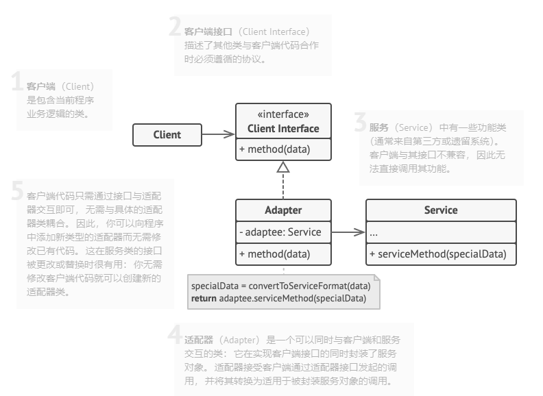
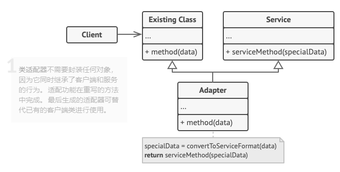

# 意图

**适配器模式**是一种结构型设计模式，它能使接口不兼容的对象相互合作。



# 问题

假设你正在开发一款股票市场监测程序，它会从不同来源下载XML格式的股票数据，然后向用户呈现出美观的图表。

在开发过程中，你决定在程序中整合一个第三方智能分析函数库。但是遇到了一个问题，那就是分析函数库只兼容JSON格式的数据。



你可以修改程序库来支持XML。但是，这可能需要修改部分依赖该程序库的现有代码。甚至还有更糟糕的情况，你可能根本没有程序库的源代码，从而无法对其进行修改。

# 解决方案

你可以创建一个适配器。这是一个特殊的对象，能够转换对象接口，使其能与其他对象进行交互。

适配器模式通过封装对象将复杂的转换过程隐藏于幕后。被封装的对象甚至察觉不到适配器的存在。

适配器不仅可以转换不同格式的数据，其还有助于采用不同接口的对象之间的合作。它的运行方式如下：

1. 适配器实现与其中一个现有对象兼容的接口
2. 现有对象可以使用该接口安全地调用适配器方法
3. 适配器方法被调用后将以另一个对象兼容的格式和顺序将请求传递给对象

有时你甚至可以创建一个双向适配器来实现双向转换调用。



让我们回到股票市场程序。为了解决数据格式不兼容的问题，你可以为分析函数库中的每一个类创建一个将XML转换为JSON格式的适配器，然后让客户端仅通过这些适配器来与函数库进行交流。当某个适配器被调用时，它会将传入的XML数据转换为JSON结构，并将其传递给被封装分析对象的相应方法。

### 真实世界类比



如果你是第一次从美国到欧洲旅行，那么在给笔记本充电时可能会大吃一惊。不同国家的电源插头和插座标准不同。美国插头和德国插座不匹配。同时提供美国标准插座和欧洲标准插头的电源适配器可以解决你的问题。

# 适配器模式结构

### 对象适配器

实现时使用了构成原则：适配器实现了其中一个对象的接口，并对另一个接口进行封装。所有流行的编程语言都可以使用实现适配器。



### 类适配器

这一实现使用了继承机制：适配器同时继承两个对象的接口。请注意，这种方式仅能在支持多重继承的编程语言中实现，例如C++。



# 适配器模式适合应用场景

### 当你希望使用某个类，但是其接口与其他代码不兼容时，可以使用适配器类。

适配器模式允许你创建一个中间层类，其可作为代码与遗留类、第三方类或提供怪异接口的类之间的转换器。

### 如果你需要复用这样一些类，他们处于同一继承体系，并且他们又有了额外的一些共同的方法，但是这些共同的方法不是所有在这一继承体系中的子类所具有的共性。

你可以扩展每个子类，将缺少的功能添加到新的子类中。但是，你必须在所有新子类中重复田间这些代码，这样会使得代码有**坏味道**。

将缺失功能添加到一个适配器类中是一种优雅得多的解决方案。然后你可以将缺少功能的对象封装在适配器中，从而动态地获取所需功能。如要这一点正常运作，目标类必须要有通用接口，适配器的成员变量应当遵循该通用接口。这种方式同**<u>装饰模式</u>**非常相似。

# 实现方式

1. 确保至少有两个类的接口不兼容：
   - 一个无法修改的功能性服务类
   - 一个或多个将受益于使用服务类的客户端类
2. 声明客户端接口，描述客户端如何与服务交互
3. 创建遵循客户端接口的适配器类。所有的方法暂时都为空
4. 在适配器类中添加一个成员变量用于保存对于服务对象的引用。通常情况下会通过构造函数对该成员变量进行初始化，但有时在调用其方法时将变量传递给适配器会更方便
5. 依次实现适配器类客户端接口的所有方法。适配器类会将实际工作委派给服务对象，自身只负责接口或数据格式的转换
6. 客户端必须通过客户端接口使用适配器。这样一来，你就可以在不影响客户端代码的情况下修改或扩展适配器

# 适配器模式优缺点

优点：

- **<u>单一职责原则</u>**。你可以将接口或数据转换代码从程序主要业务逻辑中分离
- **<u>开闭原则</u>**。只要客户端代码通过客户端接口与适配器进行交互，你就能在不修改现有客户端代码的情况下在程序中添加新类型的适配器

缺点：

- 代码整体复杂度增加，因为你需要新增一系列接口和类。有时直接更改服务类使其与其他代码兼容会更简单

# 与其他模式的关系

- **<u>桥接模式</u>**通常会于开发前期进行设计，使你能够将程序中的各个部分独立开来以便开发。另一方面，**<u>适配器模式</u>**通常在已有程序中使用，让相互不兼容的类能很好地合作。
- **<u>适配器模式</u>**可以对已有对象的接口进行修改，**<u>装饰器模式</u>**则能在不改变对象接口的前提下强化对象功能。此外，装饰还支持递归组合，适配器则无法实现。
- **<u>适配器</u>**能为被封装对象提供不同的接口，**<u>代理模式</u>**能为对象提供相同的接口，**<u>装饰</u>**则能为对象提供加强的接口。
- **<u>外观模式</u>**为现有对象定义了一个新街口，**<u>适配器</u>**则会试图运用已有的接口。适配器通常只封装一个对象，外观通常会作用于整个对象子系统上。
- **<u>桥接、状态模式</u>**和**<u>策略模式</u>**（在某种程度上包括**<u>适配器模式</u>**）的接口非常相似。实际上，它们都基于**<u>组合模式</u>**——即将工作委派给其他对象，不过也各自解决了不同的问题。模式并不只是以特定方式组织代码的配方，你还可以使用它们来和其他开发者讨论模式所解决的问题。

> [以上摘自REFACTORING GURU](https://refactoringguru.cn/design-patterns/adapter)

# 代码示例

双脚插头：

```java
public class DuplexPlug {
    private int plugNum = 2;

    public int getPlugNum() {
        return plugNum;
    }
}
```

双孔插座：

```Java
public class DuplexReceptacle {
    private int holeNum = 2;

    public void plugIn(DuplexPlug plug){
        if(plug.getPlugNum() == this.holeNum){
            System.out.println("使用双脚插头在双孔插座上充电...");
        }
    }
}
```

三脚插头：

```java
public class TriplexPlug {
    private int plugNum = 3;

    public int getPlugNum() {
        return plugNum;
    }
}
```

三脚插头双孔插座转换器：

```java
public class TriplexPlugAdapter extends DuplexPlug {
    private int holeNum = 3;

    private int plugNum = 2;

    private TriplexPlug triplexPlug;

    public TriplexPlugAdapter(TriplexPlug triplexPlug) {
        this.triplexPlug = triplexPlug;
    }

    public void plugIn(){
        if(triplexPlug.getPlugNum() == this.holeNum){
            System.out.println("使用三脚插头在三脚插头双孔插座转换器上充电...");
        }
    }

    @Override
    public int getPlugNum() {
        int plugNum;
        plugNum = this.plugNum;
        return plugNum;
    }
}
```

客户端代码：

```java
public class Demo {
    public static void main(String[] args) {
        DuplexReceptacle duplexReceptacle = new DuplexReceptacle();
        DuplexPlug duplexPlug = new DuplexPlug();
        duplexReceptacle.plugIn(duplexPlug);

        TriplexPlug triplexPlug = new TriplexPlug();
//        duplexReceptacle.plugIn(triplexPlug);

        TriplexPlugAdapter adapter = new TriplexPlugAdapter(triplexPlug);
        adapter.plugIn();
        duplexReceptacle.plugIn(adapter);
    }
}

//使用双脚插头在双孔插座上充电...
//使用三脚插头在三孔插座转换器上充电...
//使用双脚插头在双孔插座上充电...
```

