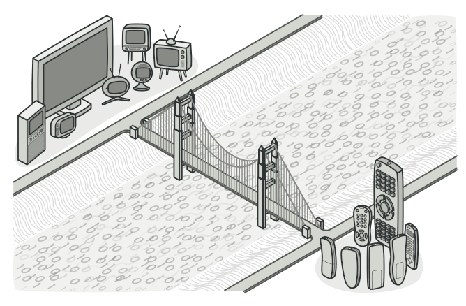
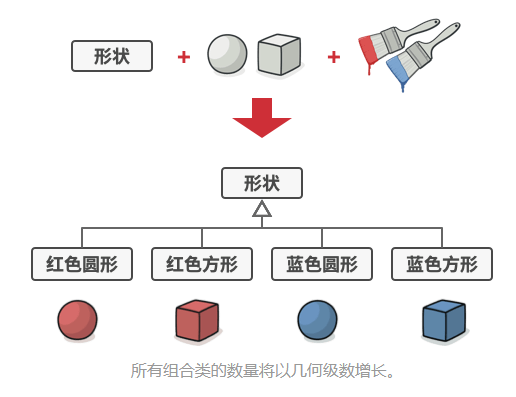
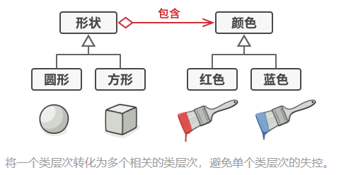
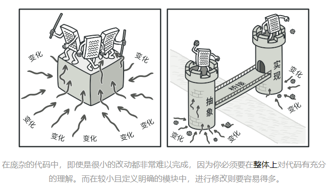
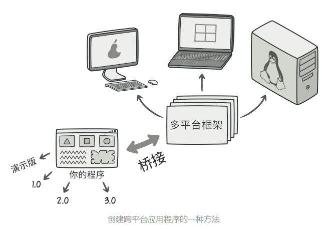
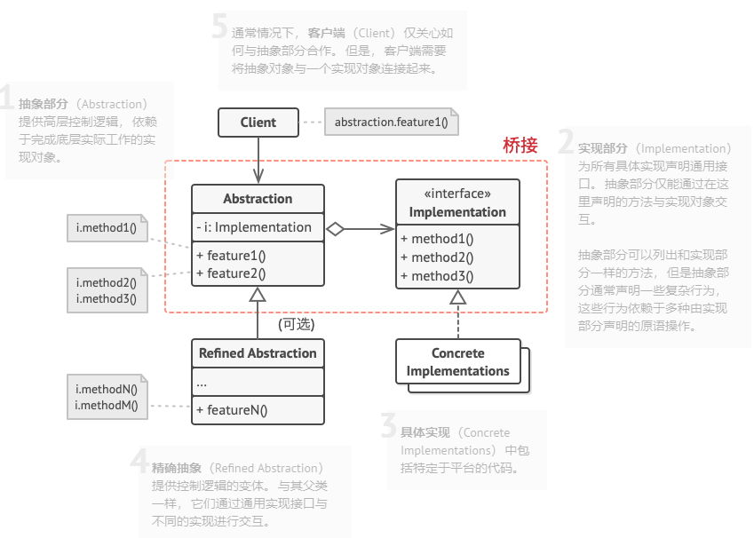

# 意图

**桥接模式**是一种结构型设计模式，可将一个大类或一系列紧密相关的类拆分为抽象和实现两个独立的层次结构，从而能在开发时分别使用。

# 问题

假如你有一个几何`形状Shape`类，从它能扩展出两个子类：`圆形Circle`和`方形Square`。你希望对这样的类层次结构进行扩展以使其包含颜色，所以你打算创建名为`红色Red`和`蓝色Blue`的形状子类。但是，由于你已有两个子类，所以总共需要创建四个类才能覆盖所有组合。

在层次机构中新增形状和颜色将导致代码复杂程度指数增长。

# 解决方案

问题的根本原因是我们试图在两个独立的维度——形状与颜色——上扩展形状类。这在处理类继承时是很常见的问题。

桥接模式通过将继承改为组合的方式来解决这个问题。具体来说，就是抽取其中一个维度并使之成为独立的类层次，这样就可以在初始类中引用这个新层次的对象，从而使得一个类不必拥有所有的状态和行为。

根据该方法，我们可以将颜色相关的代码抽取到所有拥有`红色`和`蓝色`两个子类的颜色类中，然后在`形状`类中添加一个指向某一个颜色对象的引用成员变量。现在，形状类可以将所有与颜色相关的工作委派给连入的颜色对象。这样的引用就成为了`形状`和`颜色`之间的桥梁。此后，新增颜色将不再需要修改形状的类层次，反之亦然。

### 抽象部分和实现部分

抽象部分（也被称为接口）是一些实体的高阶控制层。该层自身不完成任何具体的工作，它需要将工作委派给实现部分层（也被称为平台）。

注意，这里提到的内容与编程语言中的接口或抽象类无关。

在实际的程序中，抽象部分是图形用户界面（GUI），而实现部分则是底层操作系统代码（API），GUI层调用API层来对用户的各种操作做出响应。

一般来说，你可以在两个独立方向上扩展这种应用：

- 开发多个不同的GUI（例如面向普通用户和管理员用户进行分别配置）
- 支持多个不同的API（例如能够在Windows、Linux和macOS上运行该程序）

在最糟糕的情况下，程序可能会是一团乱麻，其中包含数百种条件语句，连接着代码各处不同种类的GUI和各种API。

你可以将特定接口-平台的组合代码抽取到独立的类中，以在混论中建立一些秩序。但是，你很快会发现这种类的数量很多。类层次将以指数形式增长，因为每添加一个新的GUI或支持一种新的API都需要创建更多的类。

让我们试着用桥接模式来解决这个问题。该模式建议将类拆分为两个类层次结构：

- 抽象部分：程序的GUI层
- 实现部分：操作系统的API

抽象对象控制程序的外观，并将真实工作委派给连入的实现对象。不同的实现只要遵循相同的接口就可以互换，使同一GUI可以在Windows和Linux下运行。

最后的结果是：你无需改动与API相关的类就可以修改GUI类。此外如果想支持一个新的操作系统，只需在实现部分层次中创建一个子类即可。

# 桥接模式结构

# 桥接模式适合应用场景

### 如果你想要拆分或重组一个具有多重功能的庞杂类，可以使用桥接模式。

类的代码行数越多，弄清其运作方式就越困难，对其进行修改所花费的时间就越长。一个功能上的变化可能需要在整个类范围内进行修改，而且常常会产生错误，甚至还会有一些严重的副作用。

桥接模式可以将庞杂类拆分为几个类层次结构。此后，你可以修改任意一个类层次结构而不会影响到其他类层次结构。这种方法可以简化代码的维护工作，并将修改已有代码的风险降到最低。

### 如果你希望在几个独立维度上扩展一个类，可以使用该模式。

桥接模式将每个维度抽取为独立的类层次。初始类将相关工作委派给属于对应类层次的对象，无需自己完成所有工作。

### 如果你需要在运行时切换不同实现方法，可使用桥接模式。

当然并不是说一定要实现这一点，桥接模式可替换抽象部分中的实现对象，具体操作就和给成员变量赋新值一样简单。

顺便说一句，最后一点是很多人混淆**<u>桥接模式</u>**和**<u>策略模式</u>**的主要原因。记住，设计模式并不仅是一种对类进行组织的方式，它还能用于沟通意图和解决问题。

# 实现方式

1. 明确类中独立的维度。独立的概念可能是：抽象/平台，域/基础设施，前端/后端或接口/实现
2. 了解客户端的业务需求，并在抽象基类中定义它们
3. 确定在所有平台上都可以执行的业务。并在通用实现接口中声明抽象部分所需的业务
4. 为你域内的所有平台创建实现类，但需确保它们遵循实现部分的接口
5. 在抽象类中添加指向实现类型的引用成员变量。抽象部分会将大部分工作委派给该成员变量所指向的实现对象
6. 如果你的高层逻辑有多个变体，则可通过扩展抽象基类为每个变体创建一个精确抽象
7. 客户端代码必须将实现对象传递给抽象部分的构造函数才能使其能够相互关联。此后，客户端只需与抽象对象进行交互，无需和实现对象打交道

# 桥接模式优缺点

优点：

- 你可以创建与平台无关的类和程序
- 客户端代码仅与高层抽象部分进行互动，不会接触到平台的详细信息
- **<u>单一职责原则</u>**。抽象部分专注于处理高层逻辑，实现部分处理平台细节
- **<u>开闭原则</u>**。你可以新增抽象部分和实现部分，且它们之间不会相互影响

缺点：

- 对高内聚的类使用该模式可能会让代码更加复杂

# 与其他模式的关系

- **<u>桥接模式</u>**通常会于开发前期进行设计，使你能够将程序中的各个部分独立开来以便开发。另一方面，**<u>适配器模式</u>**通常在已有程序中使用，让相互不兼容的类能很好地合作。
- 你可以将**<u>抽象工厂模式</u>**和**<u>桥接模式</u>**搭配使用。如果由桥接定义的抽象只能与特定实现合作，这一模式搭配就非常有用。在这种情况下，抽象工厂可以对这些关系进行封装，并且对客户端代码隐藏其复杂性。
- 你可以结合使用**<u>生成器模式</u>**和**<u>桥接模式</u>**：主管类负责抽象工作，各种不同的生成器负责实现工作。
- **<u>桥接、状态模式</u>**和**<u>策略模式</u>**（在某种程度上包括**<u>适配器模式</u>**）的接口非常相似。实际上，它们都基于**<u>组合模式</u>**——即将工作委派给其他对象，不过也各自解决了不同的问题。模式并不只是以特定方式组织代码的配方，你还可以使用它们来和其他开发者讨论模式所解决的问题。

> [摘自REFACTORING GURU](https://refactoringguru.cn/design-patterns/bridge)

