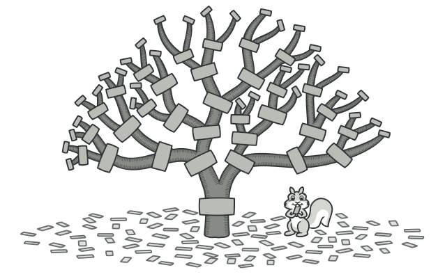
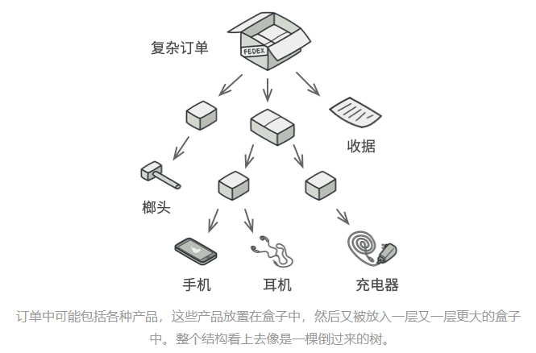
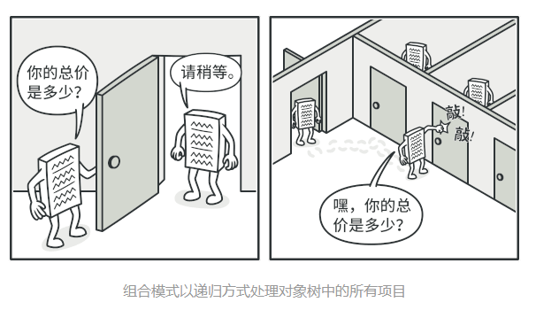
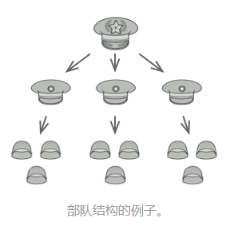
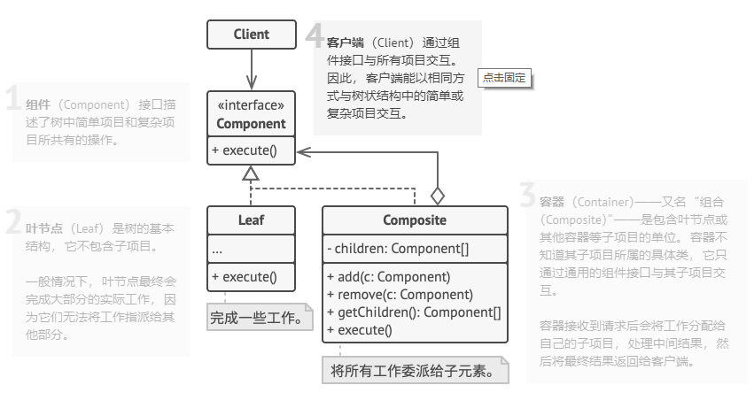

# 意图

**组合模式**是一种结构型设计模式，你可以使用它将对象组合成树状结构，并且能像使用独立对象一样使用它们。

# 问题

如果应用的核心模型能用树状结构表示，在应用中使用组合模式才有价值。

例如，你有两类对象：`产品`和`盒子`。一个`盒子`中可以包含多个`产品`或者几个较小的`盒子`。这些小`盒子`中同样可以包含一些`产品`或更小的`盒子`，以此类推。

假设你希望在这些类的基础上开发一个订购系统。订单中可以包含无包装的简单产品，也可以包含装满产品的盒子……以及其他盒子。此时你会如何计算每张订单的总价格呢？

你可以尝试直接计算：打开所有盒子，找到每件产品，然后计算总价。这在真实世界中或许可行，但在程序中，你并不能简单地使用循环语句来完成该工作。你必须事先知道所有的`产品`和`盒子`的类别，所有盒子的嵌套层数以及其他繁杂的细节信息。因此，直接计算极不方便，甚至完全不可行。

# 解决方案

组合模式建议使用一个通用接口来与`产品`和`盒子`进行交互，并且在该接口中声明一个计算总价的方法。

那么方法该如何设计呢？对于一个产品，该方法直接返回其价格；对于一个盒子，该方法遍历盒子中的所有项目，询问每个项目的价格，然后返回该盒子的总价格。如果其中某个项目是小一号的盒子，那么当前盒子也会遍历其中的所有项目，以此类推，直接计算出所有内部组成部分的价格。你甚至可以在盒子的最终价格中增加额外费用，作为该盒子的包装费用。

该方式的最大优点在于你无需了解构成树结构的对象的具体类。你也无需了解对象时简单的产品还是复杂的盒子。你只需调用通用接口以相同的方法对其进行处理即可。当你调用该方法后，对象会将请求沿着树结构传递下去。

### 真实世界类比

大部分国家的军队采用层次结构管理。每支部队包括几个师，师由旅构成，旅由团构成，团可以继续划分为排。最后，每个排由一小队实实在在的士兵组成。军事命令由最高层下达，通过每个层级传递，直到每位士兵都知道自己应该服从的命令。

# 组合模式结构

# 组合模式适合应用场景

### 如果你需要实现树状对象结构，可以使用组合模式。

组合模式为你提供了两种共享公共接口的基本元素类型：简单叶节点和复杂容器。容器中可以包含叶节点和其他容器。这使得你可以构建树状嵌套对象结构。

### 如果你希望客户端代码以相同方式处理简单和复杂元素，可以使用该模式。

组合模式中定义的所有元素共用同一个接口。在这一接口的帮助下，客户端不必在意其所使用的对象的具体类。

# 实现方式

1. 确保应用的核心模型能够以树状结构表示。尝试将其分解为简单元素和容器。记住，容器必须能够同时包含简单元素和其他容器

2. 声明组件接口及其一系列方法，这些方法对简单和复杂元素都有意义

3. 创建一个叶节点类表示简单元素。程序中可以有多个不同的叶节点类

4. 创建一个容器类表示复杂元素。在该类中，创建一个数组成员变量来存储对于其子元素的引用。该数组必须能够同时保存叶节点和容器，因此请确保将其声明为组合接口类型

   实现组件接口方法时，记住容器应该将大部分工作交给其子元素来完成

5. 最后，在容器中定义添加和删除子元素的方法

   记住，这些操作可在组件中声明。这将违反**<u>接口隔离原则</u>**，因为叶节点类中的这些方法为空。但是，这可以让客户端无差别地访问所有元素，即使是组合树状结构的元素

# 组合模式优缺点

优点：

- 你可以利用多态和递归机制更方便地使用复杂树结构
- **<u>开闭原则</u>**。无需更改现有代码，你就可以在应用中添加新元素，使其成为对象树的一部分

缺点：

- 对于功能差异较大的类，提供公共接口或许会有困难。在特定情况下，你需要过度一般化组键接口，使其变得令人难以理解

# 与其他模式的关系

- **<u>桥接、状态模式</u>**和**<u>策略模式</u>**（在某种程度上包括**<u>适配器模式</u>**）的接口非常相似。实际上，它们都基于**<u>组合模式</u>**——即将工作委派给其他对象，不过也各自解决了不同的问题。模式并不只是以特定方式组织代码的配方，你还可以使用它们来和其他开发者讨论模式所解决的问题。

- 你可以创建复杂**<u>组合</u>**树时使用**<u>生成器模式</u>**，因为这可使其构造步骤以递归的方式运行。

- **<u>责任链模式</u>**通常和**<u>组合模式</u>**结合使用。在这种情况下，叶组件接收到请求后，可以将请求沿包含全体父组件的链一直传递至对象树的底部。

- 你可以使用**<u>迭代器模式</u>**来遍历**<u>组合</u>**树。

- 你可以使用**<u>访问者模式</u>**对整个**<u>组合</u>**树执行操作。

- 你可以使用**<u>*享元模式*</u>**实现**<u>组合</u>**树的共享叶节点以节省内存。

- **<u>组合</u>**和**<u>装饰器模式</u>**的结构图很相似，因为两者都依赖递归组合来组织无限数量的对象。

  装饰类似于组合，但其只有一个子组件。此外还有一个明显不同：装饰为被封装对象添加了额外的职责，组合仅对其子节点的结果进行了“求和”。

- 大量使用**<u>组合</u>**和**<u>装饰</u>**的设计通常可从对于**<u>原型模式</u>**的使用中获益。你可以通过该模式来复制复杂结构，而非从零开始重新构造。

> [摘自REFACTORING GURU](https://refactoringguru.cn/design-patterns/composite)

