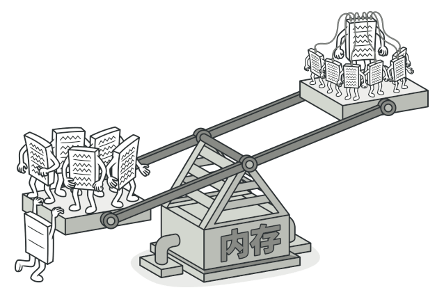
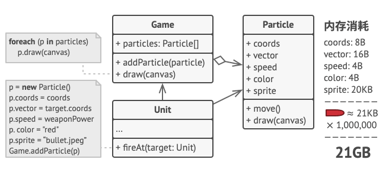
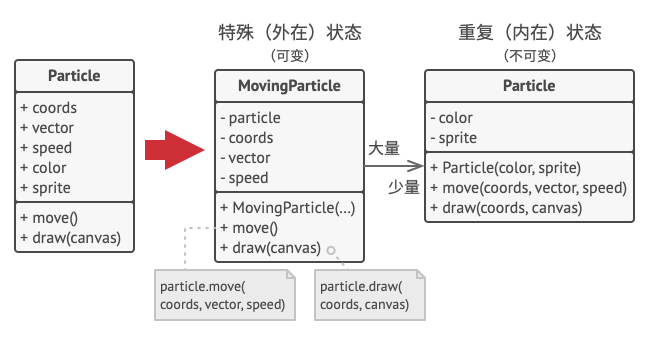
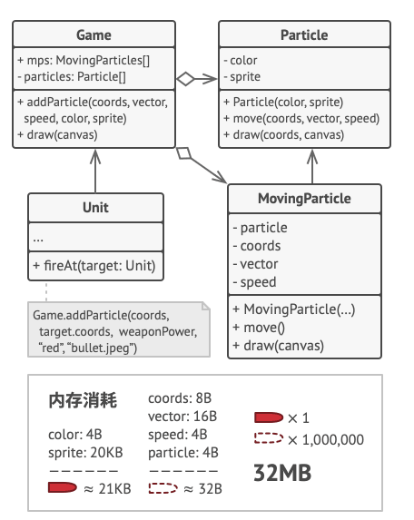
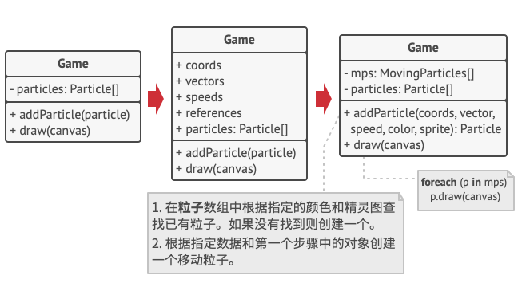
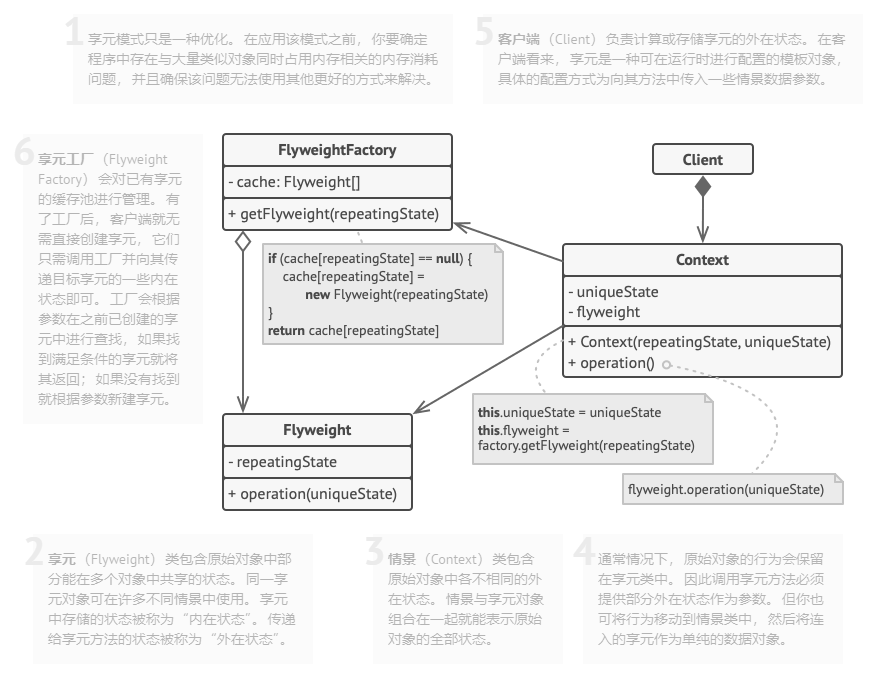

# 意图

**享元模式**是一种结构型设计模式，它摒弃了在每个对象中保存所有数据的方式，通过共享多个对象所共有的相同状态，让你能在有限的内存容量中载入更多对象。



# 问题

假设你希望在长时间工作后放松一下，所以开发了一款简单的游戏：玩家们在地图上移动并相互射击。你决定实现了一个真实的粒子系统，并将其作为游戏的特色。大量的子弹、导弹和爆炸弹片会在整个地图上穿行，为玩家提供紧张刺激的游戏体验。

开发完成后，你推送提交了最新版本的程序，并在编译游戏后将其发送给一个朋友进行测试。尽管该游戏在你电脑上完美运行，但是你的朋友却无法长时间进行游戏：游戏总会在他的电脑上运行几分钟后崩溃。在研究了几个小时的调试信息后，你发现导致游戏崩溃的原因是内存容量不足。朋友的设备性能远比不上你的电脑，因此游戏运行在他的电脑上时很快会出现问题。

真正的问题与粒子系统有关。每个粒子（一颗子弹、一枚导弹或一块弹片）都由包含完整数据的独立对象来表示。当玩家在游戏中鏖战进入高潮后的某一时刻，游戏将无法在剩余内存中载入新建粒子，于是程序就崩溃了。



# 解决方案

仔细观察`例子Particle`类，你可能会注意到颜色color和精灵图sprite这两个成员变量所消耗的内存要比其他变量多得多。更糟糕的是，对于所有的粒子来说，这两个成员变量所存储的数据几乎完全一样。



每个粒子的另一些状态（坐标、移动矢量和速度）则是不同的。因为这些成员变量的数值会不断变化。这些数据代表粒子在存续期间不断变化的情景，但每个粒子的颜色和精灵图则会保持不变。

对象的常量数据通常被称为内在状态，其位于对象中，其他对象只能读取但不能修改其数值。而对象的其他状态常常能被其他对象“从外部”改变，因此被称为外在状态。

享元模式建议不在对象中存储外在状态，而是将其传递给依赖于它的一个特殊方法。程序只在对象中保存内在状态，以方便在不同情景下重用。这些对象的区别仅在于其内在状态，因此你所需的对象数量会大大消减。



让我们回到游戏中。假如能从粒子类中抽出外在状态，那么我们只需三个不同的对象（子弹、导弹和弹片）就能表示游戏中的所有粒子。你现在很有可能已经猜到，我们将这样一个仅存储内在状态的对象成为**<u>享元</u>**。

### 外在状态存储

那么外在状态会被移动到什么地方呢？总得有类来存储它们。在大部分情况下，它们会被移动到容器对象中，也就是我们应用享元模式前的聚合对象中。

在我们的例子中，容器对象就是主要的`游戏Game`对象，其会将所有粒子存储在名为`粒子Particles`的成员变量中。为了能将外在状态移动到这个类中，你需要创建多个数组成员变量来存储每个粒子的坐标、方向矢量和速度。除此之外，你还需要另一个数组来存储指向代表粒子的特定享元的引用。这些数组必须保持同步，这样你才能够使用同一索引来获取关于某个粒子的所有数据。



更优雅的解决方案是创建独立的情景类来存储外在状态和对享元对象的引用。在该方法中，容器类只需包含一个数组。

稍等！这样的话情景对象数量不是会和不采用该模式时的对象数量一样多吗？确实如此，但这些对象要比之前的小很多。消耗内存最多的成员变量已经被移动到很少的几个享元对象中了。现在，一个享元大对象会被上千个情景小对象复用，因此无需再重复存储数千个大对象的数据。

### 享元与不可变性

由于享元对象可在不同的情景中使用，你必须确保其状态不能被修改。享元类的状态只能由构造函数的参数进行一次性初始化，它不能对其他对象公开其设置器或公有成员变量。

### 享元工厂

为了能更方便地访问各种享元，你可以创建一个工厂方法来管理已有享元对象的缓存池。工厂方法从客户端处接收目标享元对象的内在状态作为参数，如果它能在缓存池中找到所需享元，则将其返回给客户端；如果没有找到，它就会新建一个享元，并将其添加到缓存池中。

你可以选择在程序的不同地方放入该函数。最简单的选择就是将其放置在享元容器中。除此之外，你还可以新建一个工厂类，或者创建一个静态的工厂方法并将其放入实际的享元类中。

# 享元模式结构



# 享元模式适合应用场景

### 仅在程序必须支持大量对象且没有足够的内存容量时使用享元模式。

应用该模式所获的收益大小取决于使用它的方式和情景。它在下列情况中最有效：

- 程序需要生成数量巨大的相似对象
- 这将耗尽目标设备的所有内存
- 对象中包含可抽取且能在多个对象间共享的重复状态

# 实现方式

1. 考虑能否在现有子系统的基础上提供一个更简单的接口。如果该接口能让客户端代码独立于众多子系统类，那么你的方向就是正确的。
2. 在一个新的外观类中声明并实现该接口。外观应将客户端代码的调用重定向到子系统中的相应对象处。如果客户端代码没有对子系统进行初始化，也没有对其后续生命周期进行管理，那么外观必须完成此类工作。
3. 如果要充分发挥这一模式的优势，你必须确保所有客户端代码仅通过外观与子系统进行交互。此后客户端代码将不会收到任何由子系统代码修改而造成的影响，比如子系统升级后，你只需修改外观中的代码即可。
4. 如果外观变得<u>过于臃肿</u>，你可以考虑将其部分行为抽取为一个新的专用外观类。

# 享元模式优缺点

优点：

- 如果程序中有很多相似对象，那么你将可以节省大量内存

缺点：

- 你可能需要牺牲执行速度来换取内存，因为他人每次调用享元方法时都需要重新计算部分情景数据
- 代码会变得更加复杂。团队中的新成员总是会问：“为什么要像这样拆分一个实体的状态”

# 与其他模式的关系

- 你可以使用**<u>享元模式</u>**实现**<u>组合模式</u>**树的共享叶节点以节省内存。
- **<u>享元模式</u>**展示了如何生成大量的小型对象， **<u>外观</u>**则展示了如何用一个对象来代表整个子系统。
- 如果你能将对象的所有共享状态简化为一个享元对象，那么**<u>享元</u>**就和**<u>单例模式</u>**类似了。但这两个模式有两个根本性的不同：
  1. 只会有一个单例实体，但是享元类可以有多个实体，各实体的内在状态也可以不同
  2. 单例对象可以是可变的，享元对象是不可变的

> [以上摘自REFACTORING GURU](https://refactoringguru.cn/design-patterns/flyweight)

# 代码示例

包含每台电脑的共享状态：

```java
public class Computer {
    private String screen;
    private String processor;
    private ComputerType type;

    public Computer(String screen, String processor, ComputerType type) {
        this.screen = screen;
        this.processor = processor;
        this.type = type;
    }
}
```

包含每台电脑的独特状态：

```java
public class ComputerType {
    private String mac;

    private int cdKey;

    public ComputerType(String mac, int cdKey) {
        this.mac = mac;
        this.cdKey = cdKey;
    }
}
```

电脑类型工厂：

```java
public class ComputerTypeFactory {
    static Map<String, ComputerType> computerTypes = new HashMap<>();

    public static ComputerType getComputerType(String mac, int cdKey){
        ComputerType type = computerTypes.get(mac);
        if(type == null){
            type = new ComputerType(mac, cdKey);
            computerTypes.put(mac, type);
        }
        return type;
    }
}
```

电脑生产商：

```java
public class ComputerProducer {
    private List<Computer> computers = new ArrayList<>();

    public void produceComputer(String screen, String processor, String mac, int cdKey) {
        ComputerType computerType = ComputerTypeFactory.getComputerType(mac, cdKey);
        Computer computer = new Computer(screen, processor, computerType);
        computers.add(computer);
    }
}
```

客户端代码：

```java
public class Demo {
    static int COMPUTER_NUM = 1000000;
    static int TYPE_NUM = 2;

    public static void main(String[] args) {
        ComputerProducer computerProducer = new ComputerProducer();
        for(int i = 0; i < Math.floor(COMPUTER_NUM / TYPE_NUM); i++){
            computerProducer.produceComputer("三星", "i5 7500", "MAC" + random(0, COMPUTER_NUM), random(0, COMPUTER_NUM));
            computerProducer.produceComputer("三星", "i5 7500", "MAC" + random(0, COMPUTER_NUM), random(0, COMPUTER_NUM));
        }

        System.out.println(COMPUTER_NUM + "台电脑被生产");
        System.out.println("=======================");
        System.out.println("内存使用情况:");
        System.out.println("电脑占用大小 (8 bytes) * " + COMPUTER_NUM);
        System.out.println("+ 电脑类型占用大小 (~30 bytes) * " + TYPE_NUM + "");
        System.out.println("=======================");
        System.out.println("总共: " + ((COMPUTER_NUM * 8 + TYPE_NUM * 30) / 1024 / 1024) +
                "MB (替代了 " + ((COMPUTER_NUM * 38) / 1024 / 1024) + "MB)");
    }

    private static int random(int min, int max) {
        return min + (int) (Math.random() * ((max - min) + 1));
    }
}

//1000000台电脑被生产
//=======================
//内存使用情况:
//电脑占用大小 (8 bytes) * 1000000
//+ 电脑类型占用大小 (~30 bytes) * 2
//=======================
//总共: 7MB (替代了 36MB)
```

