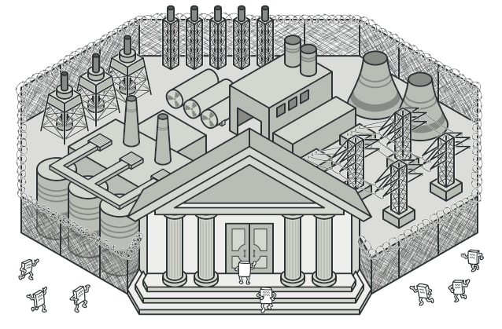
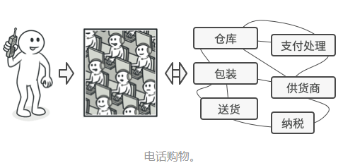

# 意图

**外观模式**是一种结构型设计模式，能为程序库、框架或其他复杂类提供一个简单的接口。



# 问题

假设你必须在代码中使用某个复杂的库或框架中的众多对象。正常情况下，你需要负责所有对象的初始化工作、管理其依赖关系并按正确的顺序执行方法等。

最终，程序中类的业务逻辑将与第三方类的实现细节紧密耦合，使得理解和维护代码的工作很难进行。

# 解决方案

外观类为包含许多活动部件的复杂子系统提供一个简单的接口。与直接调用子系统相比，外观提供的功能可能比较有限，但它却包含了客户端真正关系的功能。

如果你的程序需要与包含几十种功能的复杂库整合，但只需使用其中非常少的功能，那么使用外观模式会非常方便。

例如，上传猫咪搞笑短视频到社交媒体网站的应用可能会用到专业的视频转换库，但它只需使用一个包含`encode(filename, format)`方法的类即可。在创建这个类并将其连接到视频转换库后，你就拥有自己的第一个外观。

### 真实世界类比



当你通过电话给商店下达订单时，接线员就是该商店的所有服务和部门的外观。接线员为你提供了一个同购物系统、支付网关和各种送货服务进行互动的简单语音接口。

# 外观模式结构


# 外观模式适合应用场景

### 如果你需要一个指向复杂子系统的直接接口，且该接口的功能有限，则可以使用外观模式。

子系统通常会随着时间的推进变得越来越复杂。即使是应用了设计模式，通常你也会创建更多的类。尽管在多种情形中子系统可能是更灵活或易于复用的，但其所需的配置和样板代码数量将会增长得更快。为了解决这个问题，外观将会提供指向子系统中最常用功能的快捷方法，能够满足客户端的大部分需求。

### 如果需要将子系统组织为多层结构，可以使用外观。

创建外观来定义子系统中各层次的入口。你可以要求子系统仅使用外观来进行交互，以减少子系统之间的耦合。

让我们回到视频转换框架的例子。该框架可以拆分为两个层次：音频相关和视频相关。你可以为每个层次创建一个外观，然后要求各层的类必须通过这些外观进行交互。这种方式看上去与**<u>中介者模式</u>**非常相似。

# 实现方式

1. 考虑能否在现有子系统的基础上提供一个更简单的接口。如果该接口能让客户端代码独立于众多子系统类，那么你的方向就是正确的。
2. 在一个新的外观类中声明并实现该接口。外观应将客户端代码的调用重定向到子系统中的相应对象处。如果客户端代码没有对子系统进行初始化，也没有对其后续生命周期进行管理，那么外观必须完成此类工作。
3. 如果要充分发挥这一模式的优势，你必须确保所有客户端代码仅通过外观与子系统进行交互。此后客户端代码将不会收到任何由子系统代码修改而造成的影响，比如子系统升级后，你只需修改外观中的代码即可。
4. 如果外观变得<u>过于臃肿</u>，你可以考虑将其部分行为抽取为一个新的专用外观类。

# 外观模式优缺点

优点：

- 你可以让自己的代码独立于复杂子系统

缺点：

- 外观可能成为与程序中所有类耦合的**<u>上帝对象</u>**

# 与其他模式的关系

- **<u>外观模式</u>**为现有对象定义了一个新接口， **<u>适配器模式</u>**则会试图运用已有的接口。 *适配器*通常只封装一个对象， *外观*通常会作用于整个对象子系统上。u
- 当只需对客户端代码隐藏子系统创建对象的方式时， 你可以使用**<u>抽象工厂模式</u>**来代替**<u>外观</u>**。
- **<u>享元模式</u>**展示了如何生成大量的小型对象， **<u>外观</u>**则展示了如何用一个对象来代表整个子系统。
- **<u>外观</u>**和**<u>中介者模式</u>**的职责类似： 它们都尝试在大量紧密耦合的类中组织起合作。
  - *外观*为子系统中的所有对象定义了一个简单接口， 但是它不提供任何新功能。 子系统本身不会意识到外观的存在。 子系统中的对象可以直接进行交流。
  - *中介者*将系统中组件的沟通行为中心化。 各组件只知道中介者对象， 无法直接相互交流。
- **<u>外观</u>**类通常可以转换为**<u>单例模式</u>**类， 因为在大部分情况下一个外观对象就足够了。
- **<u>外观</u>**与**<u>代理模式</u>**的相似之处在于它们都缓存了一个复杂实体并自行对其进行初始化。 *代理*与其服务对象遵循同一接口， 使得自己和服务对象可以互换， 在这一点上它与*外观*不同。

> [以上摘自REFACTORING GURU](https://refactoringguru.cn/design-patterns/facade)

# 代码示例

子系统A：

```java
public class SystemA {
    public void methodA(){
        System.out.println("调用子系统A的方法A");
    }

    public void methodB(){
        System.out.println("调用子系统A的方法B");
    }
}
```

子系统B：

```java
public class SystemB {
    public void methodA(){
        System.out.println("调用子系统B的方法A");
    }

    public void methodB(){
        System.out.println("调用子系统B的方法B");
    }
}
```

子系统C：

```java
public class SystemC {
    public void method(){
        System.out.println("调用子系统C的方法");
    }
}
```

外观类：

```java
public class SimpleFacade {
    public static void method(){
        SystemA a = new SystemA();
        SystemB b = new SystemB();
        SystemC c = new SystemC();
        b.methodA();
        a.methodA();
        b.methodB();
        c.method();
        a.methodB();
    }
}
```

客户端代码：

```java
public class Demo {
    public static void main(String[] args) {
        SimpleFacade.method();
    }
}

//调用子系统B的方法A
//调用子系统A的方法A
//调用子系统B的方法B
//调用子系统C的方法
//调用子系统A的方法B
```

