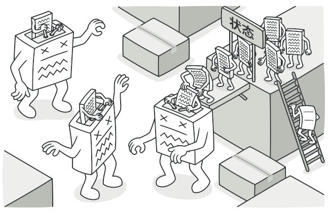
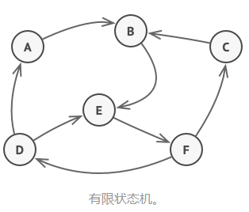
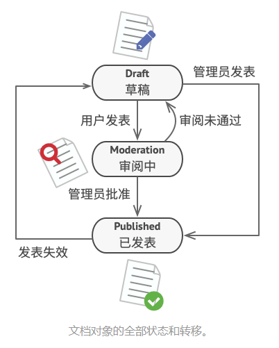
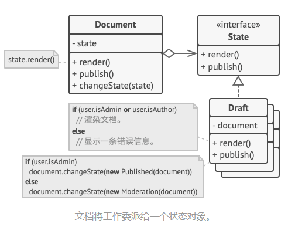
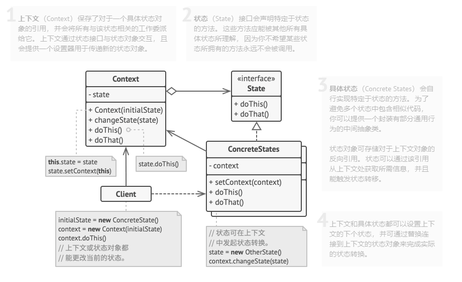

# 意图

**状态模式**是一种行为设计模式，让你能在一个对象的内部状态变化时改变其行为，使其看上去就像改变了自身所属的类一样。



# 问题

状态模式与**<u>有限状态机</u>**的概念紧密相关。



其主要思想是程序在任意时刻仅可处于几种有限的状态中。在任何一个特定状态中，程序的行为都不相同，且可瞬间从一个状态切换到另一个状态。不过，根据当前状态，程序可能会切换到另外一种状态，也可能会保持当前状态不变。这些数量有限且预先定义的状态切换规则被称为**转移**。

你话可以将该方法应用在对象上。假如你有一个`文档Document`类。文档可能会处于`草稿Draft`、`审阅中Moderation`和`已发布Published`三种状态中的一种。文档的`publish发布`方法在不同状态下的行为略有不同：

- 处于`草稿`状态时，它会将文档转移到审阅中状态。
- 处于`审阅中`状态时，如果当前用户是管理员，它会公开发文档。
- 处于`已发布`状态时，它不会进行任何操作。



状态机通常由众多条件运算符（`if`或`switch`）实现，可根据对象的当前状态选择相应的行为。“状态”通常只是对象中的一组成员变量值。即使你之前从未听说过有限状态机，你也很可能已经实现过状态模式。下面的代码应该能帮助你回忆起来。

```java
class Document is
    field state: string
    // ...
    method publish() is
        switch (state)
            "draft":
                state = "moderation"
                break
            "moderation":
                if (currentUser.role == 'admin')
                    state = "published"
                break
            "published":
                // 什么也不做。
                break
    // ...
```

当我们逐步在`文档`类中添加更多状态和依赖于状态的行为后，基于条件语句的状态机就会暴露其最大的弱点。为了能根据当前状态选择完成相应行为的方法，绝大部分方法中会包含复杂的条件语句。修改其转换逻辑可能会涉及到修改所有方法中的状态条件语句，导致代码的维护工作非常艰难。

这个问题会随着项目进行变得越发严重。我们很难在设计阶段预测到所有可能的状态和转换。随着时间推移，最初包含有限条件语句的简介状态机可能会变成臃肿的一团乱麻。

# 解决方案

状态模式建议为对象的所有可能状态新建一个类，然后将所有状态的对应行为抽取到这些类中。

原始对象被称为上下文（context），它并不会自行实现所有行为，而是会保存一个指向表示当前状态的状态对象的引用，且将所有与状态相关的工作委派给该对象。



如需将上下文转换为另一种状态，则需将当前活动的状态对象替换为另外一个代表新状态的对象。采用这种方式是有前提的：所有状态类都必须遵循同样的接口，而且上下文必须仅通过接口与这些对象进行交互。

这个结构可能看上去与**<u>策略</u>**模式相似，但有一个关键性的不同——在状态模式中，特定状态知道其他所有状态的存在，且能触发从一个状态到另一个状态的转换；策略则机会完全不知道其他策略的存在。

### 真实世界类比

智能手机的按键和开关会根据设备当前状态完成不同行为：

- 当手机处于解锁状态时，按下按键将执行各种功能
- 当手机处于锁定状态时，按下任何按键都将解锁屏幕
- 当手机电量不足时，按下任何按键偶读将显示充电页面

# 状态模式结构



# 状态模式适合应用场景

### 如果对象需要根据自身当前状态进行不同行为，同时状态的数量非常多且与状态相关的代码会频繁变更的话，可使用状态模式。

模式建议你将所有特定于状态的代码抽取到一组独立的类中。这样一来，你可以在独立于其他状态的情况下添加新状态或修改已有状态，从而减少维护成本。

### 如果某个类需要根据成员变量的当前值改变自身行为，从而需要大量的条件语句时，可使用该模式。

状态模式会将这些条件语句的分支抽取到相应状态类的方法中。同时，你还可以清除主要类中与特定状态相关的临时成员变量和帮手方法代码。

### 当相似状态和基于条件的状态机转换中存在许多重复代码时，可使用状态模式。

状态模式让你能够生成状态类层次结构，通过将共用代码抽取到抽象基类中来减少重复。

# 实现方式

1. 确定哪些类是上下文。 它可能是包含依赖于状态的代码的已有类； 如果特定于状态的代码分散在多个类中， 那么它可能是一个新的类。

2. 声明状态接口。 虽然你可能会需要完全复制上下文中声明的所有方法， 但最好是仅把关注点放在那些可能包含特定于状态的行为的方法上。

3. 为每个实际状态创建一个继承于状态接口的类。 然后检查上下文中的方法并将与特定状态相关的所有代码抽取到新建的类中。

   在将代码移动到状态类的过程中， 你可能会发现它依赖于上下文中的一些私有成员。 你可以采用以下几种变通方式：

   - 将这些成员变量或方法设为公有。
   - 将需要抽取的上下文行为更改为上下文中的公有方法， 然后在状态类中调用。 这种方式简陋却便捷， 你可以稍后再对其进行修补。
   - 将状态类嵌套在上下文类中。 这种方式需要你所使用的编程语言支持嵌套类。

4. 在上下文类中添加一个状态接口类型的引用成员变量， 以及一个用于修改该成员变量值的公有设置器。

5. 再次检查上下文中的方法， 将空的条件语句替换为相应的状态对象方法。

6. 为切换上下文状态， 你需要创建某个状态类实例并将其传递给上下文。 你可以在上下文、 各种状态或客户端中完成这项工作。 无论在何处完成这项工作， 该类都将依赖于其所实例化的具体类。

# 状态模式优缺点

优点：

- 单一职责原则。将与特定状态相关的代码放在单独的类中。
- 开闭原则。无需修改已有状态类和上下文就能引入新状态。
- 通过消除臃肿的状态机条件语句简化上下文代码。

缺点：

- 如果状态机只有很少的几个状态，或者很少发生改变，那么应用该模式可能会显得小题大作。

# 与其他模式的关系

- **<u>桥接、状态模式</u>**和**<u>策略模式</u>**（在某种程度上包括**<u>适配器模式</u>**）的接口非常相似。实际上，它们都基于**<u>组合模式</u>**——即将工作委派给其他对象，不过也各自解决了不同的问题。模式并不只是以特定方式组织代码的配方，你还可以使用它们来和其他开发者讨论模式所解决的问题。
- **<u>状态</u>**可被视为**<u>策略</u>**的扩展。两者都基于组合机制：它们都通过将部分工作委派给“帮手”对象来改变其在不同情境下的行为。策略使得这些对象相互之间完全独立，它们不知道其他对象的存在。但状态模式没有限制具体状态之间的依赖，且允许它们自行改变在不同情景下的状态。

> [以上摘自REFACTORING GURU](https://refactoringguru.cn/design-patterns/state)

# 代码示例

上下文：

```java
public class Context {
    public final static State OPEN_STATE = new OpenState();
    public final static State CLOSE_STATE = new CloseState();
    public final static State RUN_STATE = new RunState();
    public final static State STOP_STATE = new StopState();

    private State state;

    public State getState() {
        return state;
    }

    public void setState(State state) {
        this.state = state;
        state.setContext(this);
    }

    public void open(){
        state.open();
    }

    public void close(){
        state.close();
    }

    public void run(){
        state.run();
    }

    public void stop(){
        state.stop();
    }
}
```

状态接口：

```java
public abstract class State {
    Context context;

    public void setContext(Context context) {
        this.context = context;
    }

    /**
     * 开门
     */
    public abstract void open();

    /**
     * 关门
     */
    public abstract void close();

    /**
     * 运行
     */
    public abstract void run();

    /**
     * 停止
     */
    public abstract void stop();
}
```

打开状态：

```java
public class OpenState extends State{
    @Override
    public void open() {
        System.out.println("开门");
    }

    @Override
    public void close() {
        context.setState(Context.CLOSE_STATE);
        context.getState().close();
    }

    @Override
    public void run() {

    }

    @Override
    public void stop() {

    }
}
```

关闭状态：

```java
public class CloseState extends State{
    @Override
    public void open() {
        context.setState(Context.OPEN_STATE);
        context.getState().open();
    }

    @Override
    public void close() {
        System.out.println("关门");
    }

    @Override
    public void run() {
        context.setState(Context.RUN_STATE);
        context.getState().run();
    }

    @Override
    public void stop() {
        context.setState(Context.STOP_STATE);
        context.getState().stop();
    }
}
```

运行状态：

```java
public class RunState extends State{
    @Override
    public void open() {

    }

    @Override
    public void close() {

    }

    @Override
    public void run() {
        System.out.println("运行");
    }

    @Override
    public void stop() {
        context.setState(Context.STOP_STATE);
        context.getState().stop();
    }
}
```

停止状态：

```java
public class StopState extends State{
    @Override
    public void open() {
        context.setState(Context.OPEN_STATE);
        context.getState().open();
    }

    @Override
    public void close() {

    }

    @Override
    public void run() {
        context.setState(Context.RUN_STATE);
        context.getState().run();
    }

    @Override
    public void stop() {
        System.out.println("停止");
    }
}
```

客户端：

```java
public class Demo {
    public static void main(String[] args) {
        Context context = new Context();
        context.setState(new RunState());
        context.open();
        context.close();
        context.run();
        context.stop();
    }
}

//运行
//停止
```
